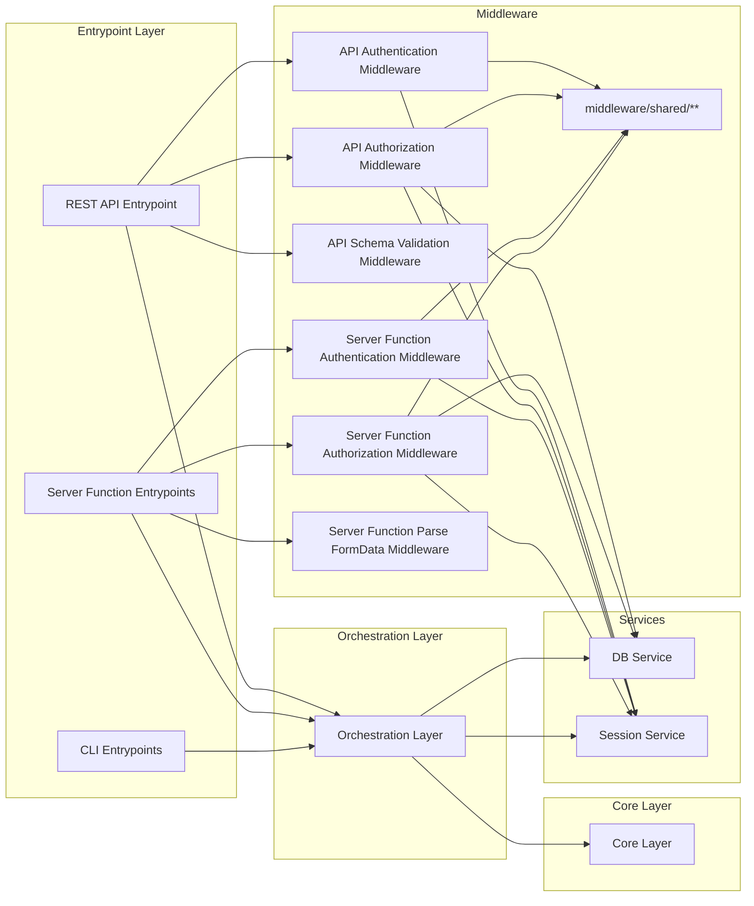
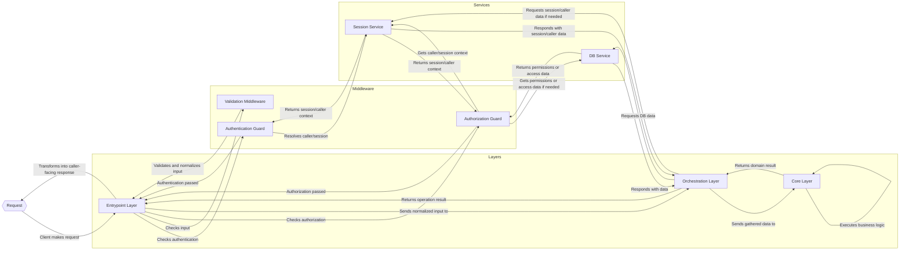

# Proposal: Backend Architecture Redesign

## Metadata

- Status: `draft`
- Created At: `2026-04-20`
- Last Updated: `2026-04-25`
- Owner: `Antony Acosta`

# Summary

This document aims to provide a comprehensive path for restructuring the backend architecture with one proposed architecture in order to simplify the development and make the data flow less obfuscated.

# Problem Statement

There is a problem of **overengineering** in the current backend codebase.

The current architecture is a modular monolith with a layered, hexagonal-style structure, where business logic is isolated from framework and database details through ports and adapters, as documented in docs/architecture/app-architecture.md.
The runtime layers are:

- Transport (`src/app/api/**/*` and `src/server/cli/*`) for request/argument parsing, response envelopes, and error-to-HTTP/CLI mapping;
- Application (`src/server/application/*`) for use-case orchestration, auth/authz enforcement, and transaction-aware workflows;
- Domain (`src/server/domain/*`) for pure business rules and invariants;
- Ports (`src/server/ports/*`) for infrastructure contracts such as repositories, rules catalog, and session context;
- Adapters (`src/server/adapters/*`) for concrete implementations like Prisma repositories, Better Auth session context, and derived catalog readers;
- Composition (`src/server/composition/*`) for config-driven wiring and service construction.
Supporting backend subsystems include `src/server/import/*`for rules ingestion/publish pipelines. HTTP transport lives in Next route handlers under src/app/api/\*_/_, which call application use-cases (and, in some current routes, directly instantiate adapters).

In theory this looks good, but in practice, this creates noise because of how it is implemented, if you check actual `route.ts` files, you will see miles long code that uses the factory pattern to try and make it abstractible while still making the route files the main source of logic. Separation of concerns is blurry and the governance of those areas isn't properly defined.

# Goals

By the end of the implementation of this proposal, the backend should have a more understandable and simpler structure, with its currently implemented endpoints fully migrated and the features that rely on those endpoints thoroughly tested.

# Scope

**In Scope**: Backend code, everything that lives inside `src/server/` is subject to this rewrite. Code inside `src/app/api/**/*` is to be refactored to consume the code from `src/server/`.
Also, stuff that lives outside `src/server/` but that consumes it somehow (be it as making the requests or importing code) should be refactored to comply with the new architecture.

**Out of Scope**: Front-end work, data presentation, implementation of features that are still not existent.

# Proposed Architecture

The backend will be separated into explicit architectural boundaries: Layers, Services, and Middleware. Making the separation of concerns more clear and avoiding visual noise of use cases/ports/adapters/domain/composition.

# Boundaries and their Responsibilities

## Layers

Layers are the mandatory architectural boundaries an operation passes through from transport input to business execution and final output. Each layer has a fixed responsibility and a clear contract with the layers around it.

### Entrypoint Layer

The Entrypoint Layer is the boundary between external callers of the backend and the internal backend layers and services. It owns the backend entrypoints, currently exposed through the **REST API**, **Server Functions**, and the **CLI**.

This layer receives transport-specific input, applies the transport-level processing required for that entrypoint, and then invokes the appropriate Orchestration Layer operation. Depending on the entrypoint, this may include parsing, normalization, schema validation, authentication, and entrypoint-level authorization checks. Not every entrypoint must go through every step.

This layer also owns transport-specific output handling. It receives results from the internal layers and transforms them into the appropriate output for the caller. It also maps internal errors into transport-appropriate failures.

This layer may use **middleware** for concerns shared across multiple entrypoints. Middleware is restricted to this layer and must not be used outside it.

**Item**: Entrypoint  
**Description**: An entrypoint is a single externally invocable backend operation belonging to the Entrypoint Layer. Different entrypoint mechanisms may have different execution models, but all entrypoints serve the same architectural role: applying entrypoint-level checks, invoking the appropriate Orchestration Layer operation, and transforming the result into the caller-facing output.

#### Common Attributes

These are attributes that apply to all the entrypoint types listed below:

**Shape**:

- **Implementation location**: entrypoint implementations live under `src/server/entrypoint/**`
- **Purity model**: non-pure, since entrypoints receive external input and produce transport-specific output
- **Dependency model**: invokes Orchestration Layer operations and may consume mechanism-specific middleware restricted to this layer
- **Responsibility model**: applies transport-level checks, invokes orchestration, and transforms results/errors into caller-facing output
- **Boundary model**: owns the transport boundary between external callers and internal backend execution

**Responsibilities**:

- Receive entrypoint-specific input
- Parse, normalize, and schema-validate input where required
- Apply entrypoint-level authentication and authorization checks where required
- Invoke the appropriate Orchestration Layer operation with normalized input
- Transform internal results into transport-specific outputs
- Map internal errors into caller-appropriate failures

**Non-responsibilities**:

- Business rule execution
- Domain validation and invariants
- Workflow orchestration
- Direct persistence logic

#### REST API Entrypoint

REST API entrypoints are backend entrypoints implemented through **Next.js backend route handlers**. They are the primary entrypoint model in this architecture.

REST API entrypoints use middleware implemented under `middleware/api/**`, composed through **`@nextwrappers/core`**. Shared concerns such as authentication, authorization, and schema validation should therefore be implemented as wrapper factories and composed onto the route handler. When logic is shared with other entrypoint mechanisms, that logic should be extracted into `middleware/shared/**` and reused from there.

Framework route files under `src/app/api/**` are limited to wiring entrypoint implementations into the Next.js routing system. Business logic must not live in those framework route files.

**Item**: REST API Entrypoint  
**Description**: A REST API Entrypoint is a single externally invocable backend operation implemented as a Next.js route-handler module under `src/server/entrypoint/api/**`, exposing one or more HTTP method handlers for a route.

**Shape**:

- **Primary implementation form**: Next.js backend route handlers
- **Implementation location**: `src/server/entrypoint/api/**`
- **Framework wiring location**: `src/app/api/**`
- **Structure**: exported object whose keys are HTTP methods (`GET`, `POST`, `PATCH`, etc.) and whose values are route handlers
- **Route export model**: framework `route.ts` files re-export the HTTP method handlers required by Next.js from the corresponding entrypoint module
- **Middleware model**: middleware is consumed through `middleware/api/**`
- **Composition model**: composed through `@nextwrappers/core` wrapper composition
- **Middleware construction model**: shared concerns are implemented as factory functions returning wrappers
- **Traceability model**: each entrypoint implementation should declare the route it implements through TSDoc `@implements`

**Example**:

- **REST API**
  Framework route file: `src/app/api/character/route.ts`
  Entrypoint implementation: `src/server/entrypoint/api/character.ts`
  Framework wiring:
  `export const GET = CharacterApiEntrypoint.GET`
  `export const POST = CharacterApiEntrypoint.POST`
  Implemented methods: `GET`, `POST`
  Wrapper composition: `stack(authentication()).with(authorization(), schemaValidation(createCharacterSchema))`
  Output: HTTP response

**Responsibilities**:

- Receive HTTP requests
- Apply REST-specific middleware through `@nextwrappers/core`
- Keep framework route files limited to wiring entrypoint implementations into the host framework
- Transform internal results into HTTP responses
- Map internal errors into HTTP responses

**Non-responsibilities**:

- Business logic inside framework route files under `src/app/api/**`
- Use of non-REST middleware execution models

#### Server Function Entrypoint

Server Function entrypoints are backend entrypoints implemented through **Server Functions**. They are used for server-side execution flows that do not go through the REST API transport.

Server Function entrypoints use the same middleware concerns as REST API entrypoints, but not the same execution mechanism. Instead of `@nextwrappers/core` wrappers, they consume mechanism-specific middleware implemented under `middleware/server-function/**`. When logic is shared with other entrypoint mechanisms, that logic should be extracted into `middleware/shared/**` and reused from there.

Server Function entrypoints must not contain business logic. Their role is to apply entrypoint-level checks, invoke the appropriate Orchestration Layer operation, and transform the result or error into the shape expected by the Server Function caller.

**Item**: Server Function Entrypoint  
**Description**: A Server Function Entrypoint is a single externally invocable backend operation implemented as a server function under `src/server/entrypoint/server-function/**`.

**Shape**:

- **Primary implementation form**: plain server-side function
- **Implementation location**: `src/server/entrypoint/server-function/**`
- **Framework wiring location**: consumed directly by the framework or by server-side application code, rather than through `route.ts`
- **Middleware model**: middleware is consumed through `middleware/server-function/**`
- **Shared middleware model**: reusable middleware logic shared with other mechanisms lives under `middleware/shared/**`
- **Composition model**: composed through plain functions or Higher Order Functions

**Example**:

- **Server Function**
  Entrypoint implementation: `src/server/entrypoint/server-function/character/create.ts`
  Middleware composition: `parseFormData()`, `authentication()`, `authorization()`
  Input: server function input or parsed form data
  Output: typed server-side result

**Responsibilities**:

- Receive server function input
- Apply server-function-specific middleware where required
- Transform internal results into the output shape expected by the server function caller
- Map internal errors into caller-appropriate failures for the server function boundary

**Non-responsibilities**:

- Use of REST-specific wrapper composition through `@nextwrappers/core`

#### CLI Entrypoint

CLI entrypoints are backend entrypoints implemented as transport-facing command handlers. They are a secondary entrypoint form in this architecture.

CLI entrypoints do not use middleware. They receive CLI input, perform any entrypoint-level parsing and normalization required for the command, invoke the appropriate Orchestration Layer operation, and transform the result into text output and exit codes.

**Item**: CLI Entrypoint  
**Description**: A CLI Entrypoint is a single externally invocable backend operation implemented as a command handler under `src/server/entrypoint/cli/**`.

**Shape**:

- **Primary implementation form**: transport-facing command function
- **Implementation location**: `src/server/entrypoint/cli/**`
- **Framework wiring location**: consumed through package scripts or equivalent CLI wiring
- **Middleware model**: CLI does not use middleware
- **Composition model**: direct function execution

**Example**:

- **CLI**
  Entrypoint implementation: `src/server/entrypoint/cli/backup-database.ts`
  Framework wiring: package.json script `"ops:backup-database": "src/server/entrypoint/cli/backup-database.ts"`
  Usage: `ops:backup-database ./path-to-save-backup-file/`
  Output: text to `stdout` plus exit code

**Responsibilities**:

- Receive CLI invocations
- Parse and normalize CLI input
- Invoke the appropriate Orchestration Layer operation
- Transform internal results into text output and exit codes
- Map internal errors into CLI failures

**Non-responsibilities**:

- Use of middleware
- REST-specific or Server Function-specific transport mechanisms

### Orchestration Layer

The Orchestration Layer is the boundary between the Entrypoint Layer and the Core Layer. It owns the execution of application operations.

This layer receives normalized input from the Entrypoint Layer, gathers the data required for the operation through services, invokes the appropriate Core Layer item, and coordinates any follow-up steps required to complete the operation. This may include reading from data sources, persisting changes, invoking external integrations, and assembling the final operation result.

On success, this layer returns the operation payload typed as `OperationResult<T>`, where `OperationResult<T>` is an identity type alias for the successful result of the operation. That result is later transformed by the Entrypoint Layer into an HTTP response or a CLI output. On failure, this layer does not return an `OperationResult`; it throws typed errors based on the nature of the failure. Those errors are translated by the Entrypoint Layer into transport-appropriate failures.

This layer uses **services** to interact with infrastructure and external capabilities. For now, this mainly includes the **DB Service**, but it may also include other infrastructure services such as third-party APIs, file storage, external modules, or other runtime dependencies.

**Item**: Orchestrator
**Description**: An orchestrator is a single application operation implemented as a plain TypeScript function. It coordinates the data gathering and execution required for one backend operation, returns an `OperationResult<T>` on success, and throws typed errors on failure. Those errors are translated into transport-appropriate failures by the Entrypoint Layer.

**Shape**:

- **Implementation form**: asynchronous plain TypeScript function
- **Purity model**: non-pure function, since it coordinates reads, writes, and external interactions through services
- **Data contract form**: typed input and typed success payload output, expressed as `OperationResult<T>`
- **Dependency model**: directly imports services and invokes Core Layer functions

**Example**:

- **Create Character Function**
  Signature: `async function createCharacterOrchestrator(input: CreateCharacterInput): Promise<OperationResult<Character>>`
  Usage: `await createCharacterOrchestrator(sanitizedBody);`
  Input: normalized request data for character creation
  Uses: DB Service to load required data and persist results
  Invokes: appropriate Core Layer item for character creation rules
  Output: `OperationResult<T>`

**Responsibilities**:

- Receive normalized input from the Entrypoint Layer
- Coordinate the execution of one application operation (Create Character / Save Character / List Characters...)
- Read required data through services
- Invoke the appropriate Core Layer item
- Persist resulting changes through services where required
- Assemble and return the typed success payload for the operation on success

**Non-responsibilities**:

- Transport-specific parsing or response shaping
- Business rule definition
- Domain validation and invariants
- Direct framework concerns
- Shared infrastructure setup

### Core Layer

The Core Layer is the boundary where the backend’s business rules are defined and executed. It owns the application’s domain logic.

This layer receives already-gathered data and normalized input from the Orchestration Layer and applies the business rules required for the operation. It is responsible for deciding whether an operation is valid under the domain rules and what the business outcome of that operation should be.

The shape of this layer is **pure functions** operating on explicitly typed data. Core items must be implemented as plain TypeScript functions, and their inputs and outputs must be described through **interfaces** that define the data contracts of each operation. These functions must not depend on transport mechanisms, framework APIs, database clients, infrastructure services, or hidden shared state. For the same input, they must always produce the same output or throw the same typed domain error.

This layer does not gather data by itself. All data required for rule evaluation must be provided to it explicitly by the Orchestration Layer. Core logic must therefore be fully expressible as function input, function output, and typed domain errors.

**Item**: Core Function  
**Description**: A Core Function is a pure TypeScript function that implements a focused business rule or domain operation. It receives all required data explicitly through typed interfaces, applies domain rules, returns a domain result on success, and throws typed domain errors on failure.

**Shape**:

- **Implementation form**: pure function
- **Data contract form**: TypeScript interfaces for input and output typing
- **Dependency model**: explicit data input only, no infrastructure or framework dependencies
- **Purity model**: pure function, deterministic for the same input

**Example**:

- **Create Character Core Function**  
  Signature: `function createCharacterCore(input: CreateCharacterCoreInput): CreateCharacterCoreResult`  
  Usage: `const result = createCharacterCore(coreInput);`  
  Input Contract: `interface CreateCharacterCoreInput { ... }`  
  Output Contract: `interface CreateCharacterCoreResult { ... }`  
  Output: domain result to be consumed by the Orchestration Layer

- **Validate Character Progression Function**  
  Signature: `function validateCharacterProgression(input: ValidateCharacterProgressionInput): ValidateCharacterProgressionResult`  
  Usage: `const result = validateCharacterProgression(coreInput);`  
  Input Contract: `interface ValidateCharacterProgressionInput { ... }`  
  Output Contract: `interface ValidateCharacterProgressionResult { ... }`  
  Output: validated domain result

**Responsibilities**:

- Define and execute business rules
- Evaluate domain invariants and consistency rules
- Decide whether an operation is valid under application rules
- Produce domain-level results from explicit typed input
- Throw typed domain errors when business rules are violated
- Remain pure and deterministic for the same input
- Express business operations through pure functions and typed interfaces

**Non-responsibilities**:

- Transport-specific parsing or response shaping
- Authentication or entrypoint-level authorization checks
- Reading from or writing to data sources
- Calling infrastructure services or external integrations
- Dependency construction or application wiring
- Framework-specific concerns
- Hidden shared state or mutable runtime context

## Middleware

Middlewares are reusable **Entrypoint Layer** operations used to apply shared transport-level concerns before an Orchestration Layer operation is invoked. Middleware is restricted to the Entrypoint Layer and must not be used outside it.

In this architecture, middleware is used for concerns such as authentication, authorization, and schema validation. These are operations that may be shared between multiple entrypoint item instances. Middleware is defined per **entrypoint mechanism**, and each mechanism may have its own execution model.

When middleware logic is shared across mechanisms, it should be extracted into `middleware/shared/**` as reusable helper functions. Mechanism-specific middleware should consume that shared logic where useful, but should remain free to use an execution model appropriate to the entrypoint mechanism.

| **Entrypoint Mechanism** | **Middleware Location** | **Consumption Model** |
| --- | --- | --- |
| REST API | `middleware/api/**` | `@nextwrappers/core` wrappers |
| Server Functions | `middleware/server-function/**` | plain functions / Higher Order Functions |
| Shared logic | `middleware/shared/**` | reused by mechanism-specific middleware when appropriate |
| CLI | _No middleware_ | _Not applicable_ |

Mechanism-specific middleware is allowed when the concern only exists for a specific entrypoint mechanism, such as HTTP header injection or stripping. In those cases, the middleware should still follow the same architectural rules and remain as similar as possible in structure and behavior to the shared middleware model.

**Item**: Middleware  
**Description**: Middleware is a reusable entrypoint-level operation that executes one focused transport-level concern before the underlying operation is invoked.

### Common Attributes

These are attributes that apply to all the middlewares listed below:

**Shape**:
- **Implementation form**: mechanism-specific middleware operation, optionally backed by shared logic from `middleware/shared/**`
- **Composition model**: REST API middleware is composed through `@nextwrappers/core`; Server Function middleware is composed through plain functions or Higher Order Functions
- **Purity model**: non-pure, since middleware may inspect input, resolve caller/session data, and terminate execution early
- **Data contract form**: entrypoint-mechanism-specific input/output handling
- **Dependency model**: may use services required for entrypoint-level concerns, but must not invoke Orchestration Layer operations or Core Layer functions directly
- **Execution model**: executes before the entrypoint handler and either passes control forward or short-circuits execution

**Responsibilities**:

- Apply one focused transport-level concern before entrypoint execution
- Inspect entrypoint input when required by that concern
- Pass control to the next middleware step or entrypoint handler when the check succeeds
- Terminate execution early by throwing a typed middleware error

**Non-responsibilities**:

- Business rule execution
- Domain validation and invariants
- Workflow orchestration
- Direct persistence as part of business operations
- Calling Core Layer functions
- Invoking Orchestration Layer operations
- Use outside the Entrypoint Layer

### Authentication Middleware

Authentication Middleware is responsible for determining the identity of the caller at the entrypoint boundary.

Its role is to resolve whether the request is associated with an authenticated caller and, when successful, ensure that caller context is available to the rest of the execution pipeline through the Session Service. It should only answer questions related to authentication state, such as whether a caller is logged in and who that caller is.

Authenticated caller context is owned by the Session Service. Middleware should only resolve or require that context and hand it off to the Session Service, which governs its persistence and propagation during the current execution.

Authentication Middleware may use session-oriented services or framework-specific mechanisms required to resolve the current caller. It must not contain business rules and must not decide whether the authenticated caller is allowed to perform a business action beyond the coarse entrypoint requirement that authentication is present.

**Item**: Authentication Middleware  
**Description**: A middleware operation that resolves and enforces authenticated caller identity before the entrypoint handler is executed.

**Responsibilities**:

- Resolve the caller identity at the entrypoint boundary
- Enforce authentication when the entrypoint requires it
- Stop execution by throwing a typed error when authentication is missing or invalid
- Provide authenticated caller context to later entrypoint processing when successful

**Non-responsibilities**:

- Business authorization decisions
- Domain rule execution
- Workflow orchestration
- Persistence unrelated to authentication/session lookup

### Authorization Middleware

Authorization Middleware is responsible for entrypoint-level authorization checks.

Its role is to decide whether a caller may proceed into the requested operation at the transport boundary. These checks are coarse-grained access checks, not domain/business rule evaluation.

**Item**: Authorization Middleware  
**Description**: A middleware operation that enforces entrypoint-level access checks before the entrypoint handler is executed.

**Responsibilities**:

- Enforce entrypoint-level access checks
- Decide whether the request may proceed at the transport boundary
- Stop execution by throwing a typed error when access is denied
- Use supporting services when needed to resolve permissions or route-level access requirements

**Non-responsibilities**:

- Business authorization logic tied to domain invariants
- Domain rule execution
- Workflow orchestration
- Direct persistence as part of business operations

### Schema Validation Middleware

Schema Validation Middleware is responsible for schema validation of entrypoint input.

Its role is to ensure that incoming input matches the shape expected by the entrypoint before the request reaches the Orchestration Layer.

**Item**: Schema Validation Middleware  
**Description**: A middleware operation that validates entrypoint input against a schema before the handler is executed.

**Responsibilities**:

- Validate input against the expected schema
- Reject malformed or structurally invalid input before operation execution
- Normalize or expose validated input for later entrypoint processing where appropriate
- Stop execution with a typed schema validation error when schema validation fails

**Non-responsibilities**:

- Domain validation and invariants
- Business rule execution
- Workflow orchestration
- Authentication or authorization decisions unless explicitly composed with other middleware

## Services

Services are reusable backend modules used to interact with infrastructure and external capabilities. They exist to keep data access, session resolution, and other infrastructure-facing concerns out of the Core Layer, while making them available to the Orchestration Layer and, when required, to Entrypoint Layer middleware.

In this architecture, services are not layers and do not define business outcomes by themselves. Their role is to provide access to capabilities the application needs in order to execute an operation, such as persistence, session lookup, external API communication, file handling, or other runtime integrations.

Services are defined by the capability they expose, not by a fixed implementation pattern. They may take any internal shape required to fulfill their purpose, such as repositories, active-record-like helpers, external-library wrappers, or rules providers. What makes something a service in this architecture is its role, not its internal structure.

Services are primarily consumed by the **Orchestration Layer**, which uses them to gather data, persist changes, and interact with external systems. Some services may also be used by **Middleware** when needed for entrypoint-level concerns such as authentication or authorization. Services must not be used by the **Core Layer**.

**Item**: Service  
**Description**: A service is a reusable backend module that exposes infrastructure-facing or integration-facing capabilities to other parts of the backend.

### Common Attributes

These are attributes that apply to all the services listed below:

**Shape**:

- **Implementation form**: implementation-defined; may be a plain TypeScript module, exported service object, wrapper, repository group, or other structure appropriate to the capability
- **Purity model**: non-pure, since services interact with infrastructure and external systems
- **Data contract form**: typed methods with typed input and output contracts
- **Dependency model**: may depend on databases, authentication/session providers, storage providers, external APIs, or other runtime integrations
- **Consumption model**: primarily used by the Orchestration Layer, and secondarily by Entrypoint Layer middleware when required for entrypoint-level concerns

**Responsibilities**:

- Expose reusable infrastructure-facing capabilities
- Read from and write to data sources when required
- Resolve session or caller-related data when required
- Encapsulate access to external systems and runtime integrations
- Provide typed operations that can be reused across backend operations

**Non-responsibilities**:

- Business rule execution
- Domain validation and invariants
- Workflow orchestration
- Transport-specific parsing or response shaping
- Defining business outcomes
- Use from the Core Layer

### DB Service

DB Service is responsible for database-facing capabilities required by the backend.

This project uses **Prisma** as its database access layer, with the schema defined under `prisma/schema.prisma`. The current database is **SQLite**, with the intention of moving to **PostgreSQL** later. Because of that, portability is a design requirement for this service: DB Service must expose application-facing persistence capabilities without leaking SQLite-specific or PostgreSQL-specific behavior into the rest of the backend.

DB Service exists to keep direct database access out of the Core Layer and out of most Entrypoint Layer code. Its primary consumers are Orchestration Layer operations, which use it to read and persist data required to execute backend operations. Some middleware may also use it when an entrypoint-level concern requires database-backed access checks.

In this architecture, DB Service is implemented as a **module/namespace exporting repository classes**. Those repository classes use a centrally defined Prisma client from a shared `client.ts` file. This keeps database access consistent across the backend while preserving a single integration point for Prisma. 

If a multi-query or multi-mutation persistence change must be executed atomically, the DB Service must expose a single persistence-capability method for that atomic write set.

That method may coordinate multiple repositories internally and must wrap the required queries and mutations in one transaction. It must receive already-decided persistence data from Orchestration and Core-derived results; it must not decide business rules, authorization, session behavior, transport concerns, or application workflow.

Transaction clients and transaction-scoped repository wiring must remain inside the DB Service boundary.

**Item**: DB Service  
**Description**: A service that exposes reusable, typed database-facing capabilities through repository classes backed by a centrally managed Prisma client.

**Shape**:

- **Implementation form**: module/namespace exporting repository classes, e.g. `DBService.characters`, `DBService.users`, `DBService.campaigns`
- **Purity model**: non-pure, since it reads from and writes to the database
- **Data contract form**: repository classes exposing typed persistence operations
- **Dependency model**: repository classes depend on the Prisma client defined centrally in `client.ts`, which is backed by the Prisma schema defined under `prisma/schema.prisma`
- **Portability model**: must avoid exposing connector-specific assumptions that would make migration from SQLite to PostgreSQL harder

**Responsibilities**:

- Expose reusable database-facing capabilities to backend consumers
- Read application data required by backend operations
- Persist application data required by backend operations
- Encapsulate Prisma-specific access details behind repository classes
- Reuse the centrally defined Prisma client for consistent database access
- Preserve database portability by avoiding leakage of SQLite-specific or PostgreSQL-specific details into higher layers
- Provide typed persistence operations that can be reused across orchestrators and, when needed, middleware

**Non-responsibilities**:

- Business rule execution
- Domain validation and invariants
- Workflow orchestration
- Transport-specific parsing or response shaping
- Authentication/session resolution unless explicitly part of persisted access data
- Defining business outcomes
- Use from the Core Layer

### Session Service

Session Service is responsible for session-related and caller-related capabilities required by the backend.

This project currently uses **Better Auth** for authentication and authorization. The current wiring is considered insufficiently structured, so this service exists to concentrate session resolution and caller-related access behind a reusable backend-facing interface. Better Auth should remain an implementation detail of this service rather than a dependency scattered across entrypoints, middleware, and orchestrators.

Session Service exists to keep direct session-provider access out of the Core Layer and out of most Entrypoint Layer code. Its primary consumers are the Authentication and Authorization Middleware, which use it for entrypoint-level checks, and the Orchestration Layer, which may use it when an application operation needs caller or session data.

Authenticated caller context is considered part of the Session Service boundary. Middleware and orchestrators should obtain caller/session context through this service rather than defining parallel context-passing mechanisms of their own.

In this architecture, Session Service is defined by the session capability it exposes, not by Better Auth itself. While the current implementation is backed by **Better Auth**, the rest of the backend should depend on the service’s typed capabilities rather than on Better Auth APIs directly. This preserves the option to rework or replace the authentication/session provider later without forcing architectural changes across the backend.

**Item**: Session Service  
**Description**: A service that exposes reusable, typed session- and caller-related capabilities backed by the current authentication provider.

**Shape**:

- **Implementation form**: module/namespace exporting session- and caller-resolution capabilities, e.g. `SessionService.getCurrentSession`, `SessionService.getCurrentUser`, `SessionService.requireSession`
- **Purity model**: non-pure, since it resolves session and caller state from external request/session infrastructure
- **Data contract form**: typed methods exposing session- and caller-related capabilities
- **Dependency model**: depends on the current authentication/session provider, currently Better Auth
- **Provider-isolation model**: Better Auth-specific wiring must remain inside this service and must not leak into higher layers

**Responsibilities**:

- Expose reusable session-related and caller-related capabilities to backend consumers
- Resolve current session information when required
- Resolve current caller/user information when required
- Support entrypoint-level authentication checks through middleware consumption
- Support entrypoint-level authorization checks when caller/session context is required
- Encapsulate Better Auth-specific session access behind a stable backend-facing interface
- Provide typed session operations that can be reused across middleware and orchestrators

**Non-responsibilities**:

- Business rule execution
- Domain validation and invariants
- Workflow orchestration
- Transport-specific parsing or response shaping
- Defining business outcomes
- Use from the Core Layer

# Diagrams

## Entity Dependency Graph



## Request Lifecycle



# Implementation Guidelines

## Folder Structure


## Error Handling

### Error Taxonomy

Errors in this architecture are organized as a **taxonomy of typed error families**. Each architectural boundary owns its own family of errors, and each family represents failures that are meaningful at that boundary.

The purpose of this taxonomy is to make failures:

- easier to debug
- easier to classify
- easier to map into transport-appropriate failures
- easier to keep consistent across the backend

This taxonomy distinguishes between:

- **Expected operational errors**: typed failures that represent known and handled failure cases
- **Unexpected internal failures**: unclassified bugs, broken assumptions, or unexpected exceptions that should be logged and surfaced as generic internal failures

The Entrypoint Layer is responsible for mapping internal typed errors into HTTP responses or CLI failures. Lower layers and supporting boundaries should throw typed errors appropriate to their own responsibility.

#### Common Rules

**General principles**:

- Every boundary may define and throw its own typed error family
- Errors must be classified by **where they originate** and **what kind of failure they represent**
- Lower-level failures may be interpreted by Orchestration when a clearer operation-level meaning exists, but transport translation and sanitization belong only to the Entrypoint Layer.
- Unexpected/untyped exceptions should never be surfaced directly to external callers
- The Entrypoint Layer is the only boundary that maps internal errors to HTTP responses, CLI failures, or Front-end facing messages for Server functions.

**Expected vs Unexpected**:

- **Expected operational errors** are known failure modes, such as invalid input, missing authentication, missing records, business rule violations, or service dependency failures
- **Unexpected internal failures** are programming mistakes, broken invariants, unhandled edge cases, or unclassified dependency failures
- Unexpected failures must be logged internally and mapped to a generic internal failure at the Entrypoint Layer

**Logging policy**:

For now, all errors should be logged to `stdout` when in development. Sensitive information, including credentials, tokens, raw session payloads, secrets, and unsafe request bodies, must be redacted or omitted in production logs.

The Entrypoint Layer owns logging.

That means:

- expected operational errors should be logged when they are surfaced through an entrypoint
- unexpected internal failures must always be logged
- lower layers may preserve error detail and causes, but Entrypoint is responsible for deciding what is logged and what is exposed to callers.

**Base error contract**:

```ts
export interface ServerErrorInput {
  code: string;
  entity:
    | "entrypoint"
    | "middleware"
    | "orchestration"
    | "core"
    | "db-service"
    | "session-service";
  status: number;
  exitCode: number;
  message: string;
  cause?: unknown;
}

export class ServerError extends Error {
  readonly code: string;
  readonly entity: ServerErrorInput["entity"];
  readonly status: number;
  readonly exitCode: number;

  constructor(input: ServerErrorInput) {
    super(input.message, { cause: input.cause });
    this.name = this.constructor.name;
    this.code = input.code;
    this.entity = input.entity;
    this.status = input.status;
    this.exitCode = input.exitCode;
  }
}
```

All typed errors in this taxonomy must extend a shared `ServerError` class, which in turn extends the JavaScript `Error` class.

Because of that inheritance, all typed errors already have the base runtime error behavior, including:
- `message`
- stack trace
- optional `cause`

In addition, all typed errors in this taxonomy must define, at minimum, these custom properties:

- `code`: a stable machine-readable error code
- `entity`: the boundary or source family that owns the error (e.g. `entrypoint`, `middleware`, `orchestration`, `core`, `db-service`, `session-service`)
- `status`: the default HTTP status associated with the error
- `exitCode`: the default CLI exit code associated with the error

The `status` and `exitCode` values define the default transport mapping for that error, but Entrypoint implementations may still sanitize how that error is surfaced to callers.

#### Error Crafting Rules

Errors should be defined based on the **path that can go wrong** and the **boundary that owns the failure**.

When defining a new error, answer these questions in order:

1. **Where did the failure originate?**
   - Entrypoint
   - Middleware
   - Orchestration
   - Core
   - Service

2. **Is the failure expected or unexpected?**
   - expected operational failure
   - unexpected internal failure

3. **What does the failure mean at that boundary?**
   - malformed input
   - missing authentication
   - forbidden access
   - missing record
   - business-rule violation
   - dependency failure
   - persistence failure
   - session resolution failure

4. **Should the error stay in that family, or be interpreted by orchestration before reaching entrypoint?**
   - service failures may remain service-specific
   - orchestrators may interpret lower-level results and throw operation-specific orchestration errors
   - core failures remain core/domain failures

5. **What are the default transport projections?**
   - default HTTP `status`
   - default CLI `exitCode`

In general:

- define errors at the boundary that owns the failure meaning
- prefer operation-meaningful orchestration errors over leaking lower-level persistence details upward
- keep core errors limited to domain/business meaning
- let services keep service-specific error detail for debugging
- let entrypoints translate and sanitize everything for callers

#### Error Families

The following families define which architectural boundary owns each typed error category.

##### Entrypoint Errors

Entrypoint Errors represent failures that occur at the transport boundary before or while invoking an Orchestration Layer operation.

These errors include transport-facing failures such as malformed request input, unsupported transport state, or transport-specific output/mapping failures.

**Responsibilities**:

- Represent transport-boundary failures
- Preserve transport-specific meaning for the Entrypoint Layer
- Be mapped directly into transport-appropriate failures

##### Middleware Errors

Middleware Errors represent failures that occur while applying a shared transport-level concern in the Entrypoint Layer.

Each middleware family owns its own error subfamily.

###### Authentication Middleware Errors

These errors represent authentication failures at the entrypoint boundary.

###### Authorization Middleware Errors

These errors represent coarse-grained entrypoint-level access failures.

###### Schema Validation Middleware Errors

These errors represent request-shape/schema failures.

**Responsibilities of Middleware Errors**:

- Represent entrypoint-level failures before orchestration begins
- Stop request processing early when required
- Preserve enough detail for debugging and transport mapping

##### Orchestration Errors

Orchestration Errors represent failures that occur while executing an application operation.

This family owns operational failures such as missing records, conflicts, dependency failures, and failures encountered while coordinating services or Core Layer operations.

This family also owns **not found** errors.

**Responsibilities**:

- Represent operation-level failures during execution
- Classify missing-data failures such as `NotFound`
- Represent failures that arise while coordinating services and core logic
- Translate service-specific failures into operation-meaningful failures when appropriate

##### Core Errors

Core Errors represent business-rule violations and domain-invalid operations.

This family is restricted to domain meaning only. Core Errors must not represent transport failures, persistence failures, or infrastructure failures.

**Responsibilities**:

- Represent business-rule violations
- Represent invalid operations under domain rules
- Preserve pure domain meaning independent of infrastructure or transport

##### Service Errors

Service Errors represent failures specific to a service boundary. Services are allowed to throw service-specific typed errors for debugging clarity.

These errors should remain meaningful inside the service boundary, but may be translated upward by Orchestration when a higher-level application meaning exists.

###### DB Service Errors

DB Service Errors represent persistence and database-access failures.

`NotFound` does **not** belong to DB Service by default in this taxonomy. If a record lookup completes successfully and returns no record, the operation-level classification of that absence belongs to the Orchestration Layer.

When a data lookup completes successfully and returns `null` or `undefined`, the corresponding orchestrator is responsible for interpreting that absence and throwing the appropriate `NotFound` orchestration error for the operation.

###### Session Service Errors

Session Service Errors represent failures in session and caller resolution.

**Responsibilities of Service Errors**:

- Represent service-specific operational failures
- Preserve debugging detail inside the service boundary
- Be translated upward when a higher-level orchestration error is more appropriate

###### Session vs Authentication Failure Rule

Session Service Errors represent failures in resolving session or caller data from the session provider or session infrastructure.

Authentication Middleware Errors represent failures in entrypoint-level authentication checks.

A useful distinction is:

- if the failure is that the caller is not authenticated, the session is invalid, or the session is expired, it is an **Authentication Middleware Error**
- if the failure is that the session provider cannot be reached, the session cannot be resolved, or the caller cannot be loaded from the provider/integration boundary, it is a **Session Service Error**

#### Transport Mapping

The Entrypoint Layer is responsible for translating and sanitizing all internal typed errors into entrypoint-specific failures.

Transport mapping is defined per entrypoint mechanism.

The existing response contract from `docs/architecture/app-architecture.md`, or the current document that supersedes it, should be reused or adapted when defining the concrete output envelope shape for REST API and CLI failures.

##### REST API Mapping

REST API entrypoints map internal typed errors into HTTP responses.

The following mapping rules apply by default:

- **Schema Validation Middleware Errors** → `400 Bad Request`
- **Authentication Middleware Errors** → `401 Unauthorized`
- **Authorization Middleware Errors** → `403 Forbidden`
- **Orchestration NotFound Errors** → `404 Not Found`
- **Core Errors (business-rule violations)** → `422 Unprocessable Entity`
- **Orchestration conflict errors** → `409 Conflict`
- **Service dependency failures** that prevent operation execution → `500 Internal Server Error` or `503 Service Unavailable`, depending on whether the dependency failure is considered internal or unavailable
- **Unexpected internal failures** → `500 Internal Server Error`

##### Server Function Mapping

Server Function entrypoints map internal typed errors into sanitized Server Function failures.

By default:
- middleware, orchestration, core, and service errors should be translated into typed failures appropriate for the Server Function caller
- raw internal implementation details must not be exposed
- unexpected internal failures must be converted into a generic internal failure for the Server Function boundary

##### CLI Mapping

CLI entrypoints map internal typed errors into CLI failures using the error’s `exitCode`.

By default:
- expected operational errors should preserve their typed `exitCode`
- unexpected internal failures should be mapped to a generic non-zero internal failure exit code
- CLI output must still be sanitized for external callers

These mappings define the default behavior. Specific entrypoints may refine their caller-facing response structure, but they must not redefine the taxonomy itself.


#### Boundary Translation Rules

Errors may cross boundaries, but they are translated and sanitized only at the **Entrypoint Layer**.

**Translation rules**:

- Middleware may throw middleware-specific errors directly
- Services may throw service-specific errors directly
- Core may throw core-specific domain errors directly
- Orchestration may interpret lower-level failures and throw orchestration-specific errors when the operation meaning is clearer at that level
- Entrypoint implementations are responsible for translating and sanitizing all errors into entrypoint-specific failures
- Entrypoint implementations must never expose raw internal errors directly to external callers
- Core errors should retain their domain meaning and should not be rewritten as service or transport errors before they reach the Entrypoint Layer.

#### Catch-All Internal Failure

Any failure that does not match a known typed error family must be treated as an unexpected internal failure.

Unexpected internal failures must:

- be logged with full debugging context
- be hidden from external callers behind a generic internal failure response
- be candidates for later promotion into a typed error if they become a known operational case

## Code Standards

This redesign will include new coding standards to the backend code, those should be recorded in the `.rulesync/` folder as new rules or edits to the existing rules. The description of these rules will describe if there is wiggle room in applying them

### Functions over classes

Functions are the new first-class citizen, this is because they are easier to maintain and keep a single responsibility. Use functions or function collections (objects with functions as properties) before classes.

#### Examples

**Do**:

Use plain functions for Core and Orchestration operations.

```ts
export interface CreateCharacterInput {
  name: string;
  ancestryId: string;
  classId: string;
}

export async function createCharacterOrchestrator(
  input: CreateCharacterInput,
): Promise<OperationResult<Character>> {
  const ancestry = await DBService.ancestries.findById(input.ancestryId);

  if (!ancestry) {
    throw new RecordNotFoundError({
      code: "CHARACTER_ANCESTRY_NOT_FOUND",
      entity: "orchestration",
      status: 404,
      exitCode: 1,
      message: "The selected ancestry does not exist.",
    });
  }

  const result = createCharacterCore({
    name: input.name,
    ancestry,
    classId: input.classId,
  });

  return DBService.characters.create(result);
}
```

**Don't**:

Do not introduce classes for ordinary operations when a function is enough.

```ts
export class CreateCharacterUseCase {
  async execute(input: CreateCharacterInput): Promise<Character> {
    const ancestry = await DBService.ancestries.findById(input.ancestryId);

    if (!ancestry) {
      throw new Error("Ancestry not found");
    }

    const result = createCharacterCore({
      name: input.name,
      ancestry,
      classId: input.classId,
    });

    return DBService.characters.create(result);
  }
}
```

Classes are still acceptable where the architecture explicitly calls for them, such as DB Service repository classes.

### Prefer immutability

Avoid mutating variables, immutability gives better traceability over data flow. Variable mutability can be used only if immutability comes with important performance downsides or obfuscation of data flow.  

#### Examples

**Do**:

Create new values when transforming data.

```ts
export function applyLevelUp(
  character: Character,
  levelUp: LevelUpResult,
): Character {
  return {
    ...character,
    level: character.level + 1,
    maxHp: character.maxHp + levelUp.hpIncrease,
    features: [...character.features, ...levelUp.newFeatures],
  };
}
```

**Don't**:

Do not mutate existing objects in place when a new value can be returned.

```ts
export function applyLevelUp(
  character: Character,
  levelUp: LevelUpResult,
): Character {
  character.level += 1;
  character.maxHp += levelUp.hpIncrease;
  character.features.push(...levelUp.newFeatures);

  return character;
}
```

### Code comments: "Why" instead of "what"

Generally, code should be simple enough that it can be understood on its own without comments. But sometimes a coding decision can be a bit confusing or unorthodox, in cases like that, comments are allowed for answering _why_ it was done that way. Comments explaining _what_ is being done should still be avoided.

#### Examples

**Do**:

Use comments to explain architectural or non-obvious reasoning.

```ts
// Session context is stored through Session Service because middleware
// must not own request-scoped caller state directly.
await SessionService.bindCurrentSession(session);
```

**Don't**:

Do not use comments to restate what the code already says.

```ts
// Gets the current session.
const session = await SessionService.getCurrentSession();

// Checks if the session does not exist.
if (!session) {
  throw new AuthenticationRequiredError();
}
```

### Avoid Shared State

Same problem than with mutability, shared state is harder to track, prefer passing through parameters when possible, if not possible, use code comments stating _why_ we need this shared state. Exceptions to this are in the form of singletons and services whose only purpose is to propagate state (like Session Service), and even those should still adhere to the **immutability** rule to the best of their extent.

#### Examples

**Do**:

Pass required data explicitly through function parameters when possible.

```ts
export function canEditCharacter(input: {
  characterOwnerId: string;
  callerUserId: string;
}): boolean {
  return input.characterOwnerId === input.callerUserId;
}
```

**Don't**:

Do not rely on mutable module-level state for operation data.

```ts
let currentUserId: string | undefined;

export function setCurrentUserId(userId: string): void {
  currentUserId = userId;
}

export function canEditCharacter(characterOwnerId: string): boolean {
  return characterOwnerId === currentUserId;
}
```

If shared state is required for execution-scoped context, it must belong to the appropriate service boundary, such as Session Service.

### Architecture is not to be tampered with

The defined architecture is the main structure, **do NOT** deviate under any circumstances. If you find work that cannot be accomplished under this architecture, stop, inform of the problem and **do NOT** proceed until you have direct and explicit approval or a redirection plan.

#### Examples

**Do**:

Stop when the required work does not fit the defined architecture and ask for an explicit architecture decision.

```ts
// Do not proceed with this implementation as-is.
// This feature requires the Entrypoint Layer to call DB Service directly for
// business data loading, which violates the current boundary rules.
// The implementation needs an approved orchestration operation first.
```

**Don't**:

Do not bypass the architecture because it is faster in the moment.

```ts
// src/app/api/characters/route.ts

export async function POST(request: Request): Promise<Response> {
  const body = await request.json();

  const existingCharacter = await prisma.character.findFirst({
    where: { name: body.name },
  });

  if (existingCharacter) {
    return Response.json({ error: "Character already exists" }, { status: 409 });
  }

  const character = await prisma.character.create({
    data: body,
  });

  return Response.json(character);
}
```

Framework route files must wire to Entrypoint implementations; they must not become the place where orchestration, persistence, and error mapping are mixed together.

### Keep parity among layers
One endpoint has one validator, one orchestrator, and one or more Core modules. If one endpoint requires more than one orchestrator, it is doing too much. If it has more than one validator, unify them. If it requires several unrelated Core functions, it is doing too much and should be split or redesigned.

#### Examples

**Do**:

Keep one externally invocable operation aligned across entrypoint, validation, orchestration, and core boundaries.

```text
src/server/entrypoint/api/characters/create.ts
src/server/middleware/api/schema-validation/create-character.ts
src/server/orchestration/character/create.ts
src/server/core/character/create.ts
```

**Don't**:

Do not make a single endpoint coordinate unrelated operations through multiple orchestrators.

```ts
export async function POST(request: Request): Promise<Response> {
  const body = await request.json();

  const character = await createCharacterOrchestrator(body.character);
  await createStartingInventoryOrchestrator(body.inventory);
  await createCampaignMembershipOrchestrator(body.campaign);
  await sendCharacterCreatedNotificationOrchestrator(character.id);

  return Response.json(character);
}
```

If an endpoint needs several unrelated orchestrators, the endpoint is likely doing too much and should be split or redesigned.

### Avoid introducing extra patterns, follow KISS

Introducing new patterns creates noise and code smell. Reuse the patterns we already have when possible, scan the project to see which patterns are used before inventing something new.

#### Examples

**Do**:

Use the existing service and function structure directly when it is enough.

```ts
export async function listCharactersOrchestrator(): Promise<
  OperationResult<CharacterSummary[]>
> {
  return DBService.characters.listSummaries();
}
```

**Don't**:

Do not introduce new abstractions that duplicate the existing architecture without adding clear value.

```ts
interface CharacterQueryPort {
  listSummaries(): Promise<CharacterSummary[]>;
}

class CharacterQueryAdapter implements CharacterQueryPort {
  async listSummaries(): Promise<CharacterSummary[]> {
    return DBService.characters.listSummaries();
  }
}

class ListCharactersUseCase {
  constructor(private readonly characterQueryPort: CharacterQueryPort) {}

  async execute(): Promise<CharacterSummary[]> {
    return this.characterQueryPort.listSummaries();
  }
}
```

The architecture already has Entrypoints, Orchestration, Core, Middleware, and Services. New patterns must not be introduced just to recreate ports, adapters, or composition layers under different names.

### Type your code

All code should have proper typing, do not use `any`, avoid `unknown`.

#### Examples

**Do**:

Define explicit input and output contracts.

```ts
export interface CreateCharacterCoreInput {
  name: string;
  ancestry: Ancestry;
  characterClass: CharacterClass;
}

export interface CreateCharacterCoreResult {
  name: string;
  ancestryId: string;
  classId: string;
  startingHp: number;
}

export function createCharacterCore(
  input: CreateCharacterCoreInput,
): CreateCharacterCoreResult {
  return {
    name: input.name,
    ancestryId: input.ancestry.id,
    classId: input.characterClass.id,
    startingHp: input.characterClass.baseHp + input.ancestry.hpBonus,
  };
}
```

**Don't**:

Do not use `any` or vague object shapes to avoid defining the actual contract.

```ts
export function createCharacterCore(input: any): any {
  return {
    name: input.name,
    ancestryId: input.ancestry.id,
    classId: input.characterClass.id,
    startingHp: input.characterClass.baseHp + input.ancestry.hpBonus,
  };
}
```

Avoid `unknown` unless the value is genuinely unknown at the boundary and is immediately narrowed into a specific type.

### Test your code

As a rule of thumb, everything under `src/server` should have useful unit testing.

#### Examples

**Do**:

Test Core functions as pure business logic.

```ts
describe("createCharacterCore", () => {
  it("calculates starting HP from class base HP and ancestry bonus", () => {
    const result = createCharacterCore({
      name: "Aldren",
      ancestry: {
        id: "human",
        hpBonus: 2,
      },
      characterClass: {
        id: "fighter",
        baseHp: 10,
      },
    });

    expect(result).toEqual({
      name: "Aldren",
      ancestryId: "human",
      classId: "fighter",
      startingHp: 12,
    });
  });
});
```

**Do**:

Test orchestrators by mocking services and verifying operation-level behavior.

```ts
describe("createCharacterOrchestrator", () => {
  it("throws an orchestration NotFound error when the ancestry does not exist", async () => {
    vi.spyOn(DBService.ancestries, "findById").mockResolvedValue(null);

    await expect(
      createCharacterOrchestrator({
        name: "Aldren",
        ancestryId: "missing-ancestry",
        classId: "fighter",
      }),
    ).rejects.toBeInstanceOf(CharacterAncestryNotFoundError);
  });
});
```

**Don't**:

Do not only test the happy path through the HTTP route while leaving Core, Orchestration, and Services untested.

```ts
describe("POST /api/characters", () => {
  it("creates a character", async () => {
    const response = await fetch("/api/characters", {
      method: "POST",
      body: JSON.stringify({
        name: "Aldren",
        ancestryId: "human",
        classId: "fighter",
      }),
    });

    expect(response.status).toBe(200);
  });
});
```

Endpoint-level tests are useful, but they do not replace unit tests for the backend code under `src/server`.
