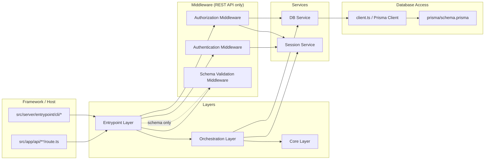
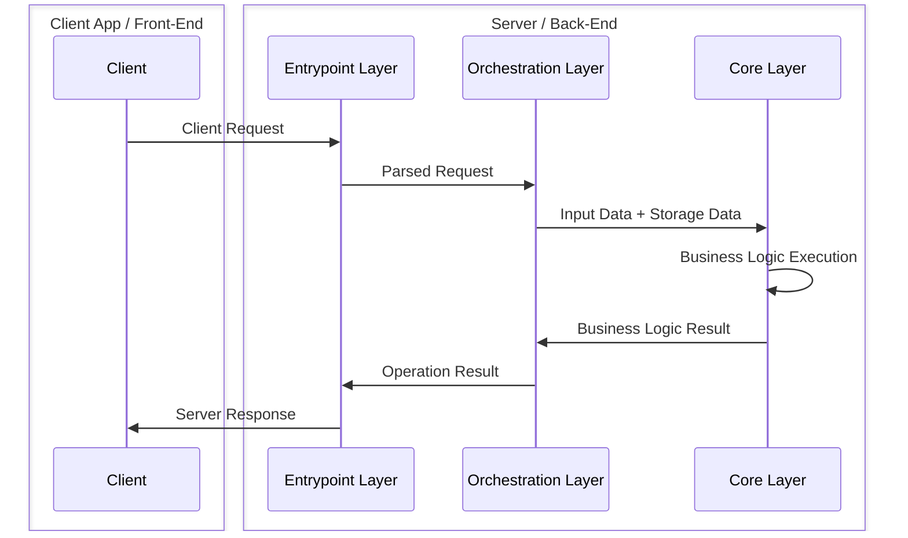
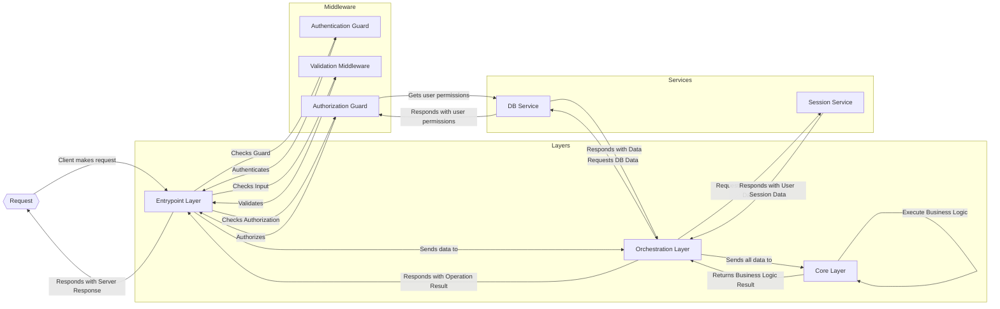
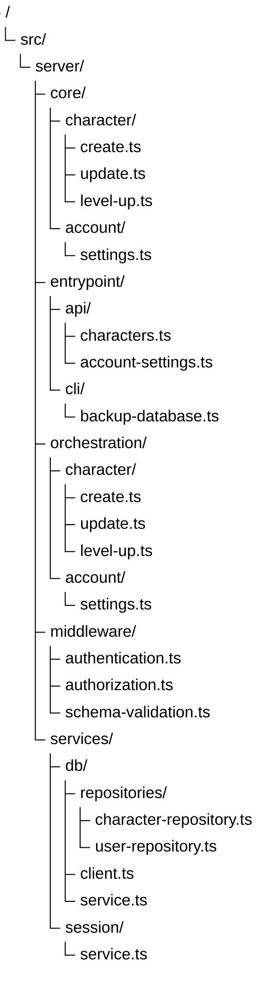

# Proposal: Backend Architecture Redesign

# Summary 
This documents aims to provide a comprehensive path for restructuring the backend architecture with one proposed architecture in order to simplify the development and make the data flow less obfuscated.

# Problem Statement
There is a problem of **overengineering** in the current backend codebase. 

The current architecture is a modular monolith with a layered, hexagonal-style structure, where business logic is isolated from framework and database details through ports and adapters, as documented in docs/architecture/app-architecture.md. 
The runtime layers are:
- Transport (`src/app/api/**/*` and `src/server/cli/*`) for request/argument parsing, response envelopes, and error-to-HTTP/CLI mapping;
- Application (`src/server/application/*`) for use-case orchestration, auth/authz enforcement, and transaction-aware workflows;
- Domain (`src/server/domain/*`) for pure business rules and invariants; 
- Ports (`src/server/ports/*`) for infrastructure contracts such as repositories, rules catalog, and session context; 
- Adapters (`src/server/adapters/*`) for concrete implementations like Prisma repositories, Better Auth session context, and derived catalog readers; 
- Composition (`src/server/composition/*`) for config-driven wiring and service construction. 
Supporting backend subsystems include `src/server/import/*`for rules ingestion/publish pipelines. HTTP transport lives in Next route handlers under src/app/api/**/*, which call application use-cases (and, in some current routes, directly instantiate adapters).

In theory this looks good, but in practice, this creates noise because of how it is implemented, if you check actual `route.ts` files, you will see miles long code that uses the factory pattern to try and make it abstractible while still making the route files the main source of logic. Separation of concerns is blurry and the governance of those areas isn't properly defined.

# Goals 
By the end of the implementation of this proposal, the backend should have a more understandeable and simpler structure, with its currently implemented endpoints fully migrated and the features that rely on those endpoints thoroughly tested.

# Scope

**In Scope**: Backend code, everything that lives inside `src/server/` is subject to this rewrite. Code inside `src/app/api/**/*` is to be refactored to consume the code from `src/server/`.
Also, stuff that lives outside `src/server/` but that consumes it somehow (be it as making the requests or importing code) should be refactored to comply with the new architecture.

**Out of Scope**: Front-end work, data presentation, implementation of features that are still not existant.

# Proposed Architecture
Separate the architecture into different boundaries, the application will be separated in **layers**, using **services** and **middleware** for checks/parsing in between those layers, making the separation of concerns more clear and avoiding visual noise of use cases/ports/adapters/domain/composition.

## Boundaries and their Responsibilities
### Layers
Layers are the mandatory architectural boundaries an operation passes through from transport input to business execution and final output. Each layer has a fixed responsibility and a clear contract with the layers around it.

#### Entrypoint Layer
The Entrypoint Layer is the boundary between external callers of the backend and the internal backend layers and services. It owns the backend entrypoints, currently exposed through the **REST API** and the **CLI**, with the **REST API** as the primary entrypoint model.

This layer receives transport-specific input, applies the transport-level processing required for that entrypoint, and then invokes the appropriate Orchestration Layer operation. Depending on the entrypoint, this may include parsing, normalization, schema validation, authentication, and entrypoint-level authorization checks. Not every entrypoint must go through every step: for example, a `GET` route may not require request body schema validation, and some entrypoints may not require authentication or authorization.

This layer also owns transport-specific output handling. It receives results from the internal layers and transforms them into the appropriate output for the caller, such as HTTP responses for REST clients or text written to `stdout` plus exit codes for CLI clients. It also maps internal errors into transport-appropriate failures.

This layer may use **middleware** for concerns shared across multiple entrypoints. Middleware is restricted to this layer and must not be used outside it.

The shape of this layer is primarily **Next.js backend route handlers** for REST API entrypoints, with CLI command handlers as a secondary form. REST API entrypoint implementations must live under `src/server/entrypoint/**`, while files under `src/app/api/**` are limited to wiring those implementations into the Next.js routing system.

Shared entrypoint concerns are composed using **`@nextwrappers/core`**. Wrappers should be composed through the package’s wrapper-composition model (`stack`, `chain`, or `merge`, as appropriate). Shared concerns such as authentication, authorization, and schema validation should therefore be implemented as wrapper factories and then composed onto the route handler.

Middleware in this layer is constructed through **factory functions**. Shared concerns such as `authentication()`, `authorization()`, and `schemaValidation(schema)` must be expressed as factories returning wrappers. Even when a wrapper does not currently require input, it should still follow the factory pattern for consistency.

**Item**: Entrypoint  
**Description**: An entrypoint is a single externally invocable backend operation. For the REST API, this is implemented as a Next.js route-handler module under `src/server/entrypoint/api/**`, exposing one or more HTTP method handlers for a route. For the CLI, it is implemented as a single command handler function under `src/server/entrypoint/cli`.

**Shape**:
- **Primary implementation form**: Next.js backend route handlers for REST API entrypoints
- **Implementation location**: entrypoint implementations live under `src/server/entrypoint/**`
- **Framework wiring location**: `src/app/api/**` files only expose those entrypoints to the Next.js routing system
- **REST API structure**: each API entrypoint is implemented as an exported object whose keys are HTTP methods (`GET`, `POST`, `PATCH`, etc.) and whose values are route handlers
- **Route export model**: framework `route.ts` files re-export the HTTP method handlers required by Next.js from the corresponding entrypoint module
- **CLI structure**: CLI entrypoints are implemented as transport-facing command functions under the same layer, but are secondary to the REST API model
- **Middleware model**: shared entrypoint concerns are composed through `@nextwrappers/core` wrapper composition
- **Middleware construction model**: shared entrypoint concerns are implemented as factory functions returning wrappers
- **Traceability model**: each entrypoint implementation should declare the route it implements through TSDoc `@implements`, instead of requiring deep folder nesting for route parity
- **Purity model**: non-pure, since entrypoints receive external input and produce transport-specific output
- **Dependency model**: invokes Orchestration Layer operations and may compose wrappers restricted to this layer

**Example**:

- **REST API**
  Framework route file: `src/app/api/character/route.ts`
  Entrypoint implementation: `src/server/entrypoint/api/character.ts`
  Framework wiring:
  `export const GET = CharacterApiEntrypoint.GET`
  `export const POST = CharacterApiEntrypoint.POST`
  Implemented methods: `GET`, `POST`
  Wrapper composition: `stack(authentication()).with(authorization(), schemaValidation(createCharacterSchema))`
  Output: HTTP response

- **CLI**
  Entrypoint implementation: `src/server/entrypoint/cli/backup-database.ts`
  Framework wiring: package.json script `"ops:backup-database": "src/server/entrypoint/cli/backup-database.ts"`
  Usage: `ops:backup-database ./path-to-save-backup-file/`
  Output: text to `stdout` plus exit code

**Responsibilities**:

- Receive HTTP requests and CLI invocations
- Parse, normalize, and schema-validate transport-specific input
- Apply entrypoint-level authentication and authorization checks where required
- Invoke the appropriate Orchestration Layer operation with normalized input
- Transform internal results into transport-specific outputs
- Map internal errors into HTTP responses or CLI exit codes/messages
- Compose shared entrypoint concerns through `@nextwrappers/core` wrappers
- Keep framework route files limited to wiring entrypoint implementations into the host framework

**Non-responsibilities**:

- Business rule execution
- Domain validation and invariants
- Workflow orchestration
- Direct persistence logic
- Business logic inside framework route files under `src/app/api/**`

#### Orchestration Layer

The Orchestration Layer is the boundary between the Entrypoint Layer and the Core Layer. It owns the execution of application operations.

This layer receives normalized input from the Entrypoint Layer, gathers the data required for the operation through services, invokes the appropriate Core Layer item, and coordinates any follow-up steps required to complete the operation. This may include reading from data sources, persisting changes, invoking external integrations, and assembling the final operation result.

On success, this layer returns the operation payload typed as `OperationResult<T>`, where `OperationResult<T>` is an identity type alias for the successful result of the operation. That result is later transformed by the Entrypoint Layer into an HTTP response or a CLI output. On failure, this layer does not return an `OperationResult`; it throws typed errors based on the nature of the failure. Those errors are translated by the Entrypoint Layer into transport-appropriate failures.

This layer uses **services** to interact with infrastructure and external capabilities. For now, this mainly includes the **DB Service**, but it may also include other infrastructure services such as third-party APIs, file storage, external modules, or other runtime dependencies.

**Item**: Orchestrator
**Description**: An orchestrator is a single application operation implemented as a plain TypeScript function. It coordinates the data gathering and execution required for one backend operation, returns an `OperationResult<T>` on success, and throws typed errors on failure. Those errors are translated into transport-appropriate failures by the Entrypoint Layer.

**Shape**:
- **Implementation form**: asynchronous plain TypeScript function
- **Purity model**: non-pure function, since it coordinates reads, writes, and external interactions through services
- **Data contract form**: typed input and typed success payload output, expressed as `OperationResult<T>`
- **Dependency model**: directly imports services and invokes Core Layer functions

**Example**:

- **Create Character Function**
  Signature: `async function createCharacterOrchestrator(input: CreateCharacterInput): Promise<OperationResult<Character>>`
  Usage: `await createCharacterOrchestrator(sanitizedBody);`
  Input: normalized request data for character creation
  Uses: DB Service to load required data and persist results
  Invokes: appropriate Core Layer item for character creation rules
  Output: `OperationResult`

**Responsibilities**:

- Receive normalized input from the Entrypoint Layer
- Coordinate the execution of one application operation (Create Character / Save Character / List Characters...)
- Read required data through services
- Invoke the appropriate Core Layer item
- Persist resulting changes through services where required
- Assemble and return the typed success payload for the operation on success

**Non-responsibilities**:

- Transport-specific parsing or response shaping
- Business rule definition
- Domain validation and invariants
- Direct framework concerns
- Shared infrastructure setup

#### Core Layer

The Core Layer is the boundary where the backend’s business rules are defined and executed. It owns the application’s domain logic.

This layer receives already-gathered data and normalized input from the Orchestration Layer and applies the business rules required for the operation. It is responsible for deciding whether an operation is valid under the domain rules and what the business outcome of that operation should be.

The shape of this layer is **pure functions** operating on explicitly typed data. Core items must be implemented as plain TypeScript functions, and their inputs and outputs must be described through **interfaces** that define the data contracts of each operation. These functions must not depend on transport mechanisms, framework APIs, database clients, infrastructure services, or hidden shared state. For the same input, they must always produce the same output or throw the same typed domain error.

This layer does not gather data by itself. All data required for rule evaluation must be provided to it explicitly by the Orchestration Layer. Core logic must therefore be fully expressible as function input, function output, and typed domain errors.

**Item**: Core Function  
**Description**: A Core Function is a pure TypeScript function that implements a focused business rule or domain operation. It receives all required data explicitly through typed interfaces, applies domain rules, returns a domain result on success, and throws typed domain errors on failure.

**Shape**:
- **Implementation form**: pure function
- **Data contract form**: TypeScript interfaces for input and output typing
- **Dependency model**: explicit data input only, no infrastructure or framework dependencies
- **Purity model**: pure function, deterministic for the same input

**Example**:

- **Create Character Core Function**  
  Signature: `function createCharacterCore(input: CreateCharacterCoreInput): CreateCharacterCoreResult`  
  Usage: `const result = createCharacterCore(coreInput);`  
  Input Contract: `interface CreateCharacterCoreInput { ... }`  
  Output Contract: `interface CreateCharacterCoreResult { ... }`  
  Output: domain result to be consumed by the Orchestration Layer

- **Validate Character Progression Function**  
  Signature: `function validateCharacterProgression(input: ValidateCharacterProgressionInput): ValidateCharacterProgressionResult`  
  Usage: `const result = validateCharacterProgression(coreInput);`  
  Input Contract: `interface ValidateCharacterProgressionInput { ... }`  
  Output Contract: `interface ValidateCharacterProgressionResult { ... }`  
  Output: validated domain result

**Responsibilities**:

- Define and execute business rules
- Evaluate domain invariants and consistency rules
- Decide whether an operation is valid under application rules
- Produce domain-level results from explicit typed input
- Throw typed domain errors when business rules are violated
- Remain pure and deterministic for the same input
- Express business operations through pure functions and typed interfaces

**Non-responsibilities**:

- Transport-specific parsing or response shaping
- Authentication or entrypoint-level authorization checks
- Reading from or writing to data sources
- Calling infrastructure services or external integrations
- Dependency construction or application wiring
- Framework-specific concerns
- Hidden shared state or mutable runtime context

### Middleware
Middlewares are reusable **Entrypoint Layer** wrappers used to apply shared transport-level concerns before an Orchestration Layer operation is invoked. Middleware is restricted to the Entrypoint Layer and must not be used outside it.

In this architecture, middleware is used for concerns such as authentication, authorization, and schema validation. It is composed through **`@nextwrappers/core`**, implemented through wrapper factories, and may use services when required for entrypoint-level checks. Middleware must not contain business logic or orchestration.

**Item**: Middleware  
**Description**: Middleware is a wrapper applied to a REST API entrypoint handler to execute one focused transport-level concern before the underlying operation is invoked.

#### Common Attributes
These are attributes that apply to all the middlewares listed below:

**Shape**:
- **Implementation form**: wrapper returned by a factory function
- **Composition model**: composed through `@nextwrappers/core`
- **Purity model**: non-pure, since middleware may inspect requests, resolve caller/session data, and terminate requests early
- **Data contract form**: REST API request/response handling
- **Dependency model**: may use services required for entrypoint-level concerns, but must not invoke Orchestration Layer operations or Core Layer functions directly
- **Execution model**: executes before the route handler and either passes control forward or short-circuits the request

**Responsibilities**:

- Apply one focused transport-level concern before route-handler execution
- Inspect REST API request data when required by that concern
- Pass control to the next wrapper or route handler when the check succeeds
- Terminate the request early with a transport-appropriate failure when the check fails

**Non-responsibilities**:

- Business rule execution
- Domain validation and invariants
- Workflow orchestration
- Direct persistence as part of business operations
- Calling Core Layer functions
- Invoking Orchestration Layer operations
- Use outside the Entrypoint Layer

#### Authentication Middleware

Authentication Middleware is responsible for determining the identity of the caller at the entrypoint boundary.

Its role is to resolve whether the request is associated with an authenticated caller and, when successful, make that caller context available to the rest of the entrypoint pipeline. It should only answer questions related to authentication state, such as whether a caller is logged in and who that caller is.

Authenticated caller context is owned by the Session Service. Middleware should resolve or require that context through the service, while wrapper-to-handler propagation is delegated to `@nextwrappers/core`.

Authentication Middleware may use session-oriented services or framework-specific mechanisms required to resolve the current caller. It must not contain business rules and must not decide whether the authenticated caller is allowed to perform a business action beyond the coarse entrypoint requirement that authentication is present.

**Item**: Authentication Middleware  
**Description**: A middleware wrapper that resolves and enforces authenticated caller identity before the route handler is executed.

**Responsibilities**:

- Resolve the caller identity at the entrypoint boundary
- Enforce authentication when the route requires it
- Stop the request with a transport-appropriate failure when authentication is missing or invalid
- Provide authenticated caller context to later entrypoint processing when successful

**Non-responsibilities**:

- Business authorization decisions
- Domain rule execution
- Workflow orchestration
- Persistence unrelated to authentication/session lookup

#### Authorization Middleware

Authorization Middleware is responsible for entrypoint-level authorization checks.

Its role is to decide whether a caller may proceed into the requested operation at the transport boundary. These checks are coarse-grained access checks, not domain/business rule evaluation.

**Item**: Authorization Middleware  
**Description**: A middleware wrapper that enforces entrypoint-level access checks before the route handler is executed.

**Responsibilities**:

- Enforce entrypoint-level access checks
- Decide whether the request may proceed at the transport boundary
- Stop the request with a transport-appropriate failure when access is denied
- Use supporting services when needed to resolve permissions or route-level access requirements

**Non-responsibilities**:

- Business authorization logic tied to domain invariants
- Domain rule execution
- Workflow orchestration
- Direct persistence as part of business operations

#### Schema Validation Middleware

Schema Validation Middleware is responsible for schema validation of REST API input.

Its role is to ensure that incoming request data matches the shape expected by the entrypoint before the request reaches the Orchestration Layer.

**Item**: Schema Validation Middleware  
**Description**: A middleware wrapper that validates request input against a schema before the route handler is executed.

**Responsibilities**:

- Validate request input against the expected schema
- Reject malformed or structurally invalid input before operation execution
- Normalize or expose validated input for later entrypoint processing where appropriate
- Stop the request with a transport-appropriate failure when schema validation fails

**Non-responsibilities**:

- Domain validation and invariants
- Business rule execution
- Workflow orchestration
- Authentication or authorization decisions unless explicitly composed with other middleware

### Services
Services are reusable backend modules used to interact with infrastructure and external capabilities. They exist to keep data access, session resolution, and other infrastructure-facing concerns out of the Core Layer, while making them available to the Orchestration Layer and, when required, to Entrypoint Layer middleware.

In this architecture, services are not layers and do not define business outcomes by themselves. Their role is to provide access to capabilities the application needs in order to execute an operation, such as persistence, session lookup, external API communication, file handling, or other runtime integrations.

Services are defined by the capability they expose, not by a fixed implementation pattern. They may take any internal shape required to fulfill their purpose, such as repositories, active-record-like helpers, external-library wrappers, or rules providers. What makes something a service in this architecture is its role, not its internal structure.

Services are primarily consumed by the **Orchestration Layer**, which uses them to gather data, persist changes, and interact with external systems. Some services may also be used by **Middleware** when needed for entrypoint-level concerns such as authentication or authorization. Services must not be used by the **Core Layer**.

**Item**: Service  
**Description**: A service is a reusable backend module that exposes infrastructure-facing or integration-facing capabilities to other parts of the backend.

#### Common Attributes
These are attributes that apply to all the services listed below:

**Shape**:
- **Implementation form**: implementation-defined; may be a plain TypeScript module, exported service object, wrapper, repository group, or other structure appropriate to the capability
- **Purity model**: non-pure, since services interact with infrastructure and external systems
- **Data contract form**: typed methods with typed input and output contracts
- **Dependency model**: may depend on databases, authentication/session providers, storage providers, external APIs, or other runtime integrations
- **Consumption model**: primarily used by the Orchestration Layer, and secondarily by Entrypoint Layer middleware when required for entrypoint-level concerns

**Responsibilities**:

- Expose reusable infrastructure-facing capabilities
- Read from and write to data sources when required
- Resolve session or caller-related data when required
- Encapsulate access to external systems and runtime integrations
- Provide typed operations that can be reused across backend operations

**Non-responsibilities**:

- Business rule execution
- Domain validation and invariants
- Workflow orchestration
- Transport-specific parsing or response shaping
- Defining business outcomes
- Use from the Core Layer

#### DB Service

DB Service is responsible for database-facing capabilities required by the backend.

This project uses **Prisma** as its database access layer, with the schema defined under `prisma/schema.prisma`. The current database is **SQLite**, with the intention of moving to **PostgreSQL** later. Because of that, portability is a design requirement for this service: DB Service must expose application-facing persistence capabilities without leaking SQLite-specific or PostgreSQL-specific behavior into the rest of the backend.

DB Service exists to keep direct database access out of the Core Layer and out of most Entrypoint Layer code. Its primary consumers are Orchestration Layer operations, which use it to read and persist data required to execute backend operations. Some middleware may also use it when an entrypoint-level concern requires database-backed access checks.

In this architecture, DB Service is implemented as a **module/namespace exporting repository classes**. Those repository classes use a centrally defined Prisma client from a shared `client.ts` file. This keeps database access consistent across the backend while preserving a single integration point for Prisma. All repository operations must be wrapped in transactions.

**Item**: DB Service  
**Description**: A service that exposes reusable, typed database-facing capabilities through repository classes backed by a centrally managed Prisma client.

**Shape**:
- **Implementation form**: module/namespace exporting repository classes, e.g. `DBService.characters`, `DBService.users`, `DBService.campaigns`
- **Purity model**: non-pure, since it reads from and writes to the database
- **Data contract form**: repository classes exposing typed persistence operations
- **Dependency model**: repository classes depend on the Prisma client defined centrally in `client.ts`, which is backed by the Prisma schema defined under `prisma/schema.prisma`
- **Portability model**: must avoid exposing connector-specific assumptions that would make migration from SQLite to PostgreSQL harder

**Responsibilities**:

- Expose reusable database-facing capabilities to backend consumers
- Read application data required by backend operations
- Persist application data required by backend operations
- Encapsulate Prisma-specific access details behind repository classes
- Reuse the centrally defined Prisma client for consistent database access
- Preserve database portability by avoiding leakage of SQLite-specific or PostgreSQL-specific details into higher layers
- Provide typed persistence operations that can be reused across orchestrators and, when needed, middleware

**Non-responsibilities**:

- Business rule execution
- Domain validation and invariants
- Workflow orchestration
- Transport-specific parsing or response shaping
- Authentication/session resolution unless explicitly part of persisted access data
- Defining business outcomes
- Use from the Core Layer

#### Session Service

Session Service is responsible for session-related and caller-related capabilities required by the backend.

This project currently uses **Better Auth** for authentication and authorization. The current wiring is considered insufficiently structured, so this service exists to concentrate session resolution and caller-related access behind a reusable backend-facing interface. Better Auth should remain an implementation detail of this service rather than a dependency scattered across entrypoints, middleware, and orchestrators.

Session Service exists to keep direct session-provider access out of the Core Layer and out of most Entrypoint Layer code. Its primary consumers are the Authentication and Authorization Middleware, which use it for entrypoint-level checks, and the Orchestration Layer, which may use it when an application operation needs caller or session data.

Authenticated caller context is considered part of the Session Service boundary. Middleware and orchestrators should obtain caller/session context through this service rather than defining parallel context-passing mechanisms of their own.

In this architecture, Session Service is defined by the session capability it exposes, not by Better Auth itself. While the current implementation is backed by **Better Auth**, the rest of the backend should depend on the service’s typed capabilities rather than on Better Auth APIs directly. This preserves the option to rework or replace the authentication/session provider later without forcing architectural changes across the backend.

**Item**: Session Service  
**Description**: A service that exposes reusable, typed session- and caller-related capabilities backed by the current authentication provider.

**Shape**:
- **Implementation form**: module/namespace exporting session- and caller-resolution capabilities, e.g. `SessionService.getCurrentSession`, `SessionService.getCurrentUser`, `SessionService.requireSession`
- **Purity model**: non-pure, since it resolves session and caller state from external request/session infrastructure
- **Data contract form**: typed methods exposing session- and caller-related capabilities
- **Dependency model**: depends on the current authentication/session provider, currently Better Auth
- **Provider-isolation model**: Better Auth-specific wiring must remain inside this service and must not leak into higher layers

**Responsibilities**:

- Expose reusable session-related and caller-related capabilities to backend consumers
- Resolve current session information when required
- Resolve current caller/user information when required
- Support entrypoint-level authentication checks through middleware consumption
- Support entrypoint-level authorization checks when caller/session context is required
- Encapsulate Better Auth-specific session access behind a stable backend-facing interface
- Provide typed session operations that can be reused across middleware and orchestrators

**Non-responsibilities**:

- Business rule execution
- Domain validation and invariants
- Workflow orchestration
- Transport-specific parsing or response shaping
- Defining business outcomes
- Use from the Core Layer

## Diagrams

### Entity Dependency Graph

### Request Data Flow

### Request Lifecycle

# Implementation Guidelines

## Folder Structure

## Error Handling

### Error Taxonomy

Errors in this architecture are organized as a **taxonomy of typed error families**. Each architectural boundary owns its own family of errors, and each family represents failures that are meaningful at that boundary.

The purpose of this taxonomy is to make failures:
- easier to debug
- easier to classify
- easier to map into transport-appropriate failures
- easier to keep consistent across the backend

This taxonomy distinguishes between:
- **Expected operational errors**: typed failures that represent known and handled failure cases
- **Unexpected internal failures**: unclassified bugs, broken assumptions, or unexpected exceptions that should be logged and surfaced as generic internal failures

The Entrypoint Layer is responsible for mapping internal typed errors into HTTP responses or CLI failures. Lower layers and supporting boundaries should throw typed errors appropriate to their own responsibility.

#### Common Rules

**General principles**:

- Every boundary may define and throw its own typed error family
- Errors must be classified by **where they originate** and **what kind of failure they represent**
- Errors should be translated upward when crossing a boundary if their original type is too implementation-specific
- Unexpected/untyped exceptions should never be surfaced directly to external callers
- The Entrypoint Layer is the only boundary that maps internal errors to HTTP responses or CLI failures

**Expected vs Unexpected**:

- **Expected operational errors** are known failure modes, such as invalid input, missing authentication, missing records, business rule violations, or service dependency failures
- **Unexpected internal failures** are programming mistakes, broken invariants, unhandled edge cases, or unclassified dependency failures
- Unexpected failures must be logged internally and mapped to a generic internal failure at the Entrypoint Layer

**Base error contract**:

All typed errors in this taxonomy should expose, at minimum:
- `code`: a stable machine-readable error code
- `entity`: the boundary or source family that owns the error (e.g. `entrypoint`, `middleware`, `orchestration`, `core`, `db-service`, `session-service`)
- `message`: a human-readable description of the failure

Stack traces are provided by the runtime and do not need to be redefined as part of the taxonomy contract.

#### Error Families

##### Entrypoint Errors

Entrypoint Errors represent failures that occur at the transport boundary before or while invoking an Orchestration Layer operation.

These errors include transport-facing failures such as malformed request input, unsupported transport state, or transport-specific output/mapping failures.

**Examples**:
- `MalformedRequestError`
- `UnsupportedMethodError`
- `ResponseMappingError`

**Responsibilities**:

- Represent transport-boundary failures
- Preserve transport-specific meaning for the Entrypoint Layer
- Be mapped directly into transport-appropriate failures

##### Middleware Errors

Middleware Errors represent failures that occur while applying a shared transport-level concern in the Entrypoint Layer.

Each middleware family owns its own error subfamily.

###### Authentication Middleware Errors
These errors represent authentication failures at the entrypoint boundary.

**Examples**:
- `MissingAuthenticationError`
- `InvalidSessionError`
- `ExpiredSessionError`

###### Authorization Middleware Errors
These errors represent coarse-grained entrypoint-level access failures.

**Examples**:
- `AccessDeniedError`
- `MissingPermissionError`
- `ForbiddenRouteError`

###### Schema Validation Middleware Errors
These errors represent request-shape/schema failures.

**Examples**:
- `SchemaValidationError`
- `MalformedBodyError`
- `InvalidQueryParameterError`

**Responsibilities of Middleware Errors**:

- Represent entrypoint-level failures before orchestration begins
- Stop request processing early when required
- Preserve enough detail for debugging and transport mapping

##### Orchestration Errors

Orchestration Errors represent failures that occur while executing an application operation.

This family owns operational failures such as missing records, conflicts, dependency failures, and failures encountered while coordinating services or Core Layer operations.

This family also owns **not found** errors.

**Examples**:
- `CharacterNotFoundError`
- `UserNotFoundError`
- `OperationConflictError`
- `DependencyFailureError`
- `PersistenceFailureError`
- `ExternalServiceFailureError`

**Responsibilities**:

- Represent operation-level failures during execution
- Classify missing-data failures such as `NotFound`
- Represent failures that arise while coordinating services and core logic
- Translate service-specific failures into operation-meaningful failures when appropriate

##### Core Errors

Core Errors represent business-rule violations and domain-invalid operations.

This family is restricted to domain meaning only. Core Errors must not represent transport failures, persistence failures, or infrastructure failures.

**Examples**:
- `InvalidCharacterBuildError`
- `IncompatibleTraitsError`
- `ProgressionRuleViolationError`
- `DomainInvariantViolationError`

**Responsibilities**:

- Represent business-rule violations
- Represent invalid operations under domain rules
- Preserve pure domain meaning independent of infrastructure or transport

##### Service Errors

Service Errors represent failures specific to a service boundary. Services are allowed to throw service-specific typed errors for debugging clarity.

These errors should remain meaningful inside the service boundary, but may be translated upward by Orchestration when a higher-level application meaning exists.

###### DB Service Errors
DB Service Errors represent persistence and database-access failures.

**Examples**:
- `DatabaseConnectionError`
- `QueryExecutionError`
- `TransactionFailureError`
- `ConstraintViolationError`

`NotFound` does **not** belong to DB Service by default in this taxonomy. If a record lookup completes successfully and returns no record, the operation-level classification of that absence belongs to the Orchestration Layer.

###### Session Service Errors
Session Service Errors represent failures in session and caller resolution.

**Examples**:
- `SessionProviderUnavailableError`
- `SessionResolutionError`
- `CallerResolutionError`

**Responsibilities of Service Errors**:

- Represent service-specific operational failures
- Preserve debugging detail inside the service boundary
- Be translated upward when a higher-level orchestration error is more appropriate

#### Transport Mapping

The Entrypoint Layer maps internal typed errors into HTTP responses.

The following mapping rules apply by default:

- **Schema Validation Middleware Errors** → `400 Bad Request`
- **Authentication Middleware Errors** → `401 Unauthorized`
- **Authorization Middleware Errors** → `403 Forbidden`
- **Orchestration NotFound Errors** → `404 Not Found`
- **Core Errors (business-rule violations)** → `422 Unprocessable Entity`
- **Orchestration conflict errors** → `409 Conflict`
- **Service dependency failures** that prevent operation execution → `500 Internal Server Error` or `503 Service Unavailable`, depending on whether the dependency failure is considered internal or unavailable
- **Unexpected internal failures** → `500 Internal Server Error`

These mappings define the default behavior. Specific entrypoints may refine their HTTP response body structure, but they should not redefine the taxonomy itself.

#### Boundary Translation Rules

Errors may be translated when crossing a boundary.

**Translation rules**:

- Middleware may throw middleware-specific errors directly
- Services may throw service-specific errors directly
- Orchestration may catch service-specific errors and translate them into orchestration-level errors when the operation meaning is clearer at that level
- Core errors should remain Core errors and should not be rewritten as service or transport errors
- Entrypoint should map errors to transport failures, but should not redefine their internal meaning

#### Catch-All Internal Failure

Any failure that does not match a known typed error family must be treated as an unexpected internal failure.

Unexpected internal failures must:
- be logged with full debugging context
- be hidden from external callers behind a generic internal failure response
- be candidates for later promotion into a typed error if they become a known operational case

## Code Standards
This redesign will include new coding standards to the backend code, those should be recorded in the `.rulesync/` folder as new rules or edits to the existing rules.

### Functions over classes
Functions are the new first-class citizen, this is because they are easier to maintain and keep a single responsibility. Use functions or function collections (objects with functions as properties) before classes.

### Prefer immutability
Avoid mutating variables, immutability gives better traceability over data flow.

### Code comments: "Why" instead of "what"
Generally, code should be simple enough that it can be understood on its own without comments. But sometimes a coding decision can be a bit confusing or unorthodox, in cases like that, comments are allowed for answering _why_ it was done that way. Comments explaining _what_ is being done should still be avoided.

### Avoid Shared State
Same problem than with mutability, shared state is harder to track, prefer passing through parameters when possible, if not possible, use code comments stating _why_ we need this shared state.

### Architecture is not to be tampered with
The defined architecture is the main structure, do NOT deviate under any circumstances. If you find work that cannot be accomplished under this architecture, stop, inform of the problem and do NOT proceed until you have direct and explict approval or a redirection plan.  

### Keep parity among layers
One endpoint has one validator, one orchestrator, one or more core modules, if one endpoint has more than one orchestrator, it is doing too much. if it has more than one validator, unify them. if it has too many core functionalities (+3), it is doing too much.

### Avoid introducing extra patterns, follow KISS
Introducing new patterns creates noise and code smell. Reuse the patterns we already have when possible, scan the project to see which patterns are used before inventing something new.

### Type your code
All code should have proper typing, do not use `any`, avoid `unknown`.

### Test your code 
As a rule of thumb, everything under `src/server` should have useful unit testing.
