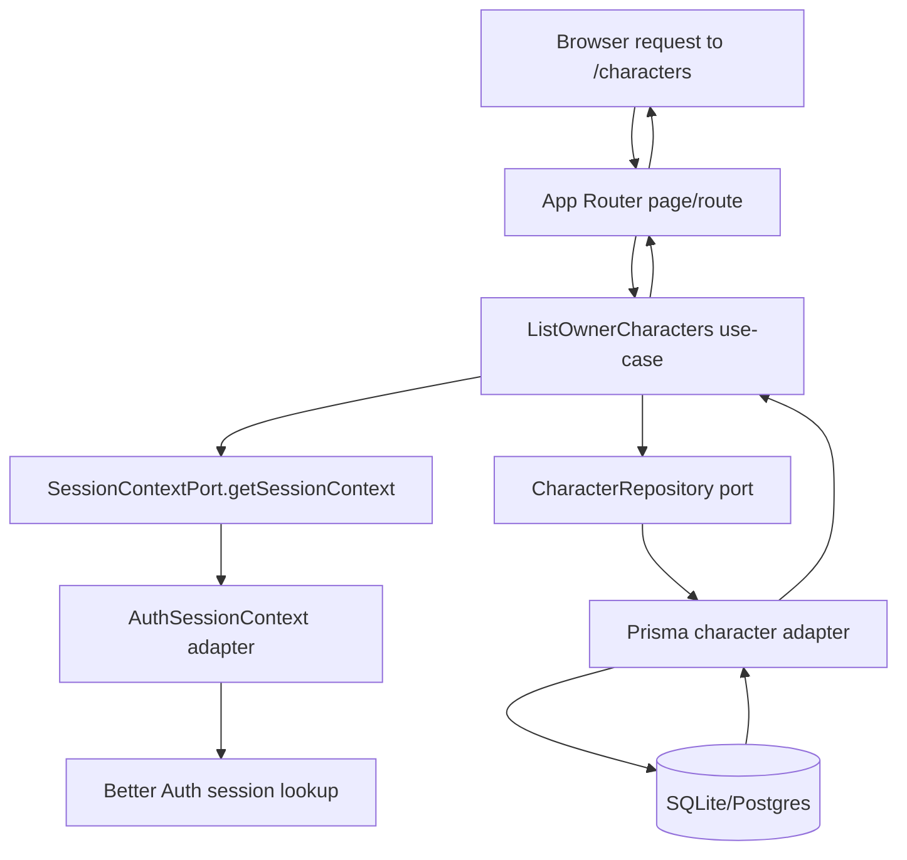
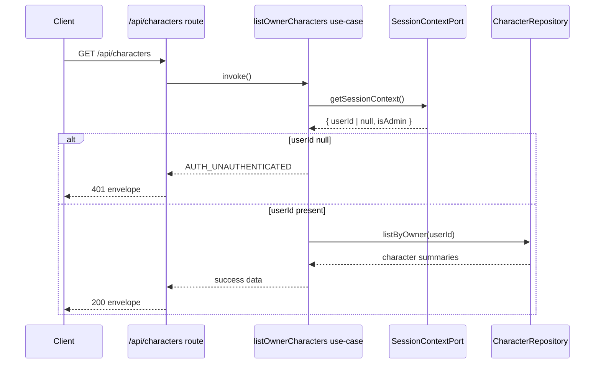
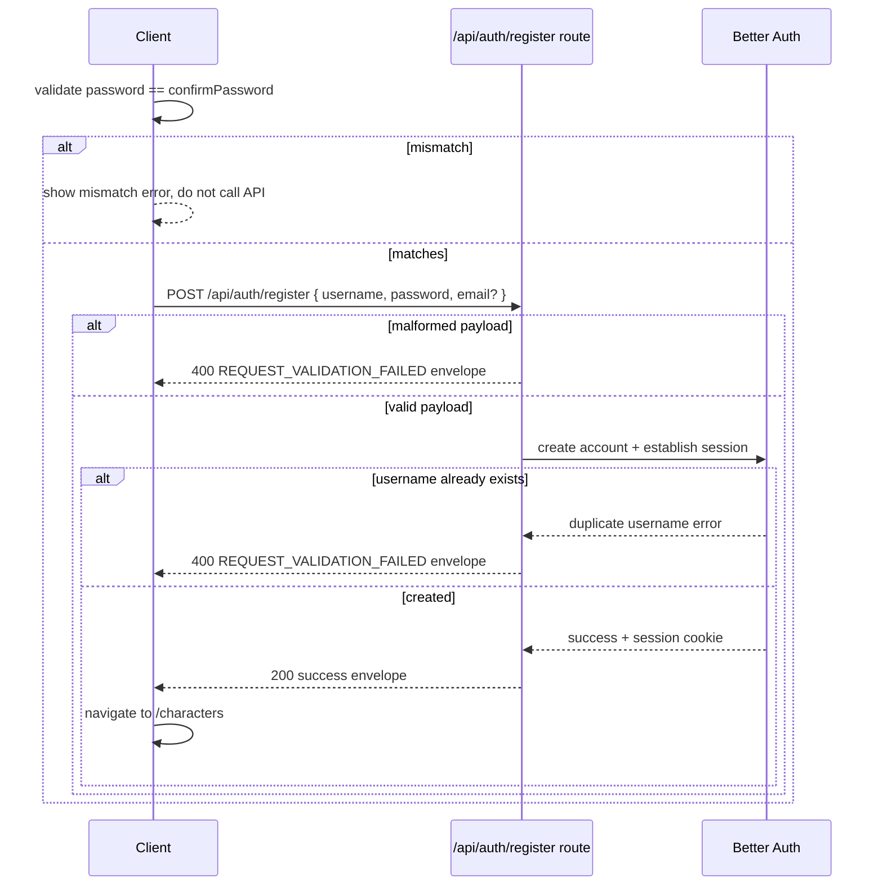

# Implementation Plan: Authentication and Identity Foundation (Phase 1)

## Metadata

- Status: `ready`
- Created At: `2026-04-05`
- Last Updated: `2026-04-05`
- Owner: `Antony Acosta`

## Changelog

- `2026-04-05` - `Antony Acosta` - Created the Phase 1 implementation plan with sequenced vertical slices for username/password auth, ownership enforcement, `/characters` protection, and API-error-contract-aligned deny behavior.
- `2026-04-05` - `Antony Acosta` - Updated Phase 1 scope to explicitly include MVP self-service registration (username + password, optional email), plus registration-focused flow, edge-case, and verification coverage.
- `2026-04-05` - `Antony Acosta` - Updated registration execution details to include client-side password confirmation and automatic post-registration session establishment with direct transition to authenticated routes.

## Goal

- Implement the first production-safe authentication and identity slice so the app can distinguish signed-out users from signed-in owners and enforce that boundary before character data access.
- Include MVP self-service registration in the same foundation slice so new users can create accounts with `username` + `password` and optional `email`.
- Deliver the first protected route (`/characters`) end-to-end with deterministic signed-out behavior and owner-scoped results.
- Lock identity persistence rules for MVP (`username` unique, `email` nullable, no email-verification gate) so future character features can safely build on stable ownership semantics.

In scope (this plan implements now):

- Better Auth credential flow configured for username + password.
- Self-service registration surface wired end-to-end (UI/client submission + server handling) for `username` + `password` with optional `email`.
- Registration UX performs basic password confirmation before API submission.
- Successful registration immediately establishes session state and transitions user into authenticated route behavior.
- Identity schema updates for unique usernames and nullable emails.
- Session resolution and owner checks enforced in application use-cases before repository calls.
- First character ownership repository/use-case path for `/characters`.
- API/route deny-path behavior mapped to `docs/architecture/api-error-contract.md` codes.
- Tests and manual checks for registration validation plus signed-out, owner, and cross-user paths.

Out of scope (intentionally deferred):

- Email verification and password-reset flows.
- OAuth/social providers.
- Multi-user collaboration/tenant models.
- Admin console behavior beyond current `isAdmin` flag shape.
- Character creation/edit UX beyond the minimal protected list/read path needed to validate authn/authz foundations.

Completion criteria:

- User persistence enforces unique `username` and allows `email = null` without blocking account creation.
- Registration creates an account for valid `username` + `password` (+ optional `email`) and rejects malformed payloads/duplicate usernames with contract-aligned validation errors.
- Registration UI blocks password mismatch (`password` vs `confirmPassword`) before API submission.
- Successful registration yields an authenticated session (cookie/session artifacts present) without requiring manual sign-in.
- Username/password sign-in establishes a session that resolves through `SessionContextPort#getSessionContext()`.
- Character-scoped use-cases perform authn then authz checks before repository access.
- `/characters` denies signed-out requests with explicit challenge behavior and renders only owner-scoped records for signed-in requests.
- Duplicate username and auth denial errors return contract-aligned codes/status (`REQUEST_VALIDATION_FAILED` 400, `AUTH_UNAUTHENTICATED` 401, `AUTH_FORBIDDEN` 403).
- Lint and targeted test coverage for allow/deny/validation paths pass.

## Non-Goals

- Full account management UX (profile editing, avatar uploads, account settings).
- Generalized auth middleware for all routes in one pass.
- Phase 2 character domain expansion beyond minimal fields required to prove owner scoping.
- Localization polishing beyond adding required i18n keys for new user-visible copy.

## Related Docs

- `docs/features/authentication-and-identity-foundation.md`
  - Feature-level scope, constraints, and acceptance criteria for this Phase 1 slice.
- `docs/specs/authentication/foundation.md`
  - Implementation contract for identity model, authn/authz ordering, protected-route behavior, and edge cases.
- `docs/architecture/app-architecture.md`
  - Source of truth for layer boundaries, dependency direction, and application-layer authz enforcement.
- `docs/architecture/api-error-contract.md`
  - Canonical error taxonomy and status mapping used by auth-related route handlers.
- `docs/architecture/internationalization.md`
  - Guards locale behavior and translation sourcing for new signed-out/unauthorized user text.
- `docs/STATUS.md`
  - Phase tracking ledger; update only if implementation evidence (not plan-only edits) changes status confidence.

## Existing Code References

- `src/auth.ts`
  - Reuse: Better Auth instance creation and Prisma adapter wiring.
  - Keep consistent: centralized auth provider config in a single module.
  - Do not copy forward: implicit defaults that do not explicitly enforce username/password behavior.

- `src/app/api/auth/[...all]/route.ts`
  - Reuse: App Router Better Auth handler integration.
  - Keep consistent: auth transport wiring stays in route handler boundary.
  - Do not copy forward: unbounded reliance on provider defaults without documented contract tests.

- `src/server/ports/session-context.ts`
  - Reuse: `SessionContextPort` as the only app-layer identity dependency.
  - Keep consistent: nullable signed-out semantics (`userId: null`, `isAdmin: false`).
  - Do not copy forward: any adapter-specific identity assumptions leaking into port types.

- `src/server/adapters/auth/auth-session-context.ts`
  - Reuse: Better Auth session lookup and signed-out fallback behavior.
  - Keep consistent: adapter-internal provider calls, safe default deny posture.
  - Do not copy forward: direct Prisma lookups in application/use-case code.

- `src/server/composition/create-app-services.ts`
  - Reuse: composition-root dependency injection.
  - Keep consistent: application use-cases receive ports/adapters via composition, not global singletons.
  - Do not copy forward: optional runtime services without explicit ownership in auth-aware use-cases.

- `prisma/schema.prisma`
  - Reuse: current Better Auth model baseline and migration workflow.
  - Keep consistent: Prisma-first persistence changes with migration artifacts checked in.
  - Do not copy forward: email-required identity assumptions that conflict with Phase 1 contract.

## Files to Change

- `prisma/schema.prisma` (risk: high)
  - Update `User` model for MVP identity contract:
    - add required unique `username`
    - make `email` nullable while preserving uniqueness semantics for non-null values
    - ensure Better Auth-compatible account/session relations stay intact.
  - Why risk: auth schema changes affect migrations, existing records, and provider expectations.
  - Depends on: Better Auth credential configuration in `src/auth.ts`.

- `src/auth.ts` (risk: medium)
  - Configure username/password auth behavior explicitly (including sign-up/sign-in expectations that align with nullable email).
  - Keep email verification disabled for MVP flows.
  - Why risk: incorrect provider config can silently break session creation.
  - Depends on: updated Prisma user fields.

- `src/app/sign-up/page.tsx` (risk: medium, if already present)
  - Add a minimal registration UI that collects `username`, `password`, `confirmPassword`, and optional `email`, then calls the registration server path.
  - Ensure client-side password confirmation mismatch blocks submission with localized feedback.
  - Must show contract-safe validation feedback for malformed payload and duplicate username.
  - Why risk: incorrect client/server integration can create confusing account-creation failure states.
  - Depends on: finalized registration API behavior and i18n keys.

- `src/server/adapters/auth/auth-session-context.ts` (risk: medium)
  - Keep deterministic signed-out fallback.
  - Normalize adapter/provider failures into predictable authn-failed semantics for higher layers.
  - Why risk: session resolution failures can create fail-open behavior if mishandled.
  - Depends on: finalized auth provider config.

- `src/server/composition/create-app-services.ts` (risk: low)
  - Wire new character repository into app services and use-cases while preserving DI boundaries.
  - Why risk: wiring mistakes can break unrelated startup behavior.
  - Depends on: new ports/adapters/use-case files.

- `src/app/characters/page.tsx` (risk: medium)
  - Enforce route-level signed-out behavior and render owner-scoped character list view model.
  - Why risk: App Router server/client boundaries can leak data if checks happen too late.
  - Depends on: authn/authz-protected character list use-case.

- `messages/en/common.json` and `messages/es/common.json` (risk: low)
  - Add translation keys for registration form labels/errors and signed-out challenge/forbidden helper copy used by `/characters` flow.
  - Why risk: missing-key runtime behavior in production can degrade UX.
  - Depends on: final copy and component usage.

## Files to Create

Persistence and migrations:

- `prisma/migrations/<timestamp>_phase1_auth_identity_foundation/migration.sql`
  - Applies user identity schema changes and any minimal new character ownership table/column required for `/characters`.

Ports:

- `src/server/ports/character-repository.ts`
  - Defines owner-scoped character read contract(s) for Phase 1 (minimum needed for `/characters`).

Adapters:

- `src/server/adapters/prisma/character-repository.ts`
  - Prisma implementation of owner-scoped character access.
  - Must accept validated owner identity from app layer; no implicit auth decisions in adapter.

Application layer:

- `src/server/application/errors/auth-errors.ts`
  - Stable typed authn/authz errors (`AUTH_UNAUTHENTICATED`, `AUTH_FORBIDDEN`) used by route surfaces.

- `src/server/application/use-cases/list-owner-characters.ts`
  - Resolves session context, enforces authn/authz order, then calls character repository for owner-scoped list.

Transport/UI:

- `src/app/api/auth/register/route.ts`
  - Registration endpoint for MVP payload validation and contract error mapping (`REQUEST_VALIDATION_FAILED`, safe `INTERNAL_ERROR`).
  - Delegates account creation and immediate session establishment to configured auth provider behavior while preserving API envelope semantics.

- `src/app/api/characters/route.ts`
  - Contract route for owner-scoped character list using API error envelope semantics.

- `src/app/characters/page.tsx` (if not already present)
  - First protected route that consumes use-case/route data and enforces signed-out behavior.

- Optional (if no existing auth entry UI): `src/app/sign-in/page.tsx`
  - Minimal username/password entry path that uses the configured Better Auth credential surface.

- `src/app/sign-up/page.tsx`
  - Minimal self-service registration entry path for username/password confirmation with optional email.

Tests:

- `src/app/api/auth/register/__tests__/route.test.ts`
  - Covers registration happy path, malformed payload (`400 REQUEST_VALIDATION_FAILED`), duplicate username (`400 REQUEST_VALIDATION_FAILED`), and safe internal error mapping.

- `src/server/application/use-cases/__tests__/list-owner-characters.authz.test.ts`
  - Signed-out deny, owner allow, and cross-user deny sequencing tests.

- `src/app/api/characters/__tests__/route.test.ts`
  - Error-envelope mapping tests (`401`, `403`, `500`) plus success envelope shape.

- `src/server/adapters/auth/__tests__/auth-session-context.test.ts`
  - Session resolution contract tests for valid session and signed-out fallback.

## Data Flow



Registration flow:

```mermaid
flowchart TD
  U2[Browser submit from /sign-up] --> V2[Client password confirmation check]
  V2 --> R2[/api/auth/register route]
  R2 --> BA2[Better Auth registration + sign-in call]
  BA2 --> DB2[(SQLite/Postgres)]
  DB2 --> BA2 --> R2 --> U2
```

Trust boundaries and validation:

- Untrusted: request params, cookies, headers, body payloads.
- Validated boundary 1 (authentication): `SessionContextPort` resolves `userId` or signed-out null state.
- Validated boundary 1a (registration input): registration route validates `username` + `password` required and `email` optional/nullable before provider call.
- Validated boundary 1b (registration UX): client checks `password === confirmPassword` before request submission.
- Validated boundary 2 (authorization): application use-case validates owner scope before any repository call.
- Trusted internal: repository queries constrained by validated `ownerUserId`.

Sequence (API route path):



Sequence (registration path):



## Behavior and Edge Cases

Success path:

- Authenticated request with valid session returns only records owned by session `userId`.
- Signed-in user with zero characters returns empty list (`200`) without errors.

Not found path:

- For Phase 1 list endpoint/page, "not found" resolves to empty collection.
- If ID-based character reads are introduced within this slice, unknown IDs return `404` only after authn/authz checks confirm owner scope rules are applied (never bypassed).

Validation failure path:

- Duplicate username on account creation maps to `REQUEST_VALIDATION_FAILED` (`400`) with safe field detail (`username`) and no SQL/provider internals.
- Malformed registration payload format (missing username/password, invalid value types) maps to `REQUEST_VALIDATION_FAILED` (`400`).
- Client-side password mismatch maps to localized inline error and no API request.

Dependency unavailable path:

- Better Auth/DB failures map to `INTERNAL_ERROR` (`500`) with safe message.

Known edge cases:

- Missing/expired/invalid session token -> treat as signed-out (`AUTH_UNAUTHENTICATED`, `401`).
- Cross-user identifier attempt via protected API/use-case -> `AUTH_FORBIDDEN` (`403`) and no record payload.
- Existing users without username during migration -> migration must be fail-closed with explicit remediation script or backfill step before enforcing `NOT NULL` + unique index.
- Registration payload includes empty/whitespace-only username -> reject as `REQUEST_VALIDATION_FAILED` (`400`) without provider/internal details.
- Registration success without session cookie artifact -> treat as `INTERNAL_ERROR` (`500`) and do not claim successful auto sign-in.

Fail-open vs fail-closed decisions:

- Authn/authz checks are fail-closed always.
- Session adapter errors fail as unauthenticated/controlled internal error; never silently continue to data access.

## Error Handling

Error categories and translation layers:

- Adapter/provider errors (Better Auth/Prisma): translated in adapters to stable internal error classes.
- Application errors: map to `AUTH_UNAUTHENTICATED`, `AUTH_FORBIDDEN`, or domain validation failures.
- Route boundary errors: serialize to API error envelope contract with status mapping from `docs/architecture/api-error-contract.md`.

HTTP mapping for this slice:

- `AUTH_UNAUTHENTICATED` -> `401`
- `AUTH_FORBIDDEN` -> `403`
- `REQUEST_VALIDATION_FAILED` -> `400`
- `INTERNAL_ERROR` -> `500`

Logging fields (minimum):

- `requestId`
- `userId` (nullable)
- `route`
- `useCase`
- `ownerUserId` (when applicable)
- `errorCode`

Sensitive data exclusions:

- Never log password values/hashes, session tokens, raw SQL errors, or stack traces in user-facing payloads.

## Types and Interfaces

Representative types to introduce/extend:

```ts
// src/server/ports/character-repository.ts
export interface CharacterSummary {
  id: string;
  name: string;
  ownerUserId: string;
  updatedAt: Date;
}

export interface CharacterRepository {
  listByOwner(ownerUserId: string): Promise<CharacterSummary[]>;
}

// src/server/application/errors/auth-errors.ts
export class AuthUnauthenticatedError extends Error {
  readonly code = "AUTH_UNAUTHENTICATED" as const;
}

export class AuthForbiddenError extends Error {
  readonly code = "AUTH_FORBIDDEN" as const;
}
```

Runtime validation shapes:

- API route input schemas (if query/body used) validate before use-case invocation.
- Auth-related response serializers guarantee envelope fields: `error.code`, `error.message`, `error.status`, `meta.requestId`, `meta.timestamp`.

Type ownership:

- Ports own cross-layer contracts.
- Adapters own provider-specific conversion.
- Route layer owns transport envelope types.

## Functions and Components

- `createListOwnerCharactersUseCase(deps)`
  - Input: optional filter params + implicit session context.
  - Output: owner-scoped character summaries.
  - Side effects: none besides repository read.
  - Rule: must call `sessionContext.getSessionContext()` before repository access.

- `mapAuthErrorToApiResponse(error, requestId)`
  - Responsibility: convert typed auth/validation/internal errors into contract-safe API envelope/status.
  - Idempotent pure function.

- `/app/characters/page.tsx` server component
  - Responsibility: protect page entry, show signed-out challenge or owner list.
  - State ownership: server-driven data fetch; no client-side auth authority.

- Optional `/app/sign-in/page.tsx` client component
  - Responsibility: collect username/password and call auth endpoint.
  - Must source all user-visible text from translation catalogs.

## Integration Points

- Better Auth route surface: `src/app/api/auth/[...all]/route.ts` remains provider integration endpoint.
- Composition root: register new character repository/use-case dependencies in `create-app-services`.
- Persistence: Prisma migration and generated client update required before runtime verification.
- i18n: add translation keys in both `messages/en/common.json` and `messages/es/common.json`; run catalog parity check when keys change.

Environment/config dependencies:

- `BETTER_AUTH_SECRET`
- `BETTER_AUTH_URL`
- `DATABASE_URL`

Rollout gating:

- `/characters` protection can ship once route + use-case + migration are wired.
- Sign-in UI can be merged as a separate follow-up slice if API/session behavior is already testable.
- Registration UI/route remain in-scope for Phase 1 and ship with the auth foundation slice.

## Implementation Order

1. Finalize identity schema contract
   - Output: updated `prisma/schema.prisma` + migration with `username` unique and `email` nullable.
   - Verify: `bun run db:generate` and migration apply in dev DB.
   - Merge safety: yes (schema-only, no route behavior changed yet).

2. Configure credential auth behavior
   - Output: updated `src/auth.ts` (+ any provider-required user field mapping).
   - Verify: targeted auth adapter/session tests for signed-in and signed-out states; registration accepts optional email.
   - Merge safety: yes if existing routes remain backward compatible.

3. Add registration route and minimal sign-up UI
   - Output: `/api/auth/register` route + `src/app/sign-up/page.tsx` with contract-safe validation/error display and password confirmation.
   - Verify: registration route tests for happy path + malformed payload + duplicate username, plus manual check that successful registration reaches `/characters` authenticated.
   - Merge safety: yes (additive auth surface aligned to MVP contract).

4. Add owner-scoped character port and Prisma adapter
   - Output: `character-repository` port + adapter with owner-filtered query methods.
   - Verify: adapter tests for owner filtering and empty-result behavior.
   - Merge safety: yes (unused by UI until use-case wiring lands).

5. Add auth-aware character use-case
   - Output: `list-owner-characters` use-case + typed auth errors.
   - Verify: application tests prove guard order (no repository call when unauthenticated/forbidden).
   - Merge safety: yes (can ship without exposed route/page).

6. Add API route with envelope/error mapping
   - Output: `/api/characters` route with success/error envelope and status mappings.
   - Verify: route tests for `200`, `401`, `403`, `500`, and envelope shape.
   - Merge safety: yes (endpoint additive).

7. Add `/characters` protected route
   - Output: server-rendered protected page using signed-out challenge behavior.
   - Verify: manual signed-out redirect/challenge and signed-in owner-list behavior.
   - Merge safety: yes (new route additive).

8. Add minimal sign-in entry UI (only if needed for local/manual validation)
   - Output: optional `sign-in` page and i18n keys.
   - Verify: manual login/logout loop and `bun run i18n:check-catalog`.
   - Merge safety: yes (additive UX surface).

9. Final contract checks and docs sync
   - Output: tests/docs updated with evidence links.
   - Verify: `bun run lint`, targeted `bun test`, and any needed route tests.
   - Merge safety: yes (stabilization pass).

## Verification

Automated checks:

- `bun run lint`
- `bun test src/app/api/auth/register/__tests__/route.test.ts`
- `bun test src/server/application/use-cases/__tests__/list-owner-characters.authz.test.ts`
- `bun test src/app/api/characters/__tests__/route.test.ts`
- `bun test src/server/adapters/auth/__tests__/auth-session-context.test.ts`
- `bun run i18n:check-catalog` (only if message catalogs change)

Manual scenarios:

- Create account with username/password and no email -> success.
- Attempt second account with same username -> `400 REQUEST_VALIDATION_FAILED`.
- Submit malformed registration payload (missing/invalid username or password) -> `400 REQUEST_VALIDATION_FAILED`.
- Submit mismatched password and confirm password -> inline mismatch error and no registration API request.
- Signed-out access to `/characters` -> explicit signed-out behavior, no character payload.
- Successful registration -> user is immediately authenticated and reaches `/characters` without separate sign-in.
- Signed-in owner access to `/characters` -> only owner records visible.
- Cross-user attempt via API/use-case fixture -> `403 AUTH_FORBIDDEN`.

Observability checks:

- Confirm deny responses include `x-request-id` and error code.
- Confirm logs include request/use-case/error code fields without sensitive auth payloads.

Negative test case (required):

- Inject invalid/expired session token and verify no repository method invocation occurs.

Rollback/recovery check (required):

- Revert `/characters` route wiring while keeping schema/auth changes if protected behavior is unstable; verify app still boots and auth API route remains functional.

## Notes

Assumptions:

- Better Auth supports username credential mode with current package version.
- Existing DB data can be migrated safely to include unique usernames (or is still low-volume/dev-only).
- No roadmap status promotion occurs from this plan alone; implementation evidence is required first.

Open questions to resolve during implementation kickoff:

- None.

Deferred follow-ups (post-Phase 1):

- Email verification and recovery.
- Password complexity policy hardening and lockout/rate-limit strategy.
- Broader route protection rollout across additional character surfaces.

## Rollout and Backout

Rollout:

- Land in small PRs by step order; each step should compile and keep existing auth route behavior stable.
- Apply DB migration before deploying route/use-case changes that require `username` and owner fields.
- Enable `/characters` protection only after auth and owner-scoping tests pass.

Backout:

- If auth runtime behavior regresses, revert route/use-case wiring first (non-destructive).
- If migration introduces unacceptable issues, rollback to previous migration baseline and temporarily disable new sign-up path while preserving existing session reads.
- Keep fail-closed behavior during rollback (deny access over permissive fallback).

## Definition of Done

- [ ] Prisma schema + migration enforce username uniqueness and nullable email contract.
- [ ] Self-service registration is implemented in Phase 1 (`username` + `password`, optional `email`) with contract-aligned validation errors.
- [ ] Username/password auth flow is configured and session resolution contract holds for signed-in/signed-out requests.
- [ ] Authn/authz checks run before character repository access in app-layer use-cases.
- [ ] `/characters` is protected end-to-end and owner-scoped.
- [ ] Auth/validation errors map to API-error-contract codes/statuses with safe envelopes.
- [ ] Automated checks pass (`lint` + targeted tests; i18n parity check when relevant).
- [ ] Docs references remain aligned (spec, feature, and status notes as needed).
