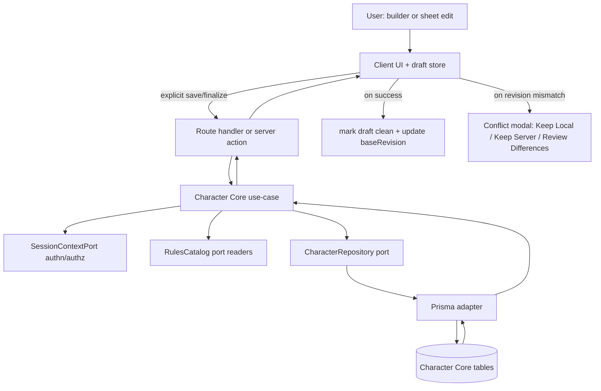
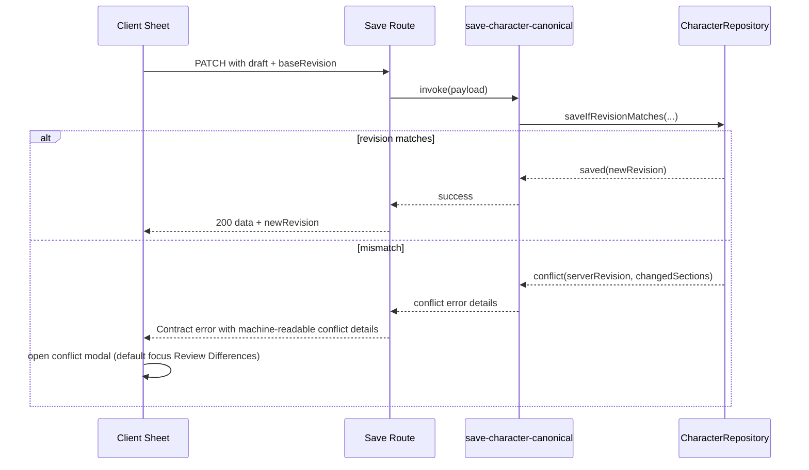

# Implementation Plan: Character Core

## Metadata

- Status: `ready`
- Created At: `2026-04-05`
- Last Updated: `2026-04-05`
- Owner: `Antony Acosta`

## Changelog

- `2026-04-05` - `Antony Acosta` - Aligned plan dependencies and verification criteria after global-state conflict policy baseline moved to explicit conflict-choice handling for user-authored canonical records.
- `2026-04-05` - `Antony Acosta` - Created the Character Core implementation plan with phased, repo-aware slices for create/edit/level/save, catalog-driven validation, sharing/export, and mobile/offline conflict handling so engineering can execute MVP in merge-safe increments.

## Goal

- Ship Character Core MVP as the first full character lifecycle slice (`create -> edit -> level -> save`) for signed-in players using 5e 2014 catalog-backed data.
- Ensure deterministic progression and explicit choice prompts (including multiclass confirmation) while preserving unsaved local drafts and conflict safety.
- Deliver practical player utility in the same slice: inventory, spells, read-only sharing toggle, and two PDF export modes.

In scope (this plan implements now):

- Canonical server-side Character Core persistence model and repositories.
- Guided builder start (concept + initial mechanics) plus transition to free-edit sheet.
- Save/update flow with hard vs soft validation and persisted warning overrides.
- Level-up plan/finalize flow with deterministic auto-apply + unresolved-choice gate.
- Multiclass class-change confirmation and level-history write contract.
- Inventory and spell editing integrated into core save path.
- Read-only share toggle + public read route behavior.
- PDF export for official-like field parity and app-summary formats (from saved state only).
- Mobile-first UI behavior for create/edit/level/save.
- Local draft rehydrate, offline preservation, and explicit conflict resolution modal with three actions.

Out of scope (intentionally deferred):

- 2024 rules support.
- NPC/monster workflows.
- Real-time multi-user co-editing.
- Full homebrew systems.
- Share-link expiration and analytics beyond MVP event instrumentation.

Completion criteria:

- End-to-end signed-in creation and first save works for 2014 PC flow.
- Free-edit + level-up (including multiclass confirmation) persists correctly.
- Inventory/spells edits persist through reload/re-login.
- Soft warnings are actionable and overridable; hard validation remains blocking.
- Share toggle and both PDF exports function from canonical saved state.
- Offline draft restore and revision-conflict prompt behave per UX contract.
- Conflict responses include machine-readable `baseRevision`, `serverRevision`, and `changedSections` details consumable by the UI conflict workflow.

## Non-Goals

- Building all downstream domains (branches/worlds/snapshots/adventures) into Character Core scope.
- Implementing server-side collaborative draft sync in this slice.
- Refactoring unrelated auth/catalog subsystems beyond required integration seams.

## Related Docs

- `docs/features/character-core.md`
  - Product scope, MVP must-haves, and release-level acceptance criteria.
- `docs/specs/character-core/foundation.md`
  - Canonical domain and behavior contracts for create/edit/level/save, validation, sharing, and export.
- `docs/specs/character-core/ux-guide.md`
  - UX interaction contracts for guided builder, warning acknowledgments, mobile behavior, and conflict prompt defaults.
- `docs/architecture/app-architecture.md`
  - Layer boundaries and dependency direction that Character Core must follow.
- `docs/architecture/global-state-management.md`
  - Client draft-store ownership boundaries and local persistence rules, including explicit conflict-choice baseline for canonical records.
- `docs/architecture/api-error-contract.md`
  - Transport envelope/error code semantics for route handlers and server boundaries.
- `docs/architecture/catalog-storage-and-read-model.md`
  - Runtime Rules Catalog availability/dataset guarantees and adapter error behavior.
- `docs/specs/authentication/foundation.md`
  - Authn/authz guard order and owner-scope enforcement before repository access.
- `docs/specs/rules-catalog/catalog-publish-and-rules-catalog-interface.md`
  - Namespaced rules reader capabilities and deterministic dataset behavior used by Character Core logic.

## Existing Code References

- `src/app/(core)/characters/page.tsx`
  - Reuse: route-group placement, server component data loading style, and `next-intl` translation access pattern.
  - Keep consistent: auth-aware user flow under `(core)` routes.
  - Avoid copying forward: direct in-page construction of use-cases for complex mutation flows (move to composition/service helpers as complexity grows).

- `src/app/api/characters/route.ts`
  - Reuse: route-factory testability pattern (`create...Route`), request-id handling, envelope shape.
  - Keep consistent: safe error mapping and `x-request-id` behavior.
  - Avoid copying forward: duplicated envelope helpers per route; consolidate shared response helpers when Character Core adds multiple endpoints.

- `src/server/application/use-cases/list-owner-characters.ts`
  - Reuse: authn/authz-before-repository guard sequence.
  - Keep consistent: typed use-case factories with explicit deps and deterministic outputs.

- `src/client/state/draft-store.ts` + `src/client/state/draft-store.storage.ts`
  - Reuse: local-first envelope persistence, schema-version checks, retention behavior, and selector-first reads.
  - Keep consistent: no domain-rule computations in store actions.

- `src/server/adapters/rules-catalog/derived-rules-catalog.ts`
  - Reuse: namespaced catalog readers and active-dataset behavior.
  - Keep consistent: fail-closed behavior on unavailable/mismatch states (mapped to API contract codes).

## Files to Change

- `prisma/schema.prisma` (risk: high)
  - Add Character Core canonical entities (character build state, level history, inventory entries, spell entries, share settings/token metadata, validation override records, revision field).
  - Add indexes for owner + updatedAt + share-token lookup.
  - Depends on migration + repository updates.

- `src/server/ports/character-repository.ts` (risk: high)
  - Expand from list-only to Character Core aggregate capabilities (`create`, `getByIdForOwner`, `saveCanonical`, `plan/finalize level transaction`, `share settings`, `export projection reads`).
  - Keep port free of Prisma-specific types.

- `src/server/adapters/prisma/character-repository.ts` (risk: high)
  - Implement aggregate persistence and transaction boundaries.
  - Add revision mismatch detection + structured conflict metadata return.

- `src/server/composition/create-app-services.ts` (risk: medium)
  - Wire Character Core use-cases and dependencies (rules catalog + session context + repository).

- `src/client/state/draft-store.types.ts` (risk: medium)
  - Add Character Core draft scopes (for builder/sheet/level-up) and base-revision metadata support.

- `src/client/state/draft-store.ts` (risk: medium)
  - Add conflict-state-safe actions (`setBaseRevision`, `markConflict`, `clearConflict`, `acknowledgeRestore`) while preserving existing store invariants.

- `src/client/state/draft-store.storage.ts` (risk: medium)
  - Extend envelope validation/migration parsing for new Character Core fields (`baseRevision`, conflict snapshot payload pointers).

- `src/app/(core)/characters/page.tsx` (risk: low)
  - Add CTA routing into guided create flow and richer list projection (share/export statuses when available).

- `messages/en/common.json` and `messages/es/common.json` (risk: medium)
  - Add builder/sheet/validation/conflict/share/export copy keys required by UX contracts.

- `docs/architecture/global-state-management.md` (risk: medium)
  - Reference and apply the shared explicit conflict-choice baseline for canonical records in implementation notes and tests.

- `docs/STATUS.md` and `docs/ROADMAP.md` (risk: low)
  - Update only when code implementation (not this plan-only document) lands with evidence.

## Files to Create

Domain and schemas:

- `src/server/domain/character-core/character-core.types.ts`
  - Core compile-time domain types (build state, warning overrides, inventory/spell entries, share settings, level history).

- `src/server/domain/character-core/character-core.validation.ts`
  - Runtime validation helpers and hard-vs-soft classification utilities.

- `src/server/domain/character-core/leveling.ts`
  - Deterministic progression and multiclass confirmation gate logic.

Application use-cases:

- `src/server/application/use-cases/create-character.ts`
- `src/server/application/use-cases/save-character-canonical.ts`
- `src/server/application/use-cases/plan-level-up.ts`
- `src/server/application/use-cases/finalize-level-up.ts`
- `src/server/application/use-cases/update-character-inventory.ts`
- `src/server/application/use-cases/update-character-spells.ts`
- `src/server/application/use-cases/set-character-share-enabled.ts`
- `src/server/application/use-cases/export-character-pdf.ts`
  - Each use-case owns auth guard, port orchestration, and typed failure mapping.

Route handlers / server actions:

- `src/app/api/characters/[id]/route.ts`
  - GET/PATCH canonical character read/save boundaries.

- `src/app/api/characters/[id]/level/plan/route.ts`
- `src/app/api/characters/[id]/level/finalize/route.ts`
- `src/app/api/characters/[id]/share/route.ts`
- `src/app/api/characters/[id]/export/route.ts`
- `src/app/api/share/[token]/route.ts`
  - Explicit HTTP boundaries for conflict responses, share read-only projection, and PDF downloads.

App routes and UI composition:

- `src/app/(core)/characters/new/page.tsx`
  - Guided builder entry (Step 1 concept + mechanics and optional preset).

- `src/app/(core)/characters/[id]/page.tsx`
  - Free-edit character sheet shell with tabs/sections from UX IA.

- `src/components/character-core/character-builder-step-one.tsx`
- `src/components/character-core/character-sheet-layout.tsx`
- `src/components/character-core/level-up-panel.tsx`
- `src/components/character-core/inventory-editor.tsx`
- `src/components/character-core/spells-editor.tsx`
- `src/components/character-core/validation-summary.tsx`
- `src/components/character-core/conflict-resolution-dialog.tsx`
- `src/components/character-core/share-toggle-card.tsx`
- `src/components/character-core/pdf-export-actions.tsx`
  - Domain-focused UI components using existing `ui/*`, `domain/*`, and tokenized styling patterns.

State helpers:

- `src/client/state/character-core-workflow.selectors.ts`
  - Encapsulated selectors for save status, warning acknowledgment state, and conflict modal state.

Tests:

- `src/server/domain/character-core/__tests__/leveling.test.ts`
- `src/server/domain/character-core/__tests__/validation.test.ts`
- `src/server/application/use-cases/__tests__/save-character-canonical.test.ts`
- `src/server/application/use-cases/__tests__/finalize-level-up.test.ts`
- `src/app/api/characters/[id]/__tests__/route.test.ts`
- `src/app/api/characters/[id]/level/__tests__/plan-finalize.route.test.ts`
- `src/app/api/characters/[id]/share/__tests__/route.test.ts`
- `src/app/api/characters/[id]/export/__tests__/route.test.ts`
- `src/client/state/__tests__/draft-store.character-core-conflict.test.ts`
- `src/app/(core)/characters/__tests__/character-core-mobile-smoke.test.tsx` (or Playwright e2e target)

## Data Flow

Canonical ownership boundary:

- **Server canonical truth:** Character aggregate, revision, history, share token state, export source projection.
- **Client draft state:** unsaved edits, dirty flags, local restore/conflict UI context, section-level diff staging.
- **Untrusted input:** route params, body payloads, localStorage draft payloads, share token.



Conflict/save sequence (required for stale writes):



## Behavior and Edge Cases

Success path:

- Signed-in owner creates character from guided Step 1, saves, enters free-edit sheet with clean draft state.
- Save/update operations persist canonical aggregate and return updated revision.
- Level-up finalize writes both build changes and immutable level history entry atomically.

Not found path:

- Owner requests unknown `characterId` -> safe not-found response (`404`) after auth check.
- Share token unknown/disabled -> not-found equivalent response (`404`) to avoid token probing details.

Validation failure path:

- Hard validation -> `REQUEST_VALIDATION_FAILED (400)` with field/path details.
- Soft warnings -> returned in response warnings list; save allowed only with explicit acknowledged warning codes.
- Unresolved level choice nodes -> `REQUEST_VALIDATION_FAILED (400)` with required choice paths.

Dependency unavailable path:

- Rules catalog unavailable/mismatch -> `RULES_CATALOG_UNAVAILABLE` or `RULES_CATALOG_DATASET_MISMATCH` (`503`) with safe details.
- PDF generation adapter failure -> `INTERNAL_ERROR (500)` with safe user-facing message.

Known edge cases and handling:

- Local draft parse/migration failure: fail open for page load; show recoverable notice; do not apply invalid payload.
- Equal-timestamp drafts in storage: preserve existing deterministic ordering behavior from draft store.
- Export requested with unsaved edits: force explicit user choice (`save then export` or `export last saved`).
- Multiclass level-up without confirmation flag: reject finalize as validation failure.
- Optional rule selected but missing in active catalog: fail closed with catalog mismatch/unavailable semantics.

## Error Handling

Error categories:

- Auth errors: `AUTH_UNAUTHENTICATED` (`401`), `AUTH_FORBIDDEN` (`403`).
- Input/domain hard validation: `REQUEST_VALIDATION_FAILED` (`400`).
- Catalog operational data issues: `RULES_CATALOG_UNAVAILABLE` / `RULES_CATALOG_DATASET_MISMATCH` (`503`).
- Unexpected failures: `INTERNAL_ERROR` (`500`).

Translation boundaries:

- Domain/use-case emits typed errors with stable `code` and safe `details`.
- Route handlers map typed errors to API envelope + status and always include `meta.requestId`.

Conflict details contract (machine-readable):

- `details.conflict = { characterId, baseRevision, serverRevision, changedSections }`
- UI uses `changedSections` to drive Review Differences section-level navigation.

Logging fields (minimum):

- `requestId`, `userId`, `characterId`, `useCase`, `errorCode`, `catalogFingerprint`, `baseRevision`, `serverRevision`.

## Types and Interfaces

Representative contracts:

```ts
interface CharacterRevisionedSaveInput {
  characterId: string;
  ownerUserId: string;
  baseRevision: number;
  draft: CharacterDraftPayload;
  acknowledgedWarningCodes: string[];
}

interface SaveCharacterResult {
  characterId: string;
  revision: number;
  warnings: CharacterValidationWarning[];
}

interface SaveConflictDetails {
  characterId: string;
  baseRevision: number;
  serverRevision: number;
  changedSections: Array<"core" | "progression" | "inventory" | "spells" | "notes">;
}

interface CharacterRepository {
  listByOwner(ownerUserId: string): Promise<CharacterSummary[]>;
  createCharacter(input: CreateCharacterInput): Promise<CharacterAggregate>;
  getByIdForOwner(characterId: string, ownerUserId: string): Promise<CharacterAggregate | null>;
  saveCanonical(input: CharacterRevisionedSaveInput): Promise<SaveCharacterResult | SaveConflictDetails>;
  finalizeLevelUp(input: FinalizeLevelUpInput): Promise<FinalizeLevelUpResult>;
  setShareEnabled(input: SetShareEnabledInput): Promise<CharacterShareSettings>;
}
```

Type ownership:

- Domain layer owns Character Core entities/value shapes.
- Port layer owns repository and rules reader contracts.
- Route layer owns transport envelope + status serialization.

## Functions and Components

Core use-cases:

- `createCreateCharacterUseCase(deps)`
  - Builds initial canonical character from guided Step 1 payload + optional preset.

- `createSaveCharacterCanonicalUseCase(deps)`
  - Runs validation pipeline, persists warning overrides, revision-guarded save.

- `createPlanLevelUpUseCase(deps)`
  - Computes deterministic auto-applies + required choice checklist.

- `createFinalizeLevelUpUseCase(deps)`
  - Enforces multiclass confirmation checkpoint and writes history + build atomically.

- `createSetCharacterShareEnabledUseCase(deps)`
  - Toggles read-only share and revokes token immediately on disable.

- `createExportCharacterPdfUseCase(deps)`
  - Produces selected format from canonical saved state only.

UI/state units:

- `CharacterBuilderStepOne` (client)
  - Owns concept+mechanics collection and quick-start preset preview/undo.

- `CharacterSheetLayout` (server shell + client sub-panels)
  - Hosts sticky summary strip, section navigation, save status surface.

- `ValidationSummary` (client)
  - Shows hard vs soft issues and explicit warning acknowledgment actions.

- `ConflictResolutionDialog` + diff panel (client)
  - Implements Keep Local / Keep Server / Review Differences contract and focus behavior.

- `useDraftStore` selectors
  - Own dirty/base-revision/conflict UI state only (no rules evaluation logic).

## Integration Points

- Authentication foundation:
  - Reuse `SessionContextPort` guard order in all Character Core mutation and read flows.

- Rules Catalog integration:
  - Use `rulesCatalog.classes/subclasses/features/spells/feats` namespaces for options and progression grants.
  - Capture dataset fingerprint on planning/finalize responses for diagnostics and deterministic behavior traceability.

- API surfaces:
  - Route handlers for explicit HTTP boundaries (`/api/characters/...`, share token route, export route).
  - Optional server actions for same-route internal interactions can wrap route calls after baseline route contract is stable.

- Draft persistence:
  - Continue `localStorage` envelope strategy with Character Core scopes.
  - Keep server draft sync deferred, but structure types so phase-2 sync can plug in without UI rewrite.

- i18n and accessibility:
  - All user-facing text through `messages/*/common.json` keys.
  - Reuse dialog/tabs/alert primitives for semantics and keyboard handling.

- Feature gating / rollout:
  - Gate Character Core editor routes behind authenticated `(core)` area and merge in phases.
  - Keep existing `/characters` list stable while per-character routes ship incrementally.

## Implementation Order

Acceptance criteria mapping used below:

- `AC1` create+save end-to-end
- `AC2` guided -> free edit continuity
- `AC3` deterministic level-up + unresolved-choice gate
- `AC4` multiclass confirmation
- `AC5` inventory/spells persistence
- `AC6` optional/variant rules integration
- `AC7` soft-warning override contract
- `AC8` read-only sharing toggle and enforcement
- `AC9` two PDF exports
- `AC10` mobile create/edit/level/save usability
- `AC11` offline draft recovery
- `AC12` conflict prompt with three actions
- `AC13` analytics event for creation completion

1. Phase 0: canonical data model + repository expansion
   - Output: Prisma schema/migration + Character Core repository port/adapter contracts.
   - Acceptance: enables `AC1`, `AC3`, `AC5`, `AC8`, `AC9`, `AC11`, `AC12`.
   - Verify: `bun run db:generate` and targeted repository tests.
   - Merge safety: yes (no route wiring yet).

2. Phase 1: create + first save vertical slice
   - Output: `new` route, Step 1 builder component, `create-character` + `save-character-canonical` use-cases, `/api/characters` create/save endpoints.
   - Acceptance: `AC1`, `AC2`, `AC7` (initial warning behavior), `AC13` (creation completion event emission).
   - Verify: `bun test` targeted create/save route and use-case tests + manual create flow.
   - Merge safety: yes (additive routes).

3. Phase 2: free-edit sheet structure + validation surfaces
   - Output: `[id]` sheet route, sticky summary, tabbed edit zones, validation summary/inline markers, warning acknowledgment persistence.
   - Acceptance: `AC2`, `AC7`, baseline of `AC10`.
   - Verify: component tests + keyboard/focus manual checks + `bun run lint`.
   - Merge safety: yes (can ship before leveling).

4. Phase 3: level-up planning/finalize including multiclass
   - Output: plan/finalize APIs + level-up panel + deterministic auto-apply + unresolved choice gates + multiclass confirmation checkpoint + level history writes.
   - Acceptance: `AC3`, `AC4`, partial `AC6`.
   - Verify: domain leveling tests, use-case finalize tests, route tests.
   - Merge safety: mostly (can ship with hidden UI entry until stable).

5. Phase 4: optional/variant rules + inventory/spells integration
   - Output: catalog-driven optional path selectors and inventory/spell editors wired into save path.
   - Acceptance: `AC5`, `AC6`, reinforcement of `AC7`.
   - Verify: integration tests for catalog-backed options and persistence across reload.
   - Merge safety: yes (per-section incremental rollout possible).

6. Phase 5: sharing + PDF export
   - Output: share toggle APIs/UI, read-only share route, export route with official-like and app-summary modes.
   - Acceptance: `AC8`, `AC9`.
   - Verify: route tests for read-only enforcement + export mode success/failure cases.
   - Merge safety: yes (feature flags optional).

7. Phase 6: mobile hardening + accessibility pass
   - Output: responsive adjustments for summary strip, section nav, inventory/spell row expansion, CTA reachability, keyboard/screen-reader fixes.
   - Acceptance: `AC10`.
   - Verify: mobile viewport E2E smoke + a11y manual checks.
   - Merge safety: yes (UI-only hardening).

8. Phase 7: offline draft recovery + conflict resolution
   - Output: draft rehydrate prompts, revision-mismatch detection path, conflict modal with Keep Local/Keep Server/Review Differences and section-level diff viewer.
   - Acceptance: `AC11`, `AC12`.
   - Verify: draft-store tests + conflict route/use-case tests + reconnect manual scenario.
   - Merge safety: partial (keep behind route-level feature switch until fully verified).

9. Phase 8: stabilization and readiness
   - Output: final contract alignment checks, docs sync, roadmap/status evidence updates.
   - Acceptance: all ACs closed with evidence.
   - Verify: `bun run lint` + targeted `bun test` suites + final manual smoke matrix.
   - Merge safety: yes.

## Verification

Automated checks (minimum per phase):

- `bun run lint`
- Targeted tests as slices land (examples):
  - `bun test src/server/domain/character-core/__tests__/leveling.test.ts`
  - `bun test src/server/application/use-cases/__tests__/save-character-canonical.test.ts`
  - `bun test src/app/api/characters/[id]/__tests__/route.test.ts`
  - `bun test src/client/state/__tests__/draft-store.character-core-conflict.test.ts`

Manual scenarios:

- Create path: quick-start and manual setup both reach first save.
- Edit path: soft warnings acknowledged once and persisted.
- Level path: deterministic changes auto-apply and unresolved choices block finalize.
- Multiclass: explicit class-change confirmation required.
- Share path: enabled token reads succeed; disable immediately revokes access.
- Export path: save-then-export vs export-last-saved behavior is explicit.
- Offline path: edit offline, refresh, restore draft, reconnect with conflict prompt.

Observability checks:

- Confirm creation completion event emitted for analytics (`AC13`).
- Confirm conflict occurrences and selected resolution path are logged with safe metadata.
- Confirm error logs include request id + code and exclude sensitive internals.

Negative test case (required):

- Attempt finalize level-up without required choice acknowledgments and verify `REQUEST_VALIDATION_FAILED` with machine-readable details.

Rollback/recovery check (required):

- Disable Character Core edit routes while preserving list route and canonical DB schema; verify app remains functional for existing `/characters` list and auth paths.

## Notes

Assumptions:

- Character Core remains 2014-only and depends on active `DerivedRulesCatalog` availability.
- Existing draft-store retention and persistence primitives remain valid for Character Core payload sizes in MVP.
- PDF generation can initially be server-side rendering/generation in-process; storage caching of generated PDFs is deferred.

Dependencies:

- Auth foundation must remain stable (`SessionContextPort` and owner checks).
- Rules catalog published dataset must be active and deterministic.
- Global-state architecture baseline for conflict choice is accepted and must be implemented as defined.

Unresolved questions:

- Should quick-start presets include confidence labels in MVP or defer to UX follow-up?

Deferred follow-ups:

- Server-side draft sync (phase 2 of global state architecture).
- Share-link expiration controls.
- Expanded analytics funnel and cohort dashboards.

## Rollout and Backout

Rollout:

- Land by phase as additive slices with route-level gating where needed.
- Keep legacy `/characters` list route operational throughout.
- Release high-risk slices (level finalize, conflicts, export) behind conservative toggles if runtime confidence is low.

Backout:

- If Character Core edit flow regresses, disable new edit/create/share/export routes first.
- Preserve canonical data and migrations; do not destructive-rollback persisted characters.
- Fall back to read-only list visibility until issue is fixed.

## Definition of Done

- [ ] Character Core canonical schema, repository contracts, and use-case wiring are implemented.
- [ ] Guided create -> first save -> free-edit flow ships with persisted data continuity.
- [ ] Level-up planning/finalize enforces deterministic auto-apply, required choices, and multiclass confirmation.
- [ ] Inventory and spells are integrated into canonical save and reload correctly.
- [ ] Optional/variant 2014 rules from Rules Catalog are selectable and validated in relevant flows.
- [ ] Soft warnings are explicitly acknowledged/persisted; hard validation remains blocking.
- [ ] Share toggle and read-only access enforcement are operational.
- [ ] Both PDF export modes succeed from saved state with clear failure semantics.
- [ ] Mobile create/edit/level/save UX meets contract checks.
- [ ] Offline draft restore + three-path conflict resolution is implemented and verified.
- [ ] Conflict responses are machine-readable and include `baseRevision`, `serverRevision`, and `changedSections` for UI branching.
- [ ] Analytics emits creation completion signal.
- [ ] Verification suite and manual smoke scenarios are documented with evidence.
