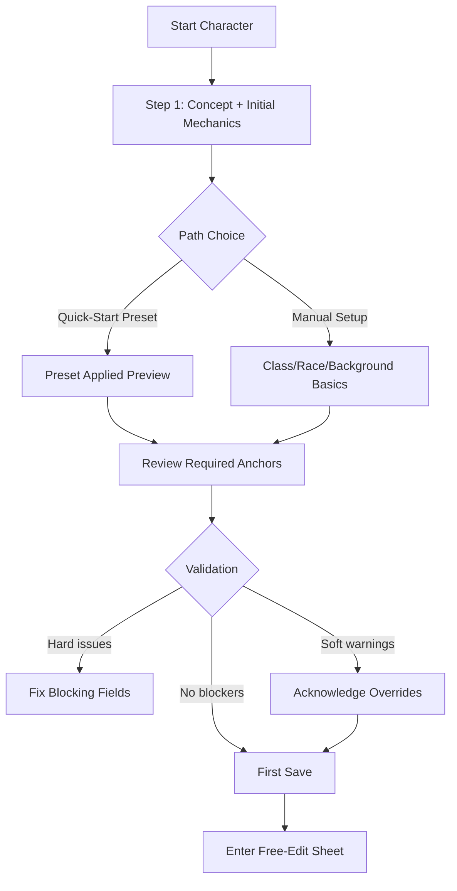

# Spec: Character Core UX Guide (MVP)

## Metadata

- Status: `proposed`
- Created At: `2026-04-05`
- Last Updated: `2026-04-06`
- Owner: `Antony Acosta`

## Changelog

- `2026-04-06` - `Antony Acosta` - Reframed Character Core UX toward a dynamic workbench model inspired by DMV builder interaction patterns (step rail, live mechanics pulse, build/story mode split, and sticky action rail) while preserving Arcane Codex accessibility and conflict-safety contracts.
- `2026-04-05` - `Antony Acosta` - Created the Character Core UX guide to define implementation-ready interaction, hierarchy, state, accessibility, and responsive behavior contracts for guided builder and free-edit sheet MVP delivery. (Made with OpenCode)

## Related Feature

- `docs/features/character-core.md`

## Context

- Character Core MVP already defines technical and domain behavior in `docs/specs/character-core/foundation.md`.
- The highest UX risk is friction between speed-first creation and correctness-first rules handling, especially on mobile and during offline/conflict recovery.
- This guide sets practical UX contracts so implementation and QA can judge usability quality consistently without inventing ad hoc UI behavior per route.

## UX Goals and Success Signals (MVP)

### UX Goals

1. **Get a valid character saved quickly** without forcing rules-heavy decisions too early.
2. **Keep editing trustworthy** by making validation state and save state obvious at all times.
3. **Support table-speed updates** (level, spells, inventory) with low navigation overhead.
4. **Prevent data-loss surprises** in offline, reconnect, and stale-write conflict moments.
5. **Stay readable in dense layouts** while preserving Arcane Codex hierarchy and semantics.

### Success Signals

- High completion rate from started create flow to first successful save.
- Median time-to-first-save for quick-start one-shot path is significantly lower than full guided path.
- Low abandon rate at validation and conflict dialogs.
- Mobile users complete create -> edit -> level -> save without desktop fallback.
- Override usage is intentional (acknowledged per warning), not accidental (blind proceed behavior).

## Inspiration Baseline (DMV Analysis)

Reference inspection artifact: `temp/character-core-dmv-inspiration.md`

Patterns to adapt:

1. **Stepper momentum:** visible sequence and completion signals reduce paralysis.
2. **Always-on mechanics pulse:** immediate stat feedback builds trust and speeds decision-making.
3. **Workbench action rail:** save/random/new/clone/export actions feel tool-like, not form-like.
4. **Build vs Story separation:** users can switch between mechanical optimization and narrative authoring without losing context.
5. **Progressive disclosure:** "show info" and "show selections" reduce noise while preserving depth.

Patterns to avoid copying directly:

- Over-dense icon-first controls that reduce accessibility clarity.
- Ad/chrome interference and stacked repeated toolbars.
- Hover-dependent or ambiguous interaction affordances.

## Information Architecture: Guided Builder + Free-Edit Sheet

### IA Principles

- Keep **mechanical anchors** visible (class, level, proficiency, HP/AC summary).
- Place **high-frequency edits** (core stats, inventory, spells, level action) within one tap from sheet landing.
- Keep **rare/advanced decisions** discoverable but collapsed until needed.
- Separate **"what is wrong"** (validation list) from **"what to do now"** (next action CTA).

### Guided Builder IA (First Save Path)



### Workbench IA (Guided + Free-Edit Shared Shell)

Use a single "Character Workbench" shell across create and edit to reduce context switching.
See **ASCII Wireframes** below for implementation-oriented region maps and interaction hotspots.

1. **Top action rail (sticky):** Save, Back, Next, Quick Start, Randomize Step, Export, Share state.
2. **Left step rail:** ordered domains with completion/warning badges:
   - Race
   - Class/Level
   - Ability Scores/Feats
   - Background
   - Proficiencies
   - Spells
   - Equipment
   - Notes/Story
3. **Center active canvas:** card-based option selection and rule-aware detail drawers.
4. **Right pulse panel (sticky):** class/level, HP/AC, proficiency, saves/skills, key feature deltas.
5. **Mode switch:** `Build` (mechanics) <-> `Story` (traits, ideals, bonds, flaws, backstory).
6. **Selections drawer:** collapsible timeline of current picks and pending choices.

### IA Layout Contract (Desktop)

```text
[Action Rail: Save | Back | Next | Quick Start | Randomize | Export]

[Step Rail] [Active Canvas]                         [Pulse Panel]
Race        option cards + info + filters           AC / HP / Speed
Class       subclass and level choices              Saves / Skills
Abilities   point buy/roll/standard                  Features / Slots
...         pending choices + warnings               Dirty/Conflict state

[Build | Story]  [Selections Drawer]
```

## ASCII Wireframes (Implementation Orientation)

These are **communication wireframes**, not visual style comps. They define layout regions, sticky behavior, and high-frequency interaction hotspots while staying within Arcane Codex workbench constraints (dense, legible, low ornament, keyboard-safe).

Legend:

- `[*]` = high-frequency interaction hotspot
- `[!]` = state-critical trust signal (save/validation/conflict)
- `(sticky)` = remains visible while canvas scrolls

### 1) Desktop Workbench Shell

```text
┌───────────────────────────────────────────────────────────────────────────────────────────────────────────────┐
│ Action Rail (sticky): [Back*] [Next*] [Save*!] [Quick Start*] [Randomize Step*] [Export] [Share!]          │
└───────────────────────────────────────────────────────────────────────────────────────────────────────────────┘
┌───────────────────────┬───────────────────────────────────────────────────────────────────────┬───────────────┐
│ Step Rail (sticky)    │ Active Canvas (scroll region)                                         │ Pulse Panel   │
│-----------------------│-----------------------------------------------------------------------│ (sticky)       │
│ [Race]        ✓ / !   │ Step Header: Race [Show Info*] [Show Selections*]                    │---------------│
│ [Class/Level] ○ / !   │ --------------------------------------------------------------------- │ Character     │
│ [Abilities]   ○ / !   │ Option Cards (grid/list):                                             │ Pulse [!]     │
│ [Background]  ○ / !   │  ┌───────────────┐  ┌───────────────┐  ┌───────────────┐             │ AC / HP /     │
│ [Proficiencies]○ / !  │  │ Elf            │  │ Dwarf         │  │ Human         │             │ Speed         │
│ [Spells]      ○ / !   │  │ +2 DEX [Δ]     │  │ +2 CON [Δ]    │  │ +1 All [Δ]    │             │ Saves /       │
│ [Equipment]   ○ / !   │  │ Select*        │  │ Select*       │  │ Select*       │             │ Skills        │
│ [Notes/Story] ○       │  └───────────────┘  └───────────────┘  └───────────────┘             │ Features/     │
│                       │                                                                       │ Slots         │
│ Validation Summary [!]│ Pending Choices [!] -> links to first unresolved field*               │ Dirty/Saved/  │
│ (jump links*)         │ Inline Error/Warning rows with acknowledge controls [!]               │ Conflict [!]  │
└───────────────────────┴───────────────────────────────────────────────────────────────────────┴───────────────┘
┌──────────────────────────────────────────────┬───────────────────────────────────────────────────────────────┐
│ Mode Switch (sticky bottom): [Build*] [Story*]│ Selections Drawer (collapsible): Recent picks + pending [*]│
└──────────────────────────────────────────────┴───────────────────────────────────────────────────────────────┘
```

### 2) Mobile Workbench Shell

```text
┌──────────────────────────────────────────────────────────────┐
│ Character Workbench                                          │
│ Save State [Unsaved/Saved/Conflict!]                         │
├──────────────────────────────────────────────────────────────┤
│ Step Rail (segmented, horizontally scrollable):              │
│ [Race*][Class*][Abilities*][Background*][Spells*][Equip*]    │
├──────────────────────────────────────────────────────────────┤
│ Active Canvas (single-column cards/forms)                    │
│ - Step header + info toggle*                                 │
│ - Option cards with delta chips [Δ] + Select*                │
│ - Inline validation + acknowledge warning controls [!]       │
│ - Pending choices jump list*                                 │
│                                                              │
│ Pulse Panel (collapsible bottom sheet):                      │
│ [Handle] Character Pulse [expand/collapse*]                  │
│   when expanded -> AC/HP/Speed, Saves/Skills, feature deltas │
└──────────────────────────────────────────────────────────────┘
┌──────────────────────────────────────────────────────────────┐
│ Sticky Bottom Actions: [Back*] [Next*] [Save*!] [••• More*] │
│ More menu -> Quick Start, Randomize Step, Export, Share      │
└──────────────────────────────────────────────────────────────┘
```

### 3) Conflict Resolution Modal Flow State

```text
State trigger: user presses Save -> server revision mismatch detected [!]

┌──────────────────────────────────────────────────────────────┐
│ CONFLICT DETECTED                                            │
│ Someone else (or another session) changed this character.    │
│ Choose how to continue.                                      │
│                                                              │
│ Changed Sections: [Core] [Inventory] [Spells]               │
│                                                              │
│ Primary actions:                                              │
│  [Review Differences*]  <- default focus (non-destructive)   │
│  [Keep Local] [Keep Server]                                  │
│                                                              │
│ Secondary: [Cancel]                                           │
└──────────────────────────────────────────────────────────────┘

Review Differences* ->
┌──────────────────────────────────────────────────────────────┐
│ Section diff list (Core / Progression / Inventory / Spells / Notes) │
│ Field-level diff panel                                       │
│ Sticky footer: [Keep Local] [Keep Server] [Back]             │
└──────────────────────────────────────────────────────────────┘

Keep Local / Keep Server -> confirmation prompt for destructive choice ->
result banner + preserved draft safety notice
```

### 4) Build vs Story Mode Comparison Snapshot

```text
┌─────────────────────────────────────┬─────────────────────────────────────┐
│ BUILD MODE (mechanics-first)       │ STORY MODE (narrative-first)        │
├─────────────────────────────────────┼─────────────────────────────────────┤
│ Goal: produce valid mechanical save│ Goal: capture roleplay context       │
│                                     │                                     │
│ Visible by default:                 │ Visible by default:                  │
│ - option cards + rule deltas [Δ]    │ - traits / ideals / bonds / flaws    │
│ - pending choices + blockers [!]    │ - backstory, notes, pronouns, hooks  │
│ - validation summary [!]             │ - writing guidance + examples         │
│                                     │                                     │
│ Pulse panel emphasis:                │ Pulse panel emphasis:                 │
│ - AC/HP/saves/skills/features        │ - core mechanical anchors compact     │
│                                     │                                     │
│ Primary CTA: [Next]/[Save]           │ Primary CTA: [Save Notes]/[Save]     │
│                                     │                                     │
│ Must not hide: save/conflict state ! │ Must not hide: save/conflict state !  │
└─────────────────────────────────────┴─────────────────────────────────────┘
```

## Key User Journeys

### 1) First-Time Create (Campaign Player)

- User starts in workbench with active first step and visible completion map.
- Option cards provide immediate stat/rule deltas in pulse panel.
- First save requires hard-valid state; soft warnings can be acknowledged and saved.
- On success, user remains in same shell (no jarring mode jump), now in free-edit context with clean draft state.

### 2) Quick-Start One-Shot

- User can choose Quick Start preset or Randomize Step from action rail.
- Canvas shows what changed and pulse panel highlights mechanical deltas.
- User can undo preset/random output before save; no irreversible lock-in before first save.
- Save CTA copy emphasizes speed plus later editability.

### 3) Level-Up (Including Multiclass)

- Level action opens guided progression panel.
- Deterministic changes auto-apply and are labeled "Auto-applied".
- Choice-required nodes block finalize until resolved.
- Multiclass branch requires explicit confirmation: "Level in a different class?" with consequences summary.
- Finalize writes level history and returns to sheet with "Level Up Saved" confirmation.

### 4) Inventory and Spells Edits

- Fast add/edit/remove interactions should be inline-first and card-aware.
- Custom entries are visibly marked as custom (not catalog-backed).
- Save behavior matches core sheet contract (draft first, explicit save canonical).
- Errors preserve unsaved edits and anchor user to first failing row/field.

### 5) Share and Export

- Share toggle communicates current state (On/Off) and immediate effect.
- Disable share warns that link access is revoked immediately.
- Export actions always target last saved state; if unsaved edits exist, show clear choice:
  - Save then export
  - Export last saved

## Interaction Contracts: Validation Warnings + Override Acknowledgments

### Validation Severity Contract

| Severity | UI Treatment | Save Behavior | User Action Required |
| --- | --- | --- | --- |
| Hard (blocking) | Inline field error + global error summary | Save blocked | Fix issue |
| Soft (overridable) | Warning callout + warning list item | Save allowed only after acknowledgment | Acknowledge warning code |

### Override Acknowledgment Rules

1. Acknowledgment is explicit per warning code (no blanket "ignore all forever").
2. Warning copy must include why it is unusual and what outcome may occur.
3. Save CTA remains disabled until all visible soft warnings are either resolved or acknowledged.
4. Acknowledged warnings persist with the character and are shown as "Acknowledged" on revisit.
5. If warning context materially changes, acknowledgment resets for that warning code.
6. Warning badges appear both on impacted controls and the owning step in the step rail.

### UX Copy Contract (Practical)

- Use plain, rules-literate language.
- Avoid vague "invalid" labels; name the exact mismatch.
- Keep warning titles short; details can expand.

## Mobile-First / Responsive Behavior Expectations

The mobile wireframe above is the baseline behavior contract for section stacking, pulse collapse, and sticky action reachability.

1. **Single-column baseline** under mobile breakpoints for builder and sheet editing.
2. Sticky summary strip remains visible but collapses non-critical metadata first.
3. Minimum tap target size: 44x44 CSS px for actionable controls.
4. Section navigation may collapse to segmented control/dropdown; active section always visible.
5. Long tables (inventory/spells) must support row expansion rather than horizontal chaos.
6. Critical CTAs (Save, Level Up Finalize) remain reachable without precision scrolling.
7. No desktop-only interaction dependency (hover-only affordances are forbidden for required tasks).
8. On mobile, step rail collapses to horizontal segmented navigation.
9. Pulse panel collapses into an expandable bottom-sheet summary card.
10. Action rail condenses to sticky bottom primary controls (`Back`, `Next`, `Save`, overflow menu).

## Offline/Local Draft + Conflict Resolution UX

### Offline Draft Behavior

- Unsaved edits write to local draft envelope with clear dirty-state indicator.
- Rehydrate prompt appears after refresh/reopen if unsaved local draft exists.
- Parse/migration failure shows recoverable notice and safe fallback to server state.

### Conflict Resolution Prompt Contract

When save detects revision mismatch, present a blocking conflict modal with exactly three paths:

1. **Keep Local** (overwrite server with local draft)
2. **Keep Server** (discard local draft)
3. **Review Differences** (compare sections, then decide)

Decision defaults and safeguards:

- Default focus goes to **Review Differences** (non-destructive default).
- Destructive actions require confirmation text.
- User never loses local draft silently.

### Differences Review Requirements

- Show section-level diff first (Core, Progression, Inventory, Spells, Notes).
- Allow drill-down to field/row-level differences for changed sections.
- Keep final decision actions visible in a sticky footer.

## Accessibility Expectations

### Keyboard and Focus

- All workflows are keyboard-completable (including conflict modal and diff review).
- Focus order follows visual/semantic reading order.
- On validation failure, focus moves to error summary then first invalid field.
- On modal open, focus is trapped; on close, focus returns to trigger.

### Screen Reader Semantics

- Inputs have explicit label + description + error association.
- Validation summary is announced and links to affected fields.
- Live-region announcements for save success/failure, restore events, and conflict detection.
- Icon-only controls require accessible names.

### Motion and Sensory Safety

- Respect `prefers-reduced-motion` and app-level motion overrides.
- Use subtle transitions (`120-220ms`) for supportive context only.
- Avoid animated layout jumps in dense forms.

## Arcane Codex Design-System Alignment Guidance

### Token and Component Rules

1. Use semantic tokens only; no one-off hardcoded color literals.
2. Reuse `ui/*` primitives for control semantics and states.
3. Use domain components for domain-critical semantics (stats/combat/validation/conflict signals).
4. Keep `workbench` behavior dense and clear; reserve richer ornament for `codex` read surfaces.
5. Use motion only to clarify causality (selection -> stat delta), not decorative flourish.

### Do / Do Not

| Do | Do Not |
| --- | --- |
| Use tokenized warning/danger/success treatments consistently | Invent local ad hoc state colors for one screen |
| Keep key mechanical state visible in sticky summary | Hide class/level/save state behind deep tabs |
| Pair icons/runes with text labels for critical meaning | Use icon-only state semantics as sole signal |
| Use existing dialog/drawer patterns for conflict + confirm | Create custom modal behavior per feature |
| Show card-level mechanical deltas before commit | Force users to infer downstream stat impact from raw text |

## UX States Checklist (Implementation + QA)

| State | Required UX Behavior |
| --- | --- |
| Loading | Skeleton or staged placeholders preserve layout and heading context |
| Empty | Explain what is missing + provide immediate next action |
| Error (recoverable) | Clear cause summary + retry or safe fallback action |
| Error (blocking validation) | Field-level errors + global summary + focus guidance |
| Success | Non-intrusive confirmation with clear next action |
| Dirty/Unsaved | Persistent unsaved indicator and save affordance |
| Stale/Conflict | Explicit prompt with Keep Local / Keep Server / Review Differences |
| Offline | Offline banner + local draft reassurance + deferred save guidance |
| Restored Draft | Restore confirmation and option to discard local draft |

## Acceptance Criteria (UX Quality + Testability)

1. New users can complete first-time create and first save using only guided cues, with no dead-end states.
2. Quick-start preset path reaches first save in fewer interactions than manual setup and remains reversible pre-save.
3. Level-up flow blocks finalize on unresolved choices and enforces explicit multiclass confirmation.
4. Validation severity behavior is consistent across builder and free-edit surfaces.
5. Conflict modal always presents the required three actions with non-destructive default focus.
6. Mobile viewport supports full create/edit/level/save workflow without hidden required controls.
7. Inventory/spell edits preserve context and unsaved work during failures.
8. Keyboard and screen reader users can complete create/save/conflict resolution paths.
9. Export flow clearly distinguishes unsaved vs saved source state before PDF generation.
10. UI implementation uses Arcane Codex token/component contracts without one-off state styling.
11. Workbench shell behavior stays consistent between create and edit contexts.

## Open Questions

1. Should quick-start presets ship with visible confidence labels (for example "table-ready" vs "needs review") in MVP or post-MVP?
2. Should randomize controls operate at full-character scope in MVP, or remain step-scoped only?
3. Should pulse panel include optional compact dice shortcuts in MVP, or stay read-only for scope safety?

## Recommended Follow-Up Docs

- `docs/specs/character-core/implementation-plan.md` (wire this UX contract into component/state/tasks).
- `docs/specs/character-core/test-plan.md` (define UX and accessibility scenario coverage).

## Related Docs

- `docs/features/character-core.md`
- `docs/specs/character-core/foundation.md`
- `docs/specs/design-system/foundation.md`
- `docs/specs/design-system/visual-baseline-v1.md`
- `docs/architecture/design-system-decision-record.md`
- `docs/architecture/global-state-management.md`

## Related Implementation Plan

- `docs/specs/character-core/implementation-plan.md`
