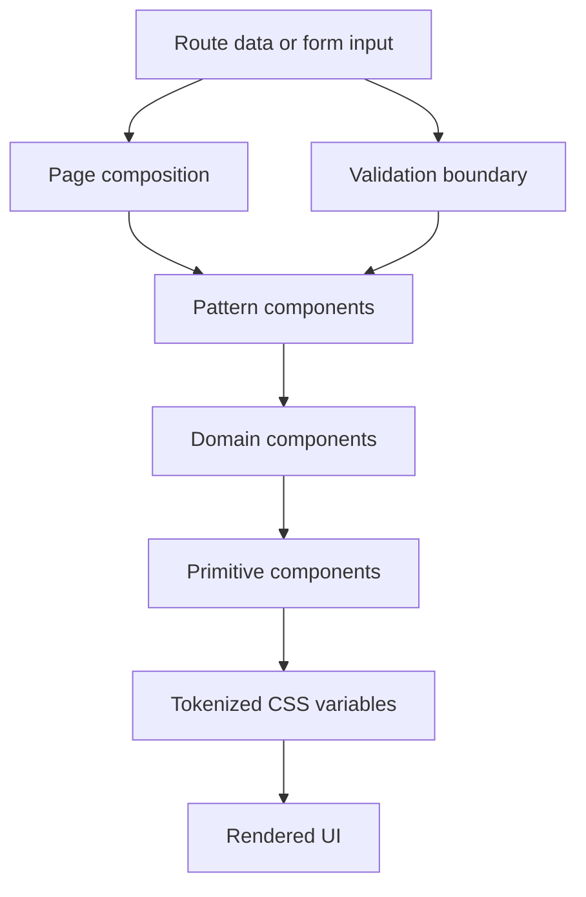
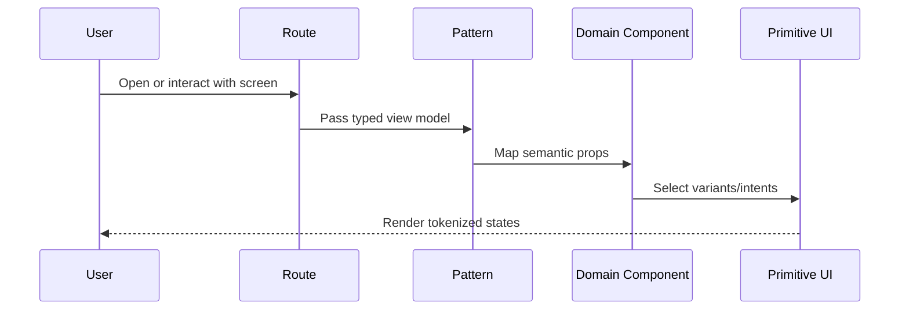

# Implementation Plan: Design System Foundation (Arcane Codex v1)

## Metadata

- Status: `in-progress`
- Created At: `2026-04-03`
- Last Updated: `2026-04-04`
- Owner: `Antony Acosta`

## Changelog

- `2026-04-03` - `Antony Acosta` - Initial document created.
- `2026-04-04` - `OpenCode` - Backfilled metadata and changelog sections for lifecycle tracking.

## Goal

- Deliver a production-usable design system foundation that replaces starter styling with an Arcane Codex visual language optimized for dense DnD workflows.
- Create reusable primitives and domain components so feature teams and AI agents can implement UI quickly without style drift.
- Improve user value by making progression planning and character management screens easier to scan, more trustworthy, and more consistent.

Scope controls:

- In scope (implement now):
  - semantic token foundation in `src/app/globals.css`
  - typography role setup in `src/app/layout.tsx`
  - local primitive component baseline in `src/components/ui/*`
  - domain emphasis components for stats/combat/branch/snapshot semantics
  - one reference route composition demonstrating Workbench and Codex surfaces
  - AI contract assets in `.rulesync/skills/*` and `.rulesync/commands/*`
- Out of scope (defer intentionally):
  - complete feature UI rollout across all app routes
  - world-specific multi-theme packs (v2)
  - PDF renderer styling parity
  - custom icon/rune authoring beyond minimal placeholders

Completion criteria:

- Arcane Codex tokens are the default styling source for app surfaces.
- Starter landing scaffold is replaced by a reference screen using design-system components.
- Core primitives provide complete interactive states and reduced-motion-safe behavior.
- Domain emphasis components exist for abilities, combat, branch lock, and snapshot frozen state.
- New UI work can be reviewed against the `.rulesync` Arcane Codex contract.

## Non-Goals

- Building a fully bespoke interaction library independent of mature primitive patterns.
- Recreating a parchment-heavy visual treatment on every interactive control.
- Introducing CSS-in-JS theming frameworks for this phase.
- Solving every future screen pattern before the first foundation slice ships.
- Refactoring unrelated server/domain architecture while implementing UI foundations.

## Related Docs

- `docs/features/design-system-foundation.md`
  - Product intent, scope boundary, and acceptance criteria for the feature layer.
- `docs/specs/design-system/foundation.md`
  - Technical behavior and edge-case constraints for the design-system slice.
- `docs/specs/design-system/visual-baseline-v1.md`
  - Preliminary option matrix and selected v1 visual decisions that this implementation must follow.
- `docs/architecture/design-system-decision-record.md`
  - Authoritative architecture decision for stack choice, token policy, and governance.
- `docs/architecture/app-architecture.md`
  - Runtime layering constraints (UI/application/domain boundaries) that this plan must respect.
- `docs/architecture/feature-workflow.md`
  - Workflow and handoff protocol for implementation and review.

## Existing Code References

- `src/app/globals.css`
  - Reuse: Tailwind v4 entrypoint and global token mapping pattern.
  - Keep consistent: global CSS variable strategy and centralized style ownership.
  - Do not copy forward: hardcoded starter light/dark palette and generic system font fallback.
- `src/app/layout.tsx`
  - Reuse: root layout wiring and metadata ownership.
  - Keep consistent: server-component default and minimal layout logic.
  - Do not copy forward: starter metadata values and non-domain font choices.
- `src/app/page.tsx`
  - Reuse: route-level composition entrypoint.
  - Keep consistent: simple page-level component ownership.
  - Do not copy forward: default Next.js tutorial copy and generic CTA UI.
- `.rulesync/skills/nextjs-app-router/SKILL.md`
  - Reuse: server component first and route boundary guidance.
  - Keep consistent: avoid unnecessary client components.
  - Do not copy forward: implicit acceptance of generic styling outcomes.
- `.rulesync/rules/10-coding-standards.md`
  - Reuse: composition over wide prop flags and KISS-first decisions.
  - Keep consistent: correctness and readability priority.
  - Do not copy forward: ad hoc abstraction before repeated need.

## Files to Change

- `src/app/globals.css` (risk: high)
  - Replace starter root variables with Arcane Codex semantic tokens.
  - Define Workbench and Codex surface classes.
  - Add motion tokens, reduced-motion handling, and utility hooks for component recipes.
  - Why risk is high: broad blast radius across all routes and components.
  - Depends on: token naming decisions in this plan and `docs/architecture/design-system-decision-record.md`.

- `src/app/layout.tsx` (risk: medium)
  - Replace starter metadata and font setup with role-based typography setup.
  - Add theme/motion attributes on root nodes to support runtime behavior.
  - Why risk is medium: shared root changes can affect all page rendering.
  - Depends on: typography token names in `src/app/globals.css`.

- `src/app/page.tsx` (risk: low)
  - Replace starter page with reference implementation using primitives + domain components.
  - Demonstrate success, empty, loading, validation guidance, and recoverable failure states.
  - Why risk is low: isolated to current root route content.
  - Depends on: existence of initial component files under `src/components`.

- `package.json` (risk: medium, conditional)
  - Add dependencies only if required for local primitives (for example `clsx`, `tailwind-merge`, `class-variance-authority`, Radix packages).
  - Why risk is medium: dependency additions can affect lockfile and build behavior.
  - Depends on: final primitive implementation approach.

- `docs/specs/design-system/foundation.md` (risk: low, conditional)
  - Update open questions and edge-case decisions as they become resolved during implementation.
  - Why risk is low: documentation-only change.
  - Depends on: implementation findings.

## Files to Create

### UI Foundation (owner: frontend)

- `src/lib/cn.ts`
  - Class merge helper for component recipe composition.
- `src/lib/design-system/tokens.ts`
  - Typed token names and semantic category exports used by UI components.

### Primitives (owner: frontend; shared by all feature routes)

- `src/components/ui/button.tsx`
- `src/components/ui/input.tsx`
- `src/components/ui/textarea.tsx`
- `src/components/ui/select.tsx`
- `src/components/ui/tabs.tsx`
- `src/components/ui/badge.tsx`
- `src/components/ui/alert.tsx`
- `src/components/ui/skeleton.tsx`
- `src/components/ui/dialog.tsx`
- `src/components/ui/drawer.tsx`
- `src/components/ui/table.tsx`

Ownership note: these files are the canonical primitives and should be modified carefully to avoid cross-feature regressions.

### Domain Components (owner: frontend + product UX)

- `src/components/domain/ability-block.tsx`
- `src/components/domain/combat-badge.tsx`
- `src/components/domain/save-row.tsx`
- `src/components/domain/branch-ribbon.tsx`
- `src/components/domain/world-lock-pill.tsx`
- `src/components/domain/snapshot-seal.tsx`
- `src/components/domain/validation-callout.tsx`

Ownership note: these encode domain semantics and should be the default path for DnD-specific state rendering.

### Pattern Components (owner: frontend)

- `src/components/patterns/stat-grid.tsx`
- `src/components/patterns/combat-summary-strip.tsx`
- `src/components/patterns/branch-summary-panel.tsx`

Ownership note: patterns compose domain + primitives and should stay route-agnostic where practical.

### Optional Docs/Test Support (owner: frontend)

- `docs/specs/design-system/token-registry.md`
- `docs/specs/design-system/component-recipes.md`

Ownership note: keep these synchronized with actual token/component implementation; do not let docs drift.

## Data Flow

Data movement in this phase is primarily presentational and state-oriented.

1. Route-level view model data enters page composition components.
2. Pattern components convert raw page data into domain component props.
3. Domain components map domain meaning to primitive variants.
4. Primitive components resolve semantic classes tied to tokenized CSS variables.
5. Rendered output communicates state and hierarchy consistently across breakpoints.

Trust boundaries:

- Untrusted input boundary: user-editable form values and route/query-derived values.
- Validation boundary: form-level validation before rendering error states; server-side validation remains authoritative where persistence is involved.
- Trusted boundary: token registry and component variant mappings owned in code.





## Behavior and Edge Cases

Expected behavior:

- Success path:
  - tokens load, components render with Arcane Codex semantics, and interaction states are visible and keyboard-accessible.
- Not found path:
  - when route data for a referenced domain object is absent, show an explicit not-found/empty panel rather than blank UI.
- Validation failure path:
  - invalid form or domain state displays `ValidationCallout` with clear guidance and non-color-only cues.
- Dependency unavailable path:
  - if optional dependencies (for example web fonts) fail, UI falls back to configured font stack and keeps layout readable.

Known edge cases and handling:

- Missing optional combat values (for example spell DC) render placeholder semantics, not zero-value misinformation.
- Long character/world names wrap safely without breaking emphasized stat panels.
- Compact density on small screens preserves tap targets and focus visibility.
- Reduced-motion users should see immediate state transitions with no disorienting animated movement.

Fail-open vs fail-closed:

- Fail-closed for semantic validity indicators (never hide invalid state if validation fails).
- Fail-open for ornamental enhancements (if decorative style utility fails, keep functional UI available).

## Error Handling

Error categories:

- `validation_error`
  - translated into user-facing inline guidance and callouts.
- `render_contract_error`
  - operational error when required component props are missing or invalid; log and render safe fallback.
- `dependency_unavailable`
  - operational warning (for example missing font or optional library); fallback UI remains functional.

Translation points:

- Domain/pattern validation issues are translated at pattern/domain boundaries.
- Unexpected runtime issues are caught at route/component boundary and mapped to recoverable UI states where feasible.

User-facing vs operational:

- User-facing: validation and recoverable dependency degradation.
- Operational only: internal render-contract diagnostics and component wiring mismatches.

Expected logging fields (when logging exists in the route/runtime context):

- `requestId` (if available)
- `route`
- `component`
- `errorCategory`
- `surfaceMode`
- `entityId` (if relevant)

## Types and Interfaces

Layer ownership:

- Route/page layer owns view model assembly.
- Pattern/domain layers own semantic rendering contracts.
- Primitive layer owns variant contracts.
- CSS token layer owns final visual value mapping.

Representative compile-time types:

```ts
export type SurfaceMode = "workbench" | "codex";
export type DensityMode = "default" | "compact";
export type MotionMode = "system" | "reduce" | "full";

export type AbilityKey = "str" | "dex" | "con" | "int" | "wis" | "cha";

export interface AbilityScoreViewModel {
  ability: AbilityKey;
  score: number;
  modifier: number;
  proficiency?: "none" | "proficient" | "expertise";
}

export interface CombatSummaryViewModel {
  armorClass: number;
  initiative: number;
  speed: string;
  hitPoints: {
    current: number;
    max: number;
    temp?: number;
  };
  spellSaveDc?: number;
}

export type Intent = "neutral" | "info" | "success" | "warning" | "danger";

export interface ValidationCalloutProps {
  intent: Intent;
  title: string;
  message: string;
  details?: string[];
}
```

Runtime validation shape (optional but recommended for route/pattern boundaries):

```ts
// Example only; choose schema library when implementation starts.
// const AbilityScoreSchema = z.object({
//   ability: z.enum(["str", "dex", "con", "int", "wis", "cha"]),
//   score: z.number().int().min(1),
//   modifier: z.number().int(),
// });
```

Conversion points:

- API/domain outputs -> page view models in route layer.
- view models -> semantic component props in pattern/domain layer.

## Functions and Components

Foundation utilities:

- `cn(...inputs)`
  - Responsibility: deterministic class merging.
  - Inputs/outputs: class tokens in, merged class string out.
  - Side effects: none.

- token helpers in `src/lib/design-system/tokens.ts`
  - Responsibility: central token naming and categorization.
  - Inputs/outputs: typed semantic keys and mapped token identifiers.
  - Side effects: none.

Primitive components:

- Responsibility: stable interaction semantics and visual states.
- Inputs/outputs: typed props in, accessible UI elements out.
- Side effects: UI-only events; no data persistence side effects.
- Idempotency: rendering is idempotent for identical props.
- Client/server expectations:
  - server component compatible by default
  - opt into client only when event handlers or browser APIs are required

Domain components:

- Responsibility: encode DnD semantics with consistent visual hierarchy.
- Inputs/outputs: typed domain props in, composed primitive output out.
- Side effects: none beyond UI interaction callbacks if provided.

Pattern components:

- Responsibility: compose domain + primitive components for route-ready sections.
- State ownership:
  - route owns data fetching and coarse state selection
  - pattern owns presentational arrangement and variant selection

## Integration Points

- Routes:
  - initial integration in `src/app/page.tsx` as a reference implementation.
- UI state:
  - loading/empty/error state patterns reused in future feature routes.
- Storage/external data:
  - none directly in this phase; route-level view models may later come from server actions.
- `.rulesync` integration:
  - `.rulesync/skills/arcane-codex-ui-contract/SKILL.md`
  - `.rulesync/commands/arcane-codex-ui-contract.md`

Environment/config/feature gates:

- Optional feature gate: `NEXT_PUBLIC_ARCANE_CODEX_ENABLED` (default `true` in development).
- Optional motion override preference stored in client settings (if settings UI exists in this phase).

Rollout strategy for incomplete integrations:

- Start with reference route and shared components only.
- Migrate feature routes incrementally to avoid broad UI regressions.

## Implementation Order

1. Establish token and typography foundation
   - Output: updated `src/app/globals.css` and `src/app/layout.tsx`
   - Verify: `bun run lint` + manual visual sanity check
   - Merge safety: yes (independent, but broad visual impact)

2. Add foundation utilities
   - Output: `src/lib/cn.ts`, `src/lib/design-system/tokens.ts`
   - Verify: lint + basic import usage in one component
   - Merge safety: yes

3. Implement primitive component baseline
   - Output: initial `src/components/ui/*` primitives
   - Verify: lint + manual keyboard/focus checks on reference usage
   - Merge safety: yes (if page still compiles and old route fallback remains functional)

4. Implement domain components
   - Output: `src/components/domain/*` components for stat/combat/branch/snapshot semantics
   - Verify: lint + manual semantic state review
   - Merge safety: yes

5. Implement pattern components and reference page
   - Output: `src/components/patterns/*` and updated `src/app/page.tsx`
   - Verify: lint + desktop/mobile manual checks + reduced-motion check
   - Merge safety: yes (isolated to root page and shared components)

6. Finalize AI contract alignment
   - Output: validated `.rulesync` skill/command docs aligned to implementation
   - Verify: doc readback + optional `bun run ai:check`
   - Merge safety: yes

## Verification

Automated checks:

- `bun run lint`
- Optional: `bun run build` if route metadata or global behavior changes materially.

Manual scenarios:

- keyboard traversal across primitives (focus ring visible and logical order)
- Workbench density readability on desktop (>=1280)
- mobile behavior on small viewport (~390 width)
- reduced-motion behavior with system preference enabled
- state completeness on reference route (loading, empty, validation, recoverable failure)

Observability checks:

- if logging exists, confirm error categories include `validation_error` and `render_contract_error`
- verify no repeated runtime warnings in dev console for baseline interactions

Negative test case:

- Pass intentionally invalid domain props to a reference pattern and verify `ValidationCallout` path appears instead of silent blank or crash.

Rollback or recovery check:

- Confirm reverting `src/app/page.tsx` to a minimal fallback screen still allows primitives/tokens to compile without runtime errors.

## Notes

Assumptions:

- Tailwind v4 remains the styling foundation.
- shadcn/Radix-style patterns are used for primitives, with local code ownership.
- Design token names in the decision record remain authoritative unless explicitly revised.

Unresolved questions:

- final font lock after readability check on dense data tables
- minimal icon/rune strategy timing (v1 vs v1.1)
- whether to enforce runtime schema validation immediately or after core UI baseline ships

Deferred follow-ups:

- world-specific token packs for v2
- component recipe and token registry docs if not shipped in this slice
- optional visual regression tooling

## Rollout and Backout

Rollout:

- Introduce changes behind incremental route adoption.
- Start by shipping reference route + shared component set.
- Migrate subsequent routes in small slices using the Arcane Codex contract checklist.

Backout:

- If regressions appear, revert route-level adoption first (`src/app/page.tsx`) while keeping foundational utilities.
- If global visual regressions are severe, revert `src/app/globals.css` and `src/app/layout.tsx` together to maintain consistent baseline.
- Keep `.rulesync` contract files; they are safe documentation assets even during partial rollback.

## Definition of Done

- [ ] Arcane Codex token foundation is implemented in global styles.
- [ ] Root layout typography and metadata are updated for design-system baseline.
- [ ] Core primitives exist with complete interaction states.
- [ ] Domain emphasis components exist for stats/combat/branch/snapshot semantics.
- [ ] Reference route demonstrates required states and both surface intents.
- [ ] Reduced-motion behavior is supported and validated.
- [ ] `bun run lint` passes for implementation changes.
- [ ] `.rulesync` Arcane Codex skill/command artifacts are aligned with implemented behavior.
- [ ] Spec and plan docs reflect final implementation decisions.
