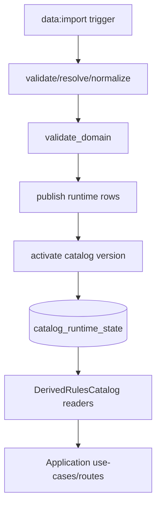

# Spec: Catalog Publish and RulesCatalog Interface (Foundation)

## Related Feature

- Placeholder: `docs/features/foundation.md` (feature rundown not created yet).
- Roadmap alignment: Phase 0 foundation operational slice completion.

## Context

- The import parser pipeline now validates, resolves, normalizes, and domain-validates Data Source input.
- The current `publish` stage is still a placeholder and does not persist normalized catalog content for runtime reads.
- Runtime `RulesCatalog` interfaces are defined in ports, but concrete derived reader adapters are not yet wired.
- Result: imports can succeed, but application code cannot query published class/spell/feat/feature content through `RulesCatalog`.

This spec defines the first publishable runtime catalog implementation and reader interface wiring.

## Current Plan

### Scope of this spec

- Persist normalized import output as versioned runtime catalog data.
- Atomically activate a catalog version when publish succeeds.
- Implement `DerivedRulesCatalog` backed by published catalog storage.
- Wire composition to expose usable `rulesCatalog.*` readers in app services.

### Storage strategy (v1)

Use a hybrid relational model in SQLite (via Prisma):

- canonical entity rows for flexibility and schema stability
- typed relation/projection rows for high-value lookups and filters

v1 storage shape:

- `CatalogEntity` (canonical rows)
  - scoped by `catalogVersionId`
  - stores normalized identity/name/source/kind and `payloadJson`
- `CatalogFeatureReference` (owner -> feature links)
- `CatalogSpellSourceEdge` (spell availability graph)

Guidance:

- canonical table is the runtime source of truth for entity payloads.
- relation tables support queryability and avoid reparsing JSON for critical option paths.

### Publish contract

On successful validation:

1. Create or reuse `CatalogVersion` for `(providerKind, datasetFingerprint, importerVersion)`.
2. Upsert canonical and relation rows for that catalog version.
3. Mark version publish status and publish timestamp.
4. Update active runtime pointer and activation event atomically.

Failure policy:

- publish/activation failures are fail-closed.
- active pointer remains unchanged on failure.

### Runtime RulesCatalog contract implementation

Implement `DerivedRulesCatalog` namespaces from published storage:

- `classes.get/list`
- `subclasses.get/listByClass`
- `races.get/list`
- `backgrounds.get/list`
- `spells.get/list`
- `feats.get/list`
- `features.resolve`
- `getDatasetVersion`

Rules:

- reads are always against active catalog version from runtime state.
- `get` methods return `null` on not found.
- filters execute through relational query criteria, not full-table JSON scans where avoidable.

### Integrity-mode behavior

- `strict`: integrity/parity errors block publish and activation.
- `warn`: publish may succeed with warnings; warnings are persisted and surfaced in CLI output.
- `off`: parity checks may be bypassed per existing policy.

## Data and Flow

Input:

- normalized data package from import pipeline (`entities`, `featureReferences`, `spellSourceEdges`).

Transform:

- normalize runtime rows for canonical and relation tables.
- write rows in transaction.
- activate catalog pointer in same transaction boundary as activation event.

Output:

- published and active catalog version with queryable runtime readers.

Trust boundaries:

- Data Source content remains untrusted until post-validation.
- Runtime readers trust only published storage content tied to active catalog version.

## Constraints and Edge Cases

- `publish` must be idempotent for same `(providerKind, datasetFingerprint, importerVersion)`.
- Activation pointer update must be atomic with activation-event insert.
- Concurrent publish attempts for same fingerprint must not duplicate active content inconsistently.
- Reader calls before any active version exists must return controlled operational error behavior.
- `RulesCatalog` payloads must preserve provenance fields required by option and lineage logic.
- Canonical payload storage must avoid runtime dependence on external Data Source file paths.
- Large payload writes must avoid unbounded memory amplification during publish.

## Open Questions

Blocking:

- Should publish use full replacement semantics per version (`delete + insert` for version rows) or upsert-diff semantics for row writes?
- Should activation happen in same transaction as publish row writes, or as a second guarded transaction after successful publish commit?
- What is the maximum accepted payload size for `payloadJson` per row in SQLite for v1, and what behavior is required if exceeded?

Non-blocking:

- Do we want optional JSON artifact snapshots (versioned files) for audit/debug in addition to DB storage?
- Should `CatalogEntity` include lightweight indexed columns for common search text to improve `list(search)` latency in v1?
- Should read adapters cache active-version row sets in-memory by fingerprint, or rely only on DB reads initially?

## Related Implementation Plan

- `docs/specs/foundation/catalog-publish-and-rules-catalog-interface-implementation-plan.md`
