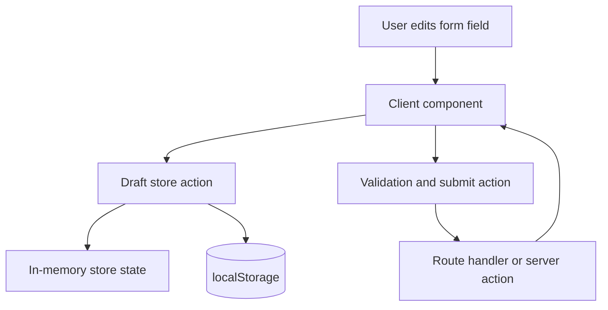
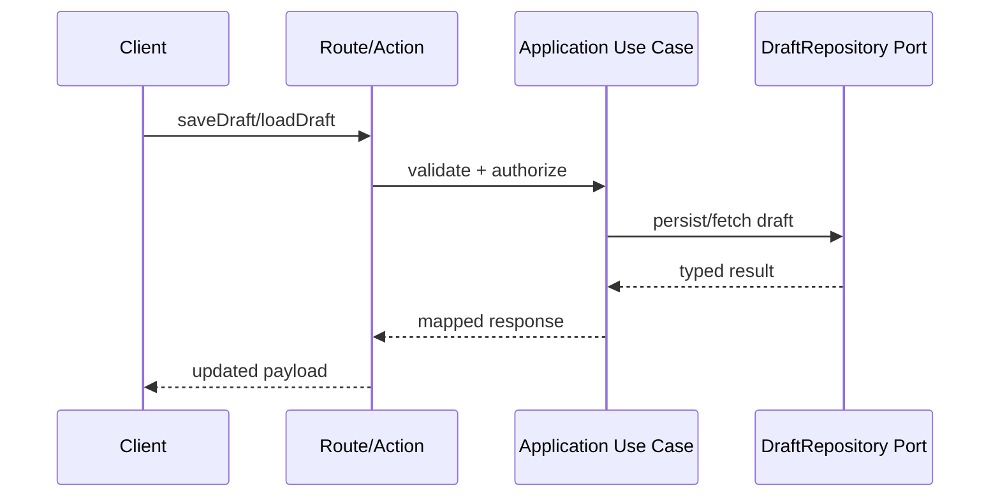

# Implementation Plan: Global State Management Foundation

## Metadata

- Status: `draft`
- Created At: `2026-04-04`
- Last Updated: `2026-04-04`
- Owner: `Antony Acosta`

## Changelog

- `2026-04-04` - `OpenCode` - Created initial implementation plan from accepted architecture decisions for draft/workflow global state.

## Goal

- Implement a safe, App Router-compatible global-state foundation for unsaved draft and UI/workflow state.
- Preserve server ownership of canonical domain entities while giving users durable draft recovery across reload and route transitions.

In scope (implement now):

- Add Zustand-based client store for draft/workflow state only.
- Add local persistence with FIFO retention (last `20` drafts per scope).
- Add action-based persistence triggers (blur + explicit save/submit interaction points).
- Add conflict resolution behavior (`updatedAt` timestamp last-write-wins, no warning UI in v1).
- Add shared contributor governance under `.rulesync` for global-state boundaries.

Out of scope (defer intentionally):

- Cross-tab synchronization.
- Collaborative/multi-user draft merging UX.
- Undo/redo timeline system.
- Full server draft persistence storage implementation (phase 2); this plan only creates the seam contracts.

Completion criteria:

- Global store only contains allowed workflow/draft state.
- Drafts rehydrate after refresh and route transitions without hydration mismatch behavior.
- Invalid or unmigratable persisted payloads fail safely and do not break route rendering.
- Retention limits enforce `20` entries per scope with FIFO eviction.
- `.rulesync` includes explicit global-state guidance and generated instructions are refreshed.

## Non-Goals

- Moving domain invariants or authorization logic into client state.
- Replacing server actions/route handlers with client-only persistence.
- Broad front-end refactors unrelated to state boundaries and persistence behavior.

## Related Docs

- `docs/architecture/global-state-management.md`
  - Source of truth for boundaries, conflict policy, and retention decisions.
- `docs/architecture/app-architecture.md`
  - Enforces layer direction and server/client responsibilities.
- `docs/architecture/feature-workflow.md`
  - Defines spec/plan handoff expectations.
- `docs/specs/design-system/foundation.md`
  - Requires explicit loading/empty/validation/recoverable-failure states.

## Existing Code References

- `src/app/layout.tsx`
  - Reuse: root layout boundary where client provider wrappers can be added safely.
  - Keep consistent: server component default for route shell.
  - Do not copy forward: starter scaffold assumptions about no stateful providers.
- `src/app/page.tsx`
  - Reuse: temporary integration target for first end-to-end draft behavior wiring.
  - Keep consistent: incremental replacement over large one-shot rewrite.
  - Do not copy forward: starter tutorial-only content.
- `.rulesync/rules/10-coding-standards.md`
  - Reuse: KISS and state locality guidance.
  - Keep consistent: explicit boundaries and readable patterns.
  - Do not copy forward: implicit assumptions that local component state is always enough.
- `.rulesync/rules/20-frontend-work.md`
  - Reuse: server-component-first guidance for App Router.
  - Keep consistent: add client boundaries only when interactivity requires them.
  - Do not copy forward: missing explicit global-state guardrails.

## Files to Change

- `package.json` (risk: low)
  - Add `zustand` dependency.
  - Depends on: final store module path choice.
- `src/app/layout.tsx` (risk: medium)
  - Wire a thin client provider for store bootstrapping/rehydration.
  - Depends on: `src/client/state/draft-store.provider.tsx`.
- `src/app/page.tsx` (risk: low)
  - Add temporary reference usage for draft patch/load/clear flow until feature routes exist.
  - Depends on: store and selector exports.
- `docs/architecture/global-state-management.md` (risk: low)
  - Update status/changelog after implementation choices are final.

## Files to Create

Client state modules:

- `src/client/state/draft-store.types.ts`
  - Owns `DraftScope`, `DraftEnvelope`, action payload contracts, and schema-version constants.
- `src/client/state/draft-store.storage.ts`
  - Owns localStorage parsing, migration checks, keying (`dcm:draft:<scope>:<entityId>:v<schemaVersion>`), and FIFO retention utilities.
- `src/client/state/draft-store.ts`
  - Owns Zustand store creation, typed actions, and action-based persistence entry points.
- `src/client/state/draft-store.selectors.ts`
  - Owns stable selector helpers for rerender-safe reads.
- `src/client/state/draft-store.provider.tsx`
  - Owns client-only rehydrate call and provider-like bootstrapping wrapper.

Optional phase-2 seam contracts (no storage adapter implementation yet):

- `src/server/ports/draft-repository.ts`
  - Contract for save/load draft capabilities.
- `src/server/application/use-cases/save-draft.ts`
  - Application-level save orchestration and policy checks.
- `src/server/application/use-cases/load-draft.ts`
  - Application-level load orchestration and policy checks.

Rulesync governance:

- `.rulesync/rules/25-global-state-management.md` (conditional)
  - Create if no equivalent rule exists.
  - Must cover server truth boundary, allowed global-store contents, persistence constraints, and prohibited patterns.

Tests:

- `src/client/state/__tests__/draft-store.test.ts`
  - Store action and selector behavior.
- `src/client/state/__tests__/draft-store.storage.test.ts`
  - Migration failure handling and FIFO retention behavior.

## Data Flow

Local-first draft flow (v1):



Phase-2 server seam flow (planned):



Trust boundaries:

- Untrusted: route/query/form inputs and persisted local payload bytes.
- Validated: client payload guards before store write; server validation/auth before phase-2 persistence.
- Trusted: application/domain invariants and canonical server entities.

## Behavior and Edge Cases

Expected behavior:

- Success path:
  - Draft updates persist on blur and explicit save/submit actions.
  - Reopen/reload restores latest valid draft.
- Validation failure path:
  - Submit errors do not clear draft; user can continue editing.
- Payload corruption path:
  - Corrupt or unmigratable payloads are discarded safely and rendering continues.
- Retention pressure path:
  - When entries exceed `20` for a scope, oldest entries are evicted first.

Fail-open vs fail-closed:

- Fail-open: UI remains usable if local draft payload is invalid.
- Fail-closed: invalid payload must never be applied as draft state.

## Error Handling

Error categories:

- `draft_payload_invalid`
  - local parse/migration failure; discard payload and continue.
- `draft_persistence_unavailable`
  - storage unavailable (private mode/quota); keep in-memory state and surface recoverable warning.
- `draft_server_save_failed` (phase 2)
  - server save failed; keep local dirty state.

Translation rules:

- Storage/serialization errors are translated at store-storage boundary.
- Server-side errors are translated at route/action boundary per API error contract.

## Types and Interfaces

```ts
export type DraftScope =
  | "character-create"
  | "progression-plan"
  | "branch-edit"
  | "snapshot-prepare";

export interface DraftEnvelope<TData> {
  scope: DraftScope;
  entityId: string;
  schemaVersion: number;
  updatedAt: string;
  data: TData;
  isDirty: boolean;
}

export interface DraftStoreState {
  byScope: Record<DraftScope, DraftEnvelope<unknown>[]>;
}
```

Ownership:

- Client types live under `src/client/state/*`.
- Phase-2 transport/application contracts live under `src/server/ports` and `src/server/application`.

## Functions and Components

- `createDraftStore()`
  - Creates Zustand store with typed actions and persistence hooks.
- `rehydrateDraftsForScope(scope)`
  - Loads and validates persisted drafts for active scope.
- `patchDraft(scope, entityId, patch)`
  - Applies partial update, refreshes timestamp, and enforces FIFO limit.
- `DraftStoreProvider`
  - Client-only wrapper that triggers safe rehydrate on mount.

## Integration Points

- App Router layout integration at `src/app/layout.tsx` with minimal client boundary.
- Feature routes consume selectors/actions from store modules.
- Phase-2 server seam integrates through route handlers/server actions and application use-cases.
- Rulesync integration requires rule authoring and regeneration commands:
  - `bun run ai:generate`
  - `bun run ai:check`

## Implementation Order

1. Add governance rule in `.rulesync`
   - Output: `.rulesync/rules/25-global-state-management.md` or documented update to equivalent rule.
   - Verify: `bun run ai:generate` and `bun run ai:check`.
   - Merge safety: yes (docs/tooling only).
2. Add client draft store contracts and storage helpers
   - Output: type + storage + core store modules.
   - Verify: unit tests for parse/migration/FIFO behavior.
   - Merge safety: yes (no route wiring yet).
3. Wire provider and first route integration
   - Output: `layout.tsx` provider usage + sample route flow.
   - Verify: manual reload/restore scenarios and lint.
   - Merge safety: partial (route behavior visible).
4. Add phase-2 server seam contracts (no adapter)
   - Output: draft repository port + application use-case shells.
   - Verify: type/lint + basic contract tests.
   - Merge safety: yes (not wired to persistence adapter).

## Verification

Automated checks:

- `bun run lint`
- `bun test src/client/state/__tests__/draft-store.test.ts`
- `bun test src/client/state/__tests__/draft-store.storage.test.ts`
- `bun run ai:generate`
- `bun run ai:check`

Manual scenarios:

- Edit draft, blur field, refresh page: latest draft restored.
- Submit invalid form: draft retained.
- Force >20 drafts in one scope: oldest entries removed first.
- Corrupt local payload manually: app loads without crash and ignores bad payload.

## Notes

- Architecture status should move to `accepted` before code implementation begins.
- Keep phase-2 seams small; do not implement full server persistence until feature routes need it.

## Rollout and Backout

- Rollout:
  - Ship local persistence first.
  - Add phase-2 contracts without runtime activation.
- Backout:
  - Disable local persistence read/write paths while keeping in-memory store active.
  - Keep provider in place to avoid route rewiring churn.

## Definition of Done

- Global draft/workflow store exists with bounded, tested persistence behavior.
- State ownership boundaries are enforced by code structure and Rulesync guidance.
- Verification checks pass and documentation links are updated.
