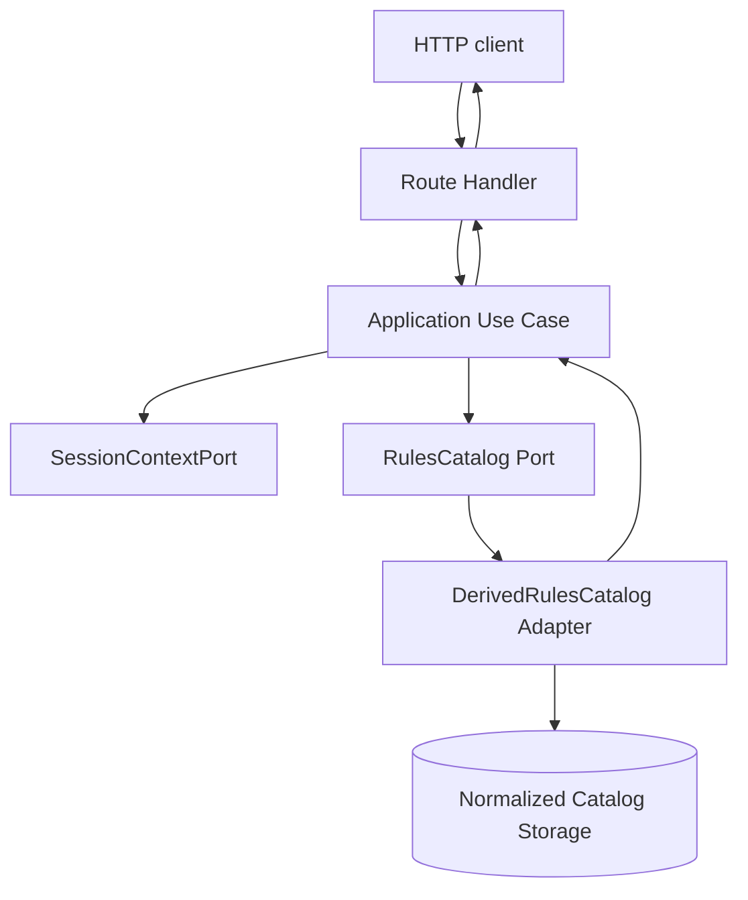
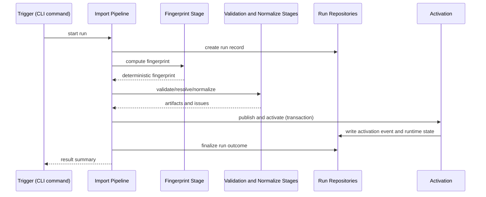

# Implementation Plan: Architectural Foundation (Phase 0)

## Metadata

- Status: `in-progress`
- Created At: `2026-04-03`
- Last Updated: `2026-04-04`
- Owner: `Antony Acosta`

## Changelog

- `2026-04-03` - `Antony Acosta` - Initial document created.
- `2026-04-04` - `Antony Acosta` - Backfilled metadata and changelog sections for lifecycle tracking. (Made with OpenCode)

## Goal

- Deliver a working backend foundation that enforces the repository's architecture rules in running code, not just in documentation.
- Enable feature teams to build use-cases on top of stable boundaries: composition -> application -> ports -> adapters.
- Produce a first end-to-end operational slice that includes auth, lineage-aware catalog metadata, and an optional example rules-read HTTP surface.

In scope (this plan implements now):

- server-side composition baseline and typed runtime config
- auth/session context port and Better Auth adapter wiring
- SQLite-first Prisma baseline for catalog lineage/import run/activation state
- import pipeline skeleton with deterministic fingerprint stage and run issue recording
- import trigger as CLI command (`bun run data:import`), not HTTP-triggered
- default `DerivedRulesCatalog` runtime adapter and `RawRulesCatalog` seam
- one operational CLI command through application use-cases
- optional example rules-read endpoint (for transport contract demonstration only)
- baseline tests for contract behavior, authz behavior, and deterministic fingerprinting

Out of scope (intentionally deferred):

- full domain behavior for progression, branching, world locks, and snapshot generation
- complete normalization logic for all Data Source entity types
- UI-heavy product flows beyond minimal API integration
- production hardening features such as distributed job runners
- admin HTTP endpoint that triggers import pipeline execution
- `RawRulesCatalog` runtime implementation and provider parity work (v2)
- full rules-entity API surface definition and rollout

Completion criteria:

- Application layer can enforce authz and read from `RulesCatalog` without touching adapter internals.
- Import run records persist stage progress, issues, and outcome even when failures occur.
- Active catalog version is switched atomically with activation event history.
- Operational command exposes provider/fingerprint/integrity state with stable CLI contract.
- If example classes route is implemented, it returns deterministic typed data via application use-case.
- Lint/typecheck/tests for this slice pass.

## Non-Goals

- Implementing the complete character lifecycle feature set for Roadmap phases 1-7.
- Building a full admin UI for import/activation operations.
- Shipping `RawRulesCatalog` as parity-complete production default.
- Introducing GraphQL, service decomposition, or cross-process event buses.

## Related Docs

- `README.md`
  - Product framing and core invariants that this implementation must preserve.
- `docs/ROADMAP.md`
  - Confirms this work belongs to Phase 0 (Foundation) and should not spill into feature scope.
- `docs/architecture/app-architecture.md`
  - Defines runtime layers, dependency direction, and non-negotiable invariants.
- `docs/architecture/data-sources.md`
  - Defines external source trust model and lineage requirements.
- `docs/architecture/parsing-pipeline.md`
  - Defines required import stages, deterministic behavior, and failure semantics.
- `docs/specs/parsing/option-complete-data-source-parsing.md`
  - Defines mandatory parser behavior to prevent false negatives and option loss.
- `docs/architecture/parser-option-completeness.md`
  - Defines shared parser completeness policy and fail-closed semantics.
- `docs/architecture/rules-catalog-provider.md`
  - Defines `RulesCatalog` contract, provider strategy, and migration protocol.
- `docs/architecture/catalog-lineage-and-import-runs.md`
  - Defines persistence model for versions, runs, issues, runtime state, and activation events.
- `docs/architecture/feature-workflow.md`
  - Defines handoff expectations and documentation workflow for follow-on feature specs.
- Placeholder: `docs/features/foundation.md`
  - Feature rundown does not exist yet; create when foundation work is tracked as a feature artifact.
- `docs/architecture/api-error-contract.md`
  - Canonical transport and error behavior for Phase 0 endpoints.

## Existing Code References

- `src/server/ports/rules-catalog.ts`
  - Reuse: namespaced reader contract and additive extension shape.
  - Keep consistent: `get` returns `null` for not found and `getDatasetVersion()` semantics.
  - Do not copy forward: generic `payload: Record<string, unknown>` as long-term domain shape.
- `src/server/composition/rules-catalog-factory.ts`
  - Reuse: composition-root provider selection pattern.
  - Keep consistent: lightweight DI and no global service locator behavior.
  - Do not copy forward: minimal options shape should evolve into typed app config.
- `src/app/layout.tsx`
  - Reuse: app shell root integration point for auth/session provider glue if needed.
  - Keep consistent: server-safe defaults and App Router conventions.
  - Do not copy forward: route-level operational logic in UI layer.
- `package.json`
  - Reuse: existing lint and build scripts as baseline verification.
  - Keep consistent: Bun command model and repository script naming style.
  - Do not copy forward: missing operational scripts for data/import/db lifecycle.

## Files to Change

- `package.json` (risk: medium)
  - Add dependencies for Prisma/Better Auth and scripts for `db:*`, `data:fingerprint`, and `data:import` entry points.
  - Why risk: dependency changes affect local setup and CI behavior.
  - Depends on: final naming of import runner and Prisma location.

- `src/server/composition/rules-catalog-factory.ts` (risk: low)
  - Expand factory options to consume app config instead of narrow provider-only options.
  - Why risk: small API change with local call-site impact only.
  - Depends on: `src/server/composition/app-config.ts`.

- `src/server/ports/rules-catalog.ts` (risk: low)
  - Keep interface stable; only tighten comments/error semantics if needed for tests.
  - Why risk: any contract break would ripple into future adapters/tests.
  - Depends on: none (port is source contract).

- `src/app/layout.tsx` (risk: low)
  - Wire auth/session wrapper only if required by chosen Better Auth integration path.
  - Why risk: could unintentionally move server/client boundaries.
  - Depends on: `src/auth.ts` and auth integration decision.

## Files to Create

Ports (ownership: server architecture and application boundary):

- `src/server/ports/session-context.ts`
  - Session identity/role contract for application authz decisions.
- `src/server/ports/catalog-version-repository.ts`
  - Catalog version, runtime state, and activation repository contract.
- `src/server/ports/catalog-import-run-repository.ts`
  - Import run lifecycle and issue logging contract.

Composition (ownership: composition root only):

- `src/server/composition/app-config.ts`
  - Parse/validate runtime config (`rulesProvider`, `dataIntegrityMode`, environment values).
- `src/server/composition/create-app-services.ts`
  - Central wiring of adapters into use-case functions.

Auth adapter (ownership: infrastructure integration):

- `src/auth.ts`
  - Better Auth config and exported helpers for session access.
- `src/server/adapters/auth/auth-session-context.ts`
  - Better Auth-backed `SessionContextPort` implementation.

Prisma persistence (ownership: adapter layer):

- `prisma/schema.prisma`
  - Initial schema for auth and catalog lineage/runtime state entities.
- `src/server/adapters/prisma/prisma-client.ts`
  - Prisma singleton and lifecycle-safe client access.
- `src/server/adapters/prisma/catalog-version-repository.ts`
  - Concrete adapter for catalog versions/runtime state/activation events.
- `src/server/adapters/prisma/catalog-import-run-repository.ts`
  - Concrete adapter for import runs and issues.

Import pipeline (ownership: non-request operational path):

- `src/server/import/types.ts`
  - Shared stage/outcome/issue types.
- `src/server/import/fingerprint/compute-dataset-fingerprint.ts`
  - Deterministic fingerprint logic over source root from `EXTERNAL_DATA_PATH`.
- `src/server/import/run-import-pipeline.ts`
  - Stage orchestration and failure semantics.
- `src/server/import/publish/activate-catalog-version.ts`
  - Transactional activation helper.

Rules adapters (ownership: rules access infrastructure):

- `src/server/adapters/rules-catalog/derived-rules-catalog.ts`
  - Default provider aggregation over namespaced readers.
- `src/server/adapters/rules-catalog/raw-rules-catalog.ts`
  - Non-default seam with explicit unsupported behavior where incomplete.
- `src/server/adapters/rules-catalog/readers/*.ts`
  - Reader modules for `classes`, `subclasses`, `races`, `backgrounds`, `spells`, `feats`, `features`.

Application use-cases (ownership: policy + orchestration):

- `src/server/application/use-cases/get-rules-catalog-health.ts`
  - Admin operational read model for provider/fingerprint/integrity status.
- Optional: `src/server/application/use-cases/list-class-options.ts`
  - Example authz-guarded read use-case for class option discovery.

Transport and command boundaries (ownership: surface boundary):

- `src/server/cli/ops-catalog-health.ts`
  - CLI command entrypoint for catalog health (`bun run ops:catalog:health`).
- Optional: `src/app/api/rules/classes/route.ts`
  - Example rules list endpoint backed by application use-case.

Tests (ownership: contract safety):

- `src/server/ports/__tests__/rules-catalog-contract.test.ts`
  - Shared contract assertions for provider behavior.
- `src/server/import/__tests__/compute-dataset-fingerprint.test.ts`
  - Determinism and ordering stability checks.
- Optional: `src/server/application/__tests__/list-class-options.authz.test.ts`
  - Owner/admin allow paths and deny paths for example endpoint.

## Data Flow

Optional request path flow (example route):



Primary import flow:



Trust boundaries and validation points:

- Untrusted external input boundary: path configured by `EXTERNAL_DATA_PATH` enters only in import modules.
- Transport boundary: route params/query/body validated before use-case invocation.
- Policy boundary: authz in application layer before adapter calls.
- Storage boundary: adapters validate persistence invariants and map DB errors to stable error categories.

## Behavior and Edge Cases

Success path:

- Import run starts, fingerprints input deterministically, validates data, publishes catalog version, atomically activates pointer, and records success.
- Runtime rules endpoint returns stable typed entity refs based on active dataset version.

Not found path:

- `RulesCatalog` namespace `get` returns `null` for missing entities.
- Application maps `null` to safe response model (`404` or empty result depending on endpoint contract).

Validation failure path:

- Import stage emits issue records with `severity=error`, marks run failed, and does not activate catalog.
- Runtime request validation returns typed client errors without adapter invocation.

Dependency unavailable path:

- DB/auth/provider availability failures map to operational error category and return controlled server error responses.

Known edge cases:

- Missing `EXTERNAL_DATA_PATH` directory -> import run fails in `sync` or `fingerprint` stage with explicit issue record.
- Fingerprint mismatch with expected active lineage under `strict` mode -> fail closed for operational checks.
- No active catalog version in runtime state -> health command reports mismatch/degraded state; rules endpoint returns controlled unavailable error.
- `RULES_PROVIDER=raw` in v1 -> startup/config validation fails with explicit unsupported-provider error.

Fail-open vs fail-closed decisions:

- Integrity checks: fail closed in `strict`, continue with warnings in `warn`, bypass only in `off` for controlled local use.
- Authz checks: always fail closed.
- Import publish/activation: always fail closed on transaction failure.

## Error Handling

Error categories:

- `ValidationError`
  - Input/schema failures at route or pipeline stage boundaries.
- `AuthorizationError`
  - Missing user context or insufficient role/ownership.
- `NotFoundError`
  - Semantic missing resource when endpoint contract requires explicit not-found handling.
- `RulesCatalogUnavailableError`
  - Provider/storage unavailable.
- `RulesCatalogDatasetMismatchError`
  - Integrity/lineage mismatch with expected dataset.
- `PersistenceError`
  - Unexpected repository/transaction failures.

Translation boundaries:

- Adapter layer translates DB/provider-specific failures into stable adapter errors.
- Application layer maps adapter errors into policy-aware operational errors.
- Route handlers map application errors into HTTP response status and safe payloads.

User-facing vs operational:

- User-facing: validation/authz/not-found summaries with no sensitive internals.
- Operational-only: stack traces, SQL/provider internals, source file details.

Logging fields (minimum):

- `requestId`
- `userId` (when available)
- `useCase`
- `providerKind`
- `datasetFingerprint`
- `importRunId` (for pipeline operations)
- `stage` (for pipeline issues)
- `errorCode`

## Types and Interfaces

Core config and session types:

```ts
export type RulesProviderKind = "derived" | "raw";
export type DataIntegrityMode = "strict" | "warn" | "off";

export interface AppConfig {
  rulesProvider: RulesProviderKind;
  dataIntegrityMode: DataIntegrityMode;
  nodeEnv: "development" | "test" | "production";
}

export interface SessionContext {
  userId: string | null;
  isAdmin: boolean;
}

export interface SessionContextPort {
  getSessionContext(): Promise<SessionContext>;
}
```

Import contracts:

```ts
export type ImportStage =
  | "sync"
  | "fingerprint"
  | "validate_source"
  | "resolve"
  | "normalize"
  | "validate_domain"
  | "publish";

export type ImportOutcome = "running" | "succeeded" | "failed" | "cancelled";

export interface ImportIssue {
  stage: ImportStage;
  severity: "info" | "warn" | "error";
  code: string;
  message: string;
  filePath?: string;
}
```

Layer ownership and conversion:

- Port-owned types live in `src/server/ports/**/*` and are implementation agnostic.
- Adapter-internal types (Prisma records, Better Auth objects) stay in adapter modules.
- Application DTOs are mapped from port types before returning to route handlers.

## Functions and Components

Composition functions:

- `readAppConfig()`
  - Responsibility: parse environment into typed `AppConfig` with safe defaults.
  - Side effects: none.
  - Output: config object or startup error.

- `createAppServices(config)`
  - Responsibility: wire adapters and expose use-case functions.
  - Side effects: initializes dependencies.
  - Output: callable use-case set.

Import pipeline functions:

- `runImportPipeline(args)`
  - Responsibility: orchestrate fixed stage order and persistence of run state/issues.
  - Side effects: writes run records, catalog versions, runtime state, activation events.
  - Output contract: returns run summary including import metrics for CLI output (`runId`, `outcome`, `catalogVersionId?`, `metrics`).
  - Idempotency: re-run with same fingerprint/importer version should no-op or create equivalent non-active duplicate per policy.

- `computeDatasetFingerprint(rootPath)`
  - Responsibility: deterministic fingerprint from sorted `(relativePath, hash)` tuples.
  - Side effects: optional debug manifest output only.

- `activateCatalogVersion(args)`
  - Responsibility: transactionally write activation event and update runtime pointer.
  - Transaction boundary: single DB transaction, fail all-or-nothing.

Application use-cases:

- `getRulesCatalogHealth()`
  - Responsibility: expose provider/fingerprint/integrity metadata for operational diagnostics.
  - Input: optional operator context.
  - Output: operational health DTO.

- Optional: `listClassOptions(args)`
  - Responsibility: authorize request and query class reader with deterministic filters.
  - Input: session context and optional search filter.
  - Output: stable list DTO.

## Integration Points

- App Router route handlers in `src/app/api/**/*` call application services only.
- Storage integration uses Prisma adapters behind repository ports.
- External source integration occurs only in import modules under `src/server/import/**/*`.
- Import trigger integration is CLI-only in v1 (`bun run data:import`); no import route handler.
- CLI command output contract: `bun run data:import` prints structured JSON summary to stdout, including import metrics so teams can persist snapshots only when needed.
- Auth integration uses Better Auth and feeds `SessionContextPort`.
- Configuration and feature gates:
  - `RULES_PROVIDER` (`derived` in v1; `raw` reserved and rejected)
  - `DATA_INTEGRITY_MODE` (`strict`, `warn`, `off`)
  - `DATABASE_URL`
  - `EXTERNAL_DATA_PATH`
  - `BETTER_AUTH_SECRET`, `BETTER_AUTH_URL`, and provider-specific auth vars
- Rollout dependencies:
  - `raw` provider work starts in v2 after dedicated spec + parity test plan.

## Implementation Order

1. Add baseline dependencies and scripts.
   - Output: updated `package.json` with Prisma/Better Auth/data scripts.
   - Verify: `bun install` and `bun run lint`.
   - Merge safety: yes; no runtime behavior change yet.

2. Add typed app config and composition root.
   - Output: `src/server/composition/app-config.ts`, `src/server/composition/create-app-services.ts`.
   - Verify: typecheck + simple unit test for config parsing.
   - Merge safety: yes; can ship without endpoint wiring.

3. Add session context port and Better Auth adapter.
   - Output: `src/server/ports/session-context.ts`, `src/server/adapters/auth/auth-session-context.ts`, `src/auth.ts`.
   - Verify: lint + manual session resolution test path.
   - Merge safety: partial; safe behind non-required route usage.

4. Add Prisma schema and client adapter baseline.
   - Output: `prisma/schema.prisma`, Prisma client singleton.
   - Verify: generate client and run migration locally.
   - Merge safety: yes with migration reviewed.

5. Implement catalog repository adapters.
   - Output: version/run repository ports and Prisma implementations.
   - Verify: adapter unit tests for create/update/failure flows.
   - Merge safety: yes; unused until pipeline wiring.

6. Implement import pipeline skeleton and fingerprint stage.
   - Output: `run-import-pipeline.ts` and deterministic fingerprint utility.
   - Verify: deterministic fingerprint tests and failure issue persistence tests.
   - Merge safety: yes; command-only path.

7. Implement rules catalog adapters.
   - Output: `derived-rules-catalog.ts`, `raw-rules-catalog.ts`, reader modules.
   - Verify: contract tests for `derived`; explicit unsupported tests for `raw`.
   - Merge safety: partial; safe if default remains `derived`.

8. Implement application use-cases and command/route surfaces.
   - Output: health use-case + CLI command, plus optional class-list use-case and route.
   - Verify: command integration checks; optional route authz/read checks if implemented.
   - Merge safety: yes if command contract is stable and authz enforced where route exists.

9. Add observability hooks and finalize operational checks.
   - Output: structured logs/metrics in use-cases and import runner.
   - Verify: manual run confirms required fields emitted.
   - Merge safety: yes.

## Verification

Automated checks:

- `bun run lint`
- `bun x tsc --noEmit`
- contract tests for `RulesCatalog` behavior (`derived` required, `raw` explicit non-support allowed)
- deterministic fingerprint tests across repeated runs and file-order permutations
- authz tests for allow/deny paths in use-cases
- parser option-expansion tests include feat/optional feature contributors when resolve/normalize stages are implemented

Manual scenarios:

- Run import command against local `EXTERNAL_DATA_PATH` and confirm run/issue records persist.
- Confirm CLI output includes parseable JSON summary with `runId`, `outcome`, and `metrics`.
- Verify failed import does not alter active catalog pointer.
- Verify parsed option coverage includes feats and optional features in supported readers when parser coverage is enabled.
- Run `bun run ops:catalog:health`; confirm JSON output on success and non-zero exit code on strict mismatch.
- Optional: call `GET /api/rules/classes` and confirm typed, deterministic output if example route is implemented.

Observability checks:

- Confirm use-case logs include `requestId`, `useCase`, `providerKind`, `datasetFingerprint`.
- Confirm import logs include `importRunId`, `stage`, `outcome`, and error codes.

Negative and recovery checks:

- Negative: set invalid `DATA_INTEGRITY_MODE` and assert startup/config validation fails.
- Negative: simulate DB unavailable path and confirm controlled operational error response.
- Recovery: activate previous known-good catalog version and confirm runtime pointer rollback succeeds.

## Notes

Assumptions:

- SQLite is the active local DB for Phase 0.
- Auth provider configuration is available for local development.
- `EXTERNAL_DATA_PATH` is set locally, points to external source input, and remains read-only at runtime.

Resolved decisions:

- Import trigger is CLI-only in foundation scope (`bun run data:import` via Bun/Node runtime).
- `RawRulesCatalog` is unsupported in v1 and deferred to v2.
- Import metrics are emitted as part of CLI command output (stdout JSON), not required as a dedicated persisted schema contract in v1.
- Auth integration standard for v1 foundation is Better Auth (Prisma adapter path).
- Generated lookup parity mismatch handling is coupled to `DATA_INTEGRITY_MODE` in v1.
- `additionalSpells` filter expressions require full v1 evaluation; unsupported expression shapes fail closed.

Deferred follow-ups:

- Full parser/normalizer coverage for all target entities.
- Provider parity shadow-read harness in staging.
- Additional application use-cases beyond health and optional class-list example.

Optional route pseudocode (example only):

```ts
export async function GET(request: Request) {
  const services = createAppServices(readAppConfig());
  const data = await services.listClassOptions({
    search: (new URL(request.url)).searchParams.get("q") ?? undefined,
  });

  return Response.json({ data });
}
```

CLI output example:

```json
{
  "runId": "run_01HXYZ...",
  "outcome": "succeeded",
  "catalogVersionId": "cat_01HXYZ...",
  "metrics": {
    "stageDurationsMs": {
      "sync": 120,
      "fingerprint": 380,
      "validate_source": 640,
      "resolve": 1120,
      "normalize": 980,
      "validate_domain": 410,
      "publish": 210
    },
    "entityCounts": {
      "classes": 12,
      "subclasses": 46,
      "spells": 362
    },
    "issueCounts": {
      "info": 4,
      "warn": 1,
      "error": 0
    }
  }
}
```

## Rollout and Backout

Rollout strategy:

- Land in small merge-safe slices by layer (ports -> adapters -> composition -> use-cases -> routes).
- Keep `RULES_PROVIDER=derived` as default during entire rollout.
- Gate operational routes by admin policy from first release.
- Keep import runner command-only for v1 foundation scope.

Backout strategy:

- If runtime issues occur, switch config back to known-good provider/settings.
- Roll back active catalog by re-activating last known-good catalog version.
- Disable operational health command usage in automation if diagnostics are unstable.
- Revert migration-dependent code only with forward-safe migration plan (no destructive resets).

## Definition of Done

- [ ] Config and composition root are implemented and used by command/route surfaces.
- [ ] Auth/session port and adapter enforce application-layer authz checks.
- [ ] Prisma schema and repository adapters support lineage/run/activation workflows.
- [ ] Import pipeline skeleton runs end-to-end and persists diagnostics.
- [ ] `DerivedRulesCatalog` provides namespaced readers and dataset version metadata.
- [ ] `RawRulesCatalog` seam exists with explicit unsupported behavior where incomplete.
- [ ] Health CLI command runs through application use-case.
- [ ] Optional: class-list endpoint runs through application use-case if route example is implemented.
- [ ] Lint/typecheck/tests for this scope pass.
- [ ] Documentation and runbook notes are updated for operators/developers.
