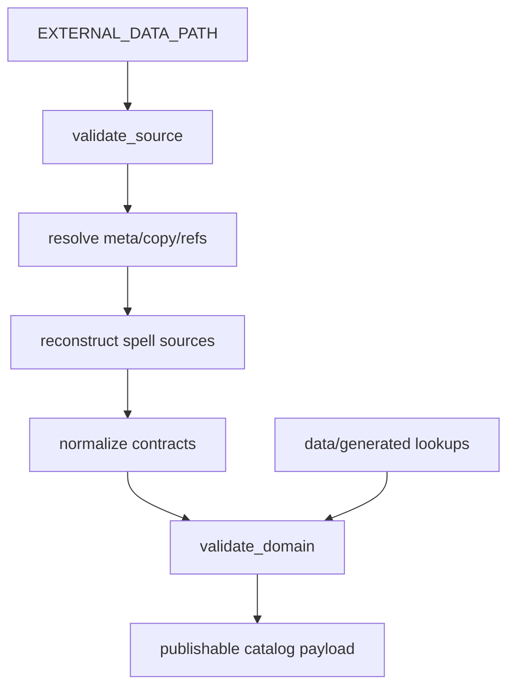

# Spec: Option-Complete Data Source Parsing (Foundation)

## Metadata

- Status: `in-progress`
- Created At: `2026-04-04`
- Last Updated: `2026-04-04`
- Owner: `Antony Acosta`

## Changelog

- `2026-04-04` - `Antony Acosta` - Initial document created.
- `2026-04-04` - `OpenCode` - Backfilled metadata and changelog sections for lifecycle tracking.
- `2026-04-04` - `OpenCode` - Tuned status to reflect active implementation progress.

## Related Feature

- Placeholder: `docs/features/foundation.md` (feature rundown not created yet).
- Roadmap scope: Phase 0 foundation import pipeline and rules data readiness.

## Context

- The current import pipeline is intentionally skeletal for foundation setup and does not yet implement full parsing semantics.
- Investigation of the current Data Source format confirmed that option availability is distributed across canonical files, meta directives, and cross-entity references.
- The highest product risk in this area is false negatives: options that should be available but are silently omitted by incomplete parsing.
- Option gaps directly damage trust in future features (character creation, progression planning, spell selection), so parser completeness is a correctness concern, not an enhancement.

This spec defines the required behavior for the first parser slice that is safe to build on for character-facing features.

## Current Plan

### Scope of this spec

- Define mandatory parser behavior that prevents option loss.
- Define required coverage for spell source expansion and reference resolution.
- Define failure semantics for unsupported or unresolved source structures.

### Canonical input contract

Path convention:

- All paths in this spec are relative to `EXTERNAL_DATA_PATH` from local `.env`.
- `EXTERNAL_DATA_PATH` is the only source root contract; no hardcoded absolute path is allowed.

Canonical inputs for this slice:

- `<EXTERNAL_DATA_PATH>/class/index.json`
- `<EXTERNAL_DATA_PATH>/class/class-*.json`
- `<EXTERNAL_DATA_PATH>/spells/index.json`
- `<EXTERNAL_DATA_PATH>/spells/spells-*.json`
- `<EXTERNAL_DATA_PATH>/spells/sources.json`
- `<EXTERNAL_DATA_PATH>/races.json`
- `<EXTERNAL_DATA_PATH>/backgrounds.json`
- `<EXTERNAL_DATA_PATH>/feats.json`
- `<EXTERNAL_DATA_PATH>/optionalfeatures.json`

Generated files are not canonical source-of-truth, but become mandatory consistency checks when present:

- `<EXTERNAL_DATA_PATH>/generated/gendata-subclass-lookup.json`
- `<EXTERNAL_DATA_PATH>/generated/gendata-spell-source-lookup.json`

### Mandatory behavior to prevent false negatives

- Implement full spell-source parity reconstruction, not only direct `spells/sources.json` list reads.
- Ingest `additionalSpells` grants from all relevant entities: subclass, background, charoption, feat, optionalfeature, race, reward.
- Support all required `additionalSpells` structures:
  - direct spell UIDs
  - `choose.from`
  - `choose` filter expressions
  - `all` filter expressions
  - addition types `innate`, `known`, `prepared`, `expanded`
- Preserve `definedInSource` and `definedInSources` lineage semantics in resolved spell availability edges.
- Resolve `_meta.dependencies`, `_meta.includes`, `_meta.otherSources`, and `_meta.internalCopies`.
- Resolve recursive `_copy` behavior with `_mod` and `_preserve` handling.
- Parse class/subclass feature UIDs using Data Source-compatible source defaults and identity parts.
- Dereference class/subclass feature references from both string and object forms while preserving reference flags.
- Preserve provenance fields required for option integrity: `edition`, `reprintedAs`, `otherSources`, and inherited-source behavior.
- Emit fail-fast diagnostics for unresolved references, unsupported additional-spell structures, and identity collisions.

### Resolved decisions

- Generated-lookup parity mismatches use dedicated parser reason `PARSER_GENERATED_LOOKUP_MISMATCH` and map through existing transport envelopes.
- Generated-lookup mismatch handling is coupled to `DATA_INTEGRITY_MODE` in v1:
  - `strict`: import fails
  - `warn`: warning diagnostic allowed
  - `off`: parity checks may be skipped by mode policy
- `additionalSpells` filter expressions require full evaluation in v1.
- Unsupported expression shapes fail closed with `PARSER_UNSUPPORTED_ADDITIONAL_SPELLS_SHAPE`.

### Stage-level behavior

- `validate_source`
  - enforce file discovery and schema mapping rules
  - reject malformed index references and JSON parse failures
- `resolve`
  - apply meta directives, copy semantics, and reference dereferencing
  - build explicit, typed intermediate relations for option derivation
- `normalize`
  - map resolved data to stable internal contracts without dropping provenance
  - include spell-source edges that represent derived and direct option paths
- `validate_domain`
  - enforce referential integrity and option-coverage checks
  - compare against generated lookups when available and fail on divergence

## Data and Flow

Inputs:

- Untrusted external dataset under `EXTERNAL_DATA_PATH`
- Optional generated lookup files under `EXTERNAL_DATA_PATH/generated`

Transformation path:

1. File discovery reads canonical index/root files.
2. Source validation applies schema and structure checks.
3. Resolve applies `_meta` and `_copy` semantics and dereferences feature links.
4. Spell-source reconstruction merges direct lists and `additionalSpells`-derived grants.
5. Normalize emits internal contracts with stable IDs and provenance metadata.
6. Domain validation enforces completeness/integrity and generated-lookup parity checks.

Trust boundaries:

- Untrusted: all files in `external/`.
- Trusted after validation: parsed and schema-validated source documents.
- Trusted for runtime publication: normalized package that passes domain validation.

## Constraints and Edge Cases

- Security hard rule: source files under external-source paths are inspected only as data; no script execution from external source trees.
- Missing source defaults in class/subclass feature UIDs must follow Data Source defaults (not ad hoc local defaults).
- `_copy` self-reference and unresolved parent links are hard failures.
- Unknown `additionalSpells` structure is a hard failure; silent skipping is prohibited.
- Generated lookup files are not canonical inputs, but if present they are mandatory parity checks.
- `reprintedAs` and `edition` variants must not collapse into a single option identity without preserved lineage.
- Fail-open vs fail-closed:
  - fail-closed for any condition that can hide options (reference resolution gaps, unsupported structures, parity mismatches)
  - fail-open only for non-option-critical decorative metadata

## Open Questions

- None for this slice.

## Related Implementation Plan

- `docs/specs/foundation/implementation-plan.md` (update required before coding this slice).
