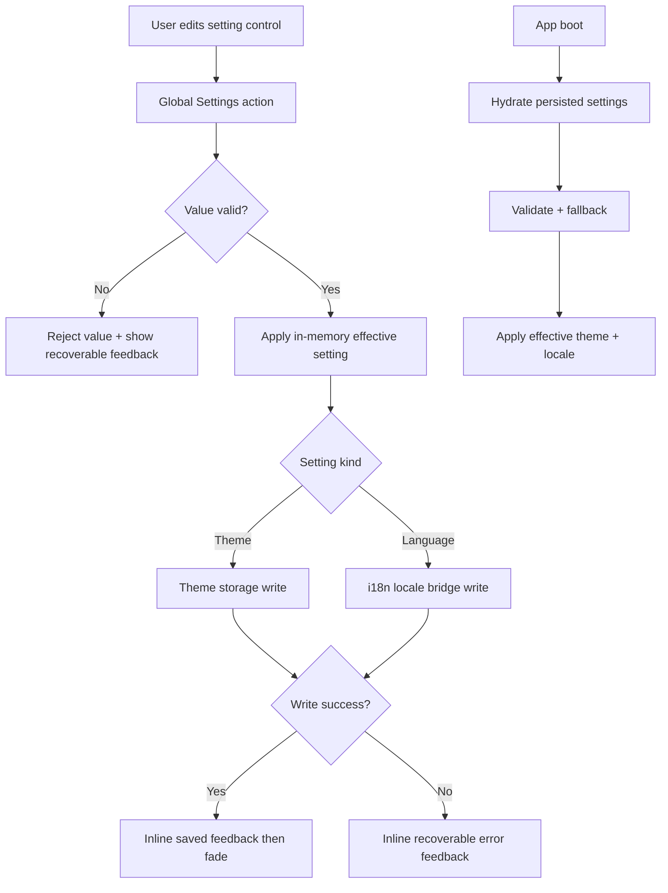

# Implementation Plan: Global Settings Foundation (MVP)

## Metadata

- Status: `ready`
- Created At: `2026-04-05`
- Last Updated: `2026-04-05`
- Owner: `Antony Acosta`

## Changelog

- `2026-04-05` - `Antony Acosta` - Expanded MVP scope to include an experimental theme border-radius setting with typed presets (`none` to `pronounced`) and updated plan details for contracts, actions/selectors, persistence/fallback validation, and verification coverage. (Made with OpenCode)
- `2026-04-05` - `Antony Acosta` - Created implementation plan for Global Settings MVP with locked scope decisions for theme/language, modal IA, unified consumer API, persistence ownership split, and verification strategy. (Made with OpenCode)

## Goal

- Deliver a small, centralized Global Settings MVP so users can reliably manage app-wide preferences from one discoverable control point.
- Ship only two preferences now (theme and language) while establishing a typed, extensible settings model and one unified consumer API; theme includes an experimental border-radius preset.
- Provide immediate user confidence with auto-apply behavior, immediate persistence, and visible save feedback.

In scope (implement now):

- Add a small cog trigger at the end of primary navigation that opens Global Settings.
- Build a two-pane modal information architecture:
  - left pane: settings section navigation
  - right pane: section content controls
- Implement MVP settings only:
  - theme (`palette`, `font`, experimental `radius`)
  - language (`SupportedLocale`)
- Expose one centralized selector/action API for all settings consumers.
- Keep persistence ownership split behind unified API:
  - theme persistence in Global Settings modules
  - locale persistence delegated to existing i18n path
- Validate persisted values before apply and fail safely to defaults.
- Show inline save feedback overlay on edited control with success fill + `Setting saved` copy and fade-out around `500-1000ms`.

Out of scope (defer intentionally):

- Any per-character/per-branch/per-world/per-game settings.
- Custom theme authoring, token editors, arbitrary palette/font uploads.
- Cross-tab real-time settings sync.
- Account/cloud sync of settings.
- Expansion to broader setting categories beyond theme/language.

Completion criteria:

- Global Settings opens from nav-end cog icon and renders a two-pane modal.
- Theme and language are editable only through Global Settings in MVP.
- Theme includes an experimental border-radius preset control with typed options (`none`, `subtle`, `moderate`, `pronounced`).
- Changes auto-apply and persist immediately with visible save feedback.
- Invalid persisted values fall back safely without broken UI.
- Consumers use centralized `useGlobalSettings(selector)` + typed actions (no ad-hoc storage access).

## Non-Goals

- Reworking design-system token architecture beyond what theme application requires.
- Replacing existing i18n locale resolution/convergence contracts.
- Building a generalized plugin/registry settings framework in MVP.
- Refactoring unrelated app-shell layout patterns.

## Related Docs

- `docs/features/global-settings.md`
  - Product scope, UX direction, and acceptance criteria for centralized user-level settings.
- `docs/specs/global-settings/foundation.md`
  - Technical contract and locked decisions for MVP behavior.
- `docs/architecture/global-state-management.md`
  - Selector/action-based client-state guidance and persistence boundary rules.
- `docs/specs/design-system/foundation.md`
  - Token and styling guardrails for palette/font application.
- `docs/specs/internationalization/foundation.md`
  - Locale persistence/resolution contract used by language setting.
- `docs/ROADMAP.md`
  - Phase 2 placement and strategic scope boundary.
- `docs/STATUS.md`
  - Operational status ledger and evidence tracking.

## Existing Code References

- `src/components/patterns/surface-shell.tsx`
  - Reuse: current app-shell header + primary nav composition point.
  - Keep consistent: nav control density and Arcane Codex styling semantics.
  - Do not copy forward: unrelated quick-action demo controls as settings entry points.

- `src/components/ui/dialog.tsx`
  - Reuse: modal baseline semantics and focus behavior.
  - Keep consistent: keyboard and accessibility contract already used by shell patterns.
  - Do not copy forward: simple demo content-only usage without section IA.

- `src/client/state/draft-store.ts` and `src/client/state/draft-store.selectors.ts`
  - Reuse: selector-first read path and typed action pattern.
  - Keep consistent: avoid ad-hoc component-level persistence logic.
  - Do not copy forward: draft-scope semantics that are domain/workflow-specific.

- `src/i18n/locales.ts` and `src/i18n/client-locale-convergence.ts`
  - Reuse: locale type/source-of-truth and convergence behavior.
  - Keep consistent: `en`/`es` allowlist and existing fallback ordering.
  - Do not copy forward: direct locale mutation from arbitrary UI components.

- `src/app/ui/sandbox/sandbox-theme-shell.tsx`
  - Reuse: approved MVP theme option set and baseline defaults (`2D`, `bookish`).
  - Keep consistent: palette/font code values and UI labels.
  - Do not copy forward: sandbox-local state implementation for production settings.

## Files to Change

- `src/components/patterns/surface-shell.tsx` (risk: medium)
  - Add nav-end cog trigger and wire modal open state.
  - Integrate Global Settings modal trigger placement contract.
  - Why risk: shared shell component impacts primary app navigation experience.
  - Depends on: new Global Settings modal component and labels.

- `src/app/workbench/page.tsx` (risk: low)
  - Provide Global Settings labels/messages needed by shell trigger if route-local labels are currently passed.
  - Why risk: mostly copy wiring.
  - Depends on: message keys.

- `src/app/codex/page.tsx` (risk: low)
  - Mirror workbench label wiring for consistency.
  - Why risk: mostly copy wiring.
  - Depends on: message keys.

- `src/app/layout.tsx` (risk: medium)
  - Wrap app children with Global Settings provider and hydration initializer.
  - Apply effective theme attributes/variables at root early enough to avoid visual mismatch.
  - Why risk: root-level change affects all routes and hydration behavior.
  - Depends on: Global Settings store/provider module.

- `src/app/globals.css` (risk: medium)
  - Add CSS variable mapping hooks/classes to apply selected palette/font combinations globally.
  - Why risk: broad visual blast radius if token mapping is wrong.
  - Depends on: normalized theme preference shape.

- `messages/en/common.json` (risk: low)
  - Add Global Settings labels, section names, control labels, save feedback copy (`Setting saved`), and error/help text.
  - Why risk: copy/key parity only.
  - Depends on: final component key structure.

- `messages/es/common.json` (risk: low)
  - Add parity translations for all new Global Settings keys.
  - Why risk: copy/key parity only.
  - Depends on: English source keys.

- `docs/specs/global-settings/foundation.md` (risk: low, conditional)
  - Update only if implementation reveals a true contract correction.
  - Why risk: doc drift if changed without clear reason.

## Files to Create

Global settings state contracts (owner: client-state boundary):

- `src/client/state/global-settings.types.ts`
  - Typed settings model, option unions, defaults, save-feedback status types.

- `src/client/state/global-settings.selectors.ts`
  - Selector helpers for theme (palette/font/radius), language, and control-level save feedback.

- `src/client/state/global-settings.store.ts`
  - Zustand store with typed actions (`setThemePalette`, `setThemeFont`, `setThemeRadius`, `setLanguage`, `resetToDefaults`).

- `src/client/state/global-settings.provider.tsx`
  - Provider/hydration wiring and consumer hooks (`useGlobalSettings`, `useGlobalSettingsActions`).

Theme persistence and apply layer (owner: Global Settings module):

- `src/client/state/global-settings.theme-storage.ts`
  - Theme read/write helpers, parse/validate payload, fallback handling.

- `src/client/state/global-settings.theme-apply.ts`
  - Apply validated theme preference to document/root CSS variables/attributes.

Locale delegation bridge (owner: Global Settings + i18n integration):

- `src/client/state/global-settings.locale-bridge.ts`
  - Adapter that delegates locale updates to existing i18n persistence/resolution path.

UI components (owner: frontend UI):

- `src/components/settings/global-settings-modal.tsx`
  - Two-pane modal container, section rail, and content panel composition.

- `src/components/settings/theme-settings-panel.tsx`
  - Palette/font/radius controls, auto-apply interaction, inline save feedback overlay.

- `src/components/settings/language-settings-panel.tsx`
  - Language control bound to locale bridge with same save feedback pattern.

- `src/components/settings/setting-save-feedback.tsx`
  - Reusable inline overlay feedback presenter (`saving`, `saved`, `error`) with reduced-motion-safe fade behavior.

Tests and tooling (owner: platform/frontend):

- `src/client/state/__tests__/global-settings.store.test.ts`
  - Store action/selector behavior, fallback handling, latest-write-wins semantics.

- `src/client/state/__tests__/global-settings.theme-storage.test.ts`
  - Theme parse/validate/storage unavailable paths.

- `src/components/settings/__tests__/global-settings-modal.a11y.test.tsx` (or nearest existing UI test location)
  - Modal semantics, keyboard traversal, focus return, live-region announcement.

## Data Flow

1. User clicks nav-end cog trigger.
2. Global Settings modal opens with section rail (`appearance`, `language`) and current effective values.
3. User changes theme palette/font/radius or language.
4. Action validates candidate value against allowlist.
5. Store applies valid value immediately to in-memory effective state.
6. Persistence executes immediately:
   - theme -> Global Settings theme storage
   - language -> i18n locale bridge
7. UI receives persistence result and shows inline feedback on edited control:
   - success: success fill + `Setting saved` copy, fade out `500-1000ms`
   - failure: recoverable warning copy with next-step guidance
8. On next app load, hydration resolves persisted values, validates, then applies safe effective values.

Trust boundaries:

- **Untrusted input**: UI event payloads, localStorage/cookie values.
- **Validated boundary**: palette/font/radius/locale parsed against supported lists.
- **Trusted internal state**: typed `GlobalSettingsState` used by consumers and UI rendering.



## Behavior and Edge Cases

Expected behavior:

- Success path:
  - edit applies instantly, persists immediately, and shows non-blocking saved feedback.
- Not found path:
  - not applicable (settings are local controls, no entity lookup).
- Validation failure path:
  - invalid candidate (or persisted value) is ignored and replaced by safe default.
- Dependency unavailable path:
  - storage/locale write failure keeps app usable, preserves in-memory applied value when possible, and shows recoverable guidance.

Known edge cases and handling:

- Unknown palette/font/radius persisted values -> fallback to default (`2D`, `bookish`, `moderate`).
- Partial theme payload -> recover valid field and default invalid/missing field.
- Invalid locale persisted value -> defer to i18n fallback result (`cookie/localStorage/header/default`).
- Rapid changes -> latest user intent wins; stale feedback should not override newer control state.
- Modal close during pending write -> write may complete; next open reflects final state.
- Storage unavailable (private mode/quota/policy) -> no crash, show recoverable warning.

Fail-open vs fail-closed:

- Fail-closed: value validation (never apply unknown palette/font/radius/locale).
- Fail-open: UI remains interactive when persistence fails; user can continue session with in-memory setting.

## Error Handling

Error categories:

- `settings_theme_invalid_payload`
  - persisted theme payload (palette/font/radius) cannot be validated.
- `settings_theme_radius_invalid_value`
  - unsupported radius value from UI/storage input is rejected and replaced by safe fallback.
- `settings_theme_persistence_unavailable`
  - theme write/read unavailable or rejected by runtime storage constraints.
- `settings_locale_update_failed`
  - delegated i18n locale update did not complete.
- `settings_feedback_timing_conflict`
  - stale feedback timer would overwrite newer state (handled internally, typically no user-visible error).

Translation boundaries:

- Persistence-layer errors are normalized at Global Settings boundary into user-safe status copy.
- Raw exceptions are operational diagnostics only; never shown directly in UI.

User-facing vs operational:

- User-facing: concise recoverable feedback near control (`saved` or actionable warning).
- Operational: structured logs/telemetry categories for diagnosis.

Expected logging fields (when logging hook is available):

- `errorCategory`
- `settingKey` (`theme.palette`, `theme.font`, `theme.radius`, `language`)
- `attemptedValue`
- `persistenceOwner` (`global-settings-theme` | `i18n-locale`)

## Types and Interfaces

```ts
import type { SupportedLocale } from "@/i18n/locales";

export const GLOBAL_THEME_PALETTES = ["2A", "2B", "2C", "2D", "2E"] as const;
export const GLOBAL_THEME_FONTS = ["baseline", "serifUi", "bookish", "times"] as const;
export const GLOBAL_THEME_RADII = ["none", "subtle", "moderate", "pronounced"] as const;

export type ThemePaletteCode = (typeof GLOBAL_THEME_PALETTES)[number];
export type ThemeFontCode = (typeof GLOBAL_THEME_FONTS)[number];
export type ThemeRadiusCode = (typeof GLOBAL_THEME_RADII)[number];

export interface ThemePreference {
  palette: ThemePaletteCode;
  font: ThemeFontCode;
  radius: ThemeRadiusCode;
}

export type SettingSectionKey = "appearance" | "language";

export type SaveFeedbackState = "idle" | "saving" | "saved" | "error";

export interface SettingFeedback {
  state: SaveFeedbackState;
  messageKey?: string;
  updatedAtMs?: number;
}

export interface GlobalSettingsState {
  theme: ThemePreference;
  language: SupportedLocale;
  feedbackBySetting: Record<"theme.palette" | "theme.font" | "theme.radius" | "language", SettingFeedback>;
  isHydrated: boolean;
}

export interface GlobalSettingsActions {
  rehydrate(): Promise<void> | void;
  setThemePalette(palette: ThemePaletteCode): Promise<void>;
  setThemeFont(font: ThemeFontCode): Promise<void>;
  setThemeRadius(radius: ThemeRadiusCode): Promise<void>;
  setLanguage(locale: SupportedLocale): Promise<void>;
  resetToDefaults(): Promise<void>;
  clearFeedback(settingKey: "theme.palette" | "theme.font" | "theme.radius" | "language"): void;
}

export type GlobalSettingsStore = GlobalSettingsState & GlobalSettingsActions;

export type GlobalSettingsSelector<TSelected> = (state: GlobalSettingsStore) => TSelected;

export function useGlobalSettings<TSelected>(selector: GlobalSettingsSelector<TSelected>): TSelected;
export function useGlobalSettingsActions(): GlobalSettingsActions;
```

Runtime validation ownership:

- Theme parsing/validation in `global-settings.theme-storage.ts`.
- Locale validation remains in i18n locale utilities; Global Settings consumes typed `SupportedLocale` boundary.

## Functions and Components

- `createGlobalSettingsStore()`
  - Owns settings state/actions and persistence orchestration.
  - Side effects: theme apply + persistence writes + locale bridge calls.

- `rehydrateGlobalSettings()`
  - Reads persisted theme and resolved locale, validates, then seeds effective store state.
  - Must run once on client boot under provider.

- `useGlobalSettings(selector)`
  - Selector-based consumer read hook; default path for components.

- `useGlobalSettingsActions()`
  - Typed write actions for settings updates.

- `GlobalSettingsModal`
  - Client component using `Dialog` primitive, section rail, and content panel.
  - Owns modal-local UI state (open/close + active section), not persistence.

- `ThemeSettingsPanel` / `LanguageSettingsPanel`
  - Bind controls to centralized actions and show per-control save feedback (including `theme.radius`).

- `SettingSaveFeedback`
  - Handles visual + accessible status announcement and fade timing.

## Integration Points

- **Design tokens and theme application**
  - Theme selection maps to approved palette/font options from sandbox baseline.
  - Application uses existing token variables in `globals.css`; avoid ad-hoc color/font literals.

- **i18n integration**
  - Language setting delegates writes to existing locale persistence/convergence path.
  - Supported locale source remains `src/i18n/locales.ts`.

- **App shell / navigation**
  - Cog trigger appears at end of primary navigation in shell header.
  - Modal opens from this control consistently across routes using shared shell pattern.

- **Persistence modules**
  - Theme persistence local to Global Settings module.
  - Locale persistence owned by i18n module through adapter bridge.
  - Consumers never pick persistence owner directly.

## Implementation Order

1. Define typed settings contracts and selectors
   - Output: `global-settings.types.ts`, `global-settings.selectors.ts`
   - Verify: typecheck + lint
   - Merge safety: yes (no runtime wiring)

2. Implement theme persistence + apply modules
   - Output: `global-settings.theme-storage.ts`, `global-settings.theme-apply.ts`
   - Verify: targeted unit tests for palette/font/radius parse + fallback + storage-unavailable
   - Merge safety: yes (not user-triggered yet)

3. Implement locale delegation bridge and unified store actions
   - Output: `global-settings.locale-bridge.ts`, `global-settings.store.ts`
   - Verify: store unit tests for success/failure + latest-write-wins
   - Merge safety: medium (new state module)

4. Add provider and root hydration wiring
   - Output: `global-settings.provider.tsx`, `src/app/layout.tsx` updates
   - Verify: `bun run lint` + manual reload check for initial theme/locale application
   - Merge safety: medium (root runtime change)

5. Build Global Settings modal and section panels
   - Output: `global-settings-modal.tsx`, `theme-settings-panel.tsx`, `language-settings-panel.tsx`, `setting-save-feedback.tsx`
   - Verify: keyboard navigation, focus trap, feedback visibility, reduced-motion behavior
   - Merge safety: medium (new shared UI surface)

6. Add nav cog trigger and route label wiring
   - Output: `surface-shell.tsx`, `workbench/page.tsx`, `codex/page.tsx`
   - Verify: trigger placement at nav end and modal open/close behavior
   - Merge safety: medium (primary navigation change)

7. Add i18n message keys and parity checks
   - Output: `messages/en/common.json`, `messages/es/common.json`
   - Verify: `bun run i18n:check-catalog`
   - Merge safety: yes (copy + parity)

8. Final hardening + docs sync
   - Output: tests, optional minor spec corrections only if needed
   - Verify: `bun run lint` + targeted tests + accessibility checklist
   - Merge safety: yes (stabilization)

## Verification Matrix

Automated checks:

- `bun run lint`
- `bun run i18n:check-catalog`
- targeted tests:
  - `bun test src/client/state/__tests__/global-settings.store.test.ts`
  - `bun test src/client/state/__tests__/global-settings.theme-storage.test.ts`
  - modal/accessibility test file(s)

Manual checks:

- Open modal from nav-end cog on both workbench and codex routes.
- Confirm two-pane IA: section rail left, form content right.
- Change palette/font and verify immediate visual apply + persisted restore after reload.
- Change radius and verify immediate corner-style apply + persisted restore after reload.
- Change language and verify locale update + persisted restore after reload.
- Confirm save overlay on edited control shows success fill + `Setting saved`, then fades in `~500-1000ms`.
- Simulate theme persistence failure and confirm recoverable non-blocking warning.
- Verify defaults when persisted values are invalid (`2D`, `bookish`, `moderate`, i18n-resolved locale).

Accessibility checks:

- Trigger is keyboard reachable and has clear accessible name.
- Dialog semantics (`role=dialog`, labelled title), focus trap, `Escape` close, focus returns to trigger.
- Section navigation rail is keyboard operable with clear active indicator.
- Save feedback announced via polite live region and understandable without color alone.
- Reduced-motion preference disables non-essential fade/transition animation.
- With reduced motion enabled, save feedback remains visible/readable without animated fade timing assumptions.

## Rollout and Backout

Rollout:

- Ship as always-on MVP (no feature flag required for initial narrow scope).
- Keep changes isolated to centralized settings module + shell integration.
- Validate in development using both supported locales and all theme options.

Backout:

- If regression occurs, disable trigger + modal mounting in `surface-shell.tsx` while keeping design-system defaults (`2D`, `bookish`, `moderate`) and existing i18n behavior intact.
- If theme persistence is problematic, temporarily keep apply-only in-memory behavior and skip storage write path.
- If locale bridge fails, revert language action to no-op and rely on current i18n resolution defaults.

## Notes

Assumptions for implementation:

- Existing design-system token setup can represent all five palettes, four fonts, and the four experimental radius presets without re-architecting token layers.
- Existing i18n locale update utility can be invoked from Global Settings bridge without changing i18n fallback contract.
- `SurfaceShell` remains the correct shared app-shell integration point for primary-nav trigger placement.

Deferred follow-ups (explicitly out of MVP):

- Additional user-level settings sections (accessibility/notifications/privacy).
- Cross-tab preference synchronization.
- Cloud/account settings sync.

## Definition of Done

- [ ] Global Settings modal is available from a nav-end cog icon on primary routes.
- [ ] Two-pane IA is implemented and keyboard-accessible.
- [ ] MVP settings scope is limited to theme + language.
- [ ] Theme options exactly match locked set (`2A-2E`, `baseline/serifUi/bookish/times`, radius: `none/subtle/moderate/pronounced`).
- [ ] Settings updates auto-apply and persist immediately.
- [ ] Save feedback uses inline overlay success fill + `Setting saved` and fades in `~500-1000ms`.
- [ ] Persistence ownership split is implemented behind unified API.
- [ ] Consumers use centralized selector/action hooks only.
- [ ] Invalid persisted values fallback safely without UI breakage (`2D`, `bookish`, `moderate`, i18n-resolved locale).
- [ ] i18n catalogs include all new settings copy with parity.
- [ ] Verification matrix checks pass (or remaining gaps are explicitly documented).
