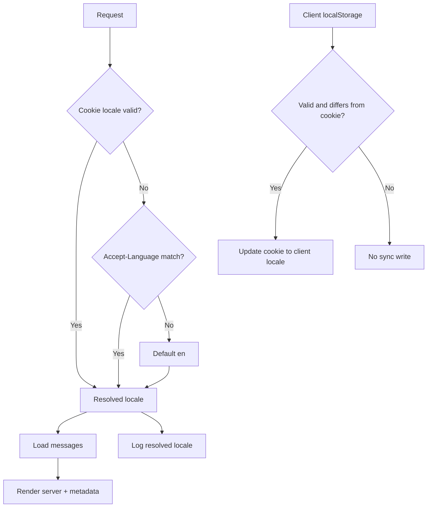

# Spec: Internationalization Foundation (next-intl v1)

## Metadata

- Status: `in-progress`
- Created At: `2026-04-04`
- Last Updated: `2026-04-04`
- Owner: `foundation architecture`

## Changelog

- `2026-04-04` - `Antony Acosta` - Initial i18n foundation spec created. (Made with OpenCode)
- `2026-04-04` - `Antony Acosta` - Updated metadata and changelog format to match template updates. (Made with OpenCode)
- `2026-04-04` - `Antony Acosta` - Refined scope alignment by deferring switcher placement to Global Settings and adding the pseudolocalization enforcement trigger before first UI beta. (Made with OpenCode)

## Related Feature

- `docs/features/internationalization.md`
- Shared architecture source: `docs/architecture/internationalization.md`.

## Context

- `docs/architecture/internationalization.md` defines the cross-cutting i18n direction and key decisions (library, locale strategy, fallback policy, diagnostics).
- This spec defines the first feature-specific contract for implementing i18n behavior in product surfaces without re-litigating architecture choices.
- The immediate risk is inconsistent locale handling between server render, client hydration, and user preference updates, which can produce copy flicker, wrong-language metadata, and hard-to-debug support logs.
- The second risk is translation coupling drift: domain/application layers leaking user-facing prose instead of stable machine-readable codes.

This spec narrows scope to the minimum stable i18n foundation needed for upcoming UI features.

## Current Plan

### Scope of this spec

- Implement request-level locale resolution using the architecture-defined priority and locale-neutral URLs.
- Implement locale preference persistence and synchronization behavior between cookie and client cache.
- Implement message catalog loading boundaries for server and client rendering with `next-intl`.
- Implement feature-facing fallback/error behavior for unsupported locales and missing message keys.
- Ensure server diagnostics include resolved locale code per request.

### Out of scope for this spec

- Translation vendor/editorial workflow decisions.
- Localization of external rules datasets or user-generated content.
- Currency formatting policy (deferred by architecture).
- CI policy changes beyond current architecture direction.
- Language switcher placement and settings IA (deferred to a future Global Settings feature).

### Feature contract

1. **Locale resolution contract**
   - Locale candidates are evaluated in architecture order:
     1) persisted locale cookie, 2) localStorage (client-only), 3) `Accept-Language`, 4) default `en`.
   - Server-rendered request resolution uses cookie + `Accept-Language` only.
   - Client runtime may read localStorage as a preference cache and must synchronize accepted values back into cookie.
   - Only configured locales (`en`, `es`) are valid resolved outputs in this slice.

2. **Persistence and synchronization contract**
   - A user-initiated locale change must update both cookie and localStorage on the client path.
   - If localStorage and cookie disagree on the client, localStorage wins once, then cookie is overwritten to converge state.
   - Invalid persisted values are ignored and replaced by the next valid fallback source.

3. **Message-loading contract**
   - Message catalogs are loaded from locale/domain namespaces defined by architecture (`messages/<locale>/*.json`).
   - Server components and metadata generation consume server-side translation helpers.
   - Client components use translation hooks only for interactive/local state copy they own.
   - Shared presentational components should receive already-localized strings via props when deep hook coupling is unnecessary.

4. **Domain boundary contract**
   - Domain/app/service layers emit stable typed codes/values only.
   - UI maps those codes to localized user-facing copy.
   - API/CLI machine contracts remain locale-neutral.

5. **Failure and fallback contract**
   - Development: missing keys fail fast.
   - Production: fallback to default locale key path plus structured diagnostics.
   - Unsupported locale inputs fail closed to the next fallback source, never to arbitrary locale strings.

6. **Diagnostics contract**
   - Server request logs include resolved locale code.
   - Locale diagnostics must not include raw user-authored free text.

### Tradeoff stance

- Locale-neutral URLs reduce routing complexity now, at the cost of postponing locale-specific SEO path expansion.
- Client localStorage preference improves perceived persistence across sessions, but creates one synchronization edge that must be deterministic.
- Passing translated strings into presentational components reduces coupling and testing burden, but can increase prop surface area; use it when the component is not locale-decision aware.

## Data and Flow

Inputs:

- Request cookie locale value (optional, untrusted)
- `Accept-Language` request header (optional, untrusted)
- Client localStorage locale value (optional, untrusted, client only)
- Supported locale registry for the slice: `en`, `es`
- Locale message catalogs under `messages/<locale>/`

Transformation path:

1. Request enters server boundary.
2. Server resolves locale from cookie -> `Accept-Language` -> default `en`.
3. Server loads locale messages and renders server components/metadata with resolved locale.
4. Server logs include resolved locale code.
5. Client hydrates; if localStorage contains a valid locale that differs from cookie, client updates cookie and applies resolved locale for subsequent navigation.
6. User locale-change action updates localStorage and cookie, then triggers localized rerender behavior.

Trust boundaries:

- **Untrusted**: cookie values, localStorage values, headers.
- **Validated**: locale after supported-locale check.
- **Trusted internal**: resolved locale enum and loaded message catalogs.

Outputs:

- Deterministic resolved locale for rendering.
- Localized UI strings and locale-aware formatting behavior.
- Structured diagnostics with locale code context.

Shared references:

- `docs/architecture/internationalization.md`

## Constraints and Edge Cases

- **Invalid persisted locale values**
  - Any value outside supported locales is treated as absent and ignored.
- **First visit with no persisted preference**
  - Resolution depends on `Accept-Language`; if unmatched, use `en`.
- **Client/server mismatch on initial hydration**
  - A mismatch caused by localStorage preference may trigger client locale switch; convergence must update cookie to prevent repeated mismatch.
- **Missing locale catalog file/namespace**
  - Must follow architecture fallback semantics (dev fail-fast, production fallback + diagnostics).
- **Unknown API/domain error code translation mapping**
  - UI must render a stable generic localized fallback message; raw backend text is not shown.
- **Logging hygiene**
  - Locale code is logged; user free-text content is excluded.
- **Pseudolocalization**
  - Not CI-gated for this slice; optional local hook usage is allowed per architecture.
- **Pseudolocalization enforcement trigger**
  - Stronger pseudolocalization enforcement is required before the first real UI beta.
- **Fail-open vs fail-closed**
  - Fail-closed for locale validity and message key resolution rules that could render wrong-language or misleading copy.
  - Fail-open for optional diagnostics enrichment only.

## Open Questions

- None for this slice.

## Related Implementation Plan

- `docs/specs/internationalization/implementation-plan.md`
