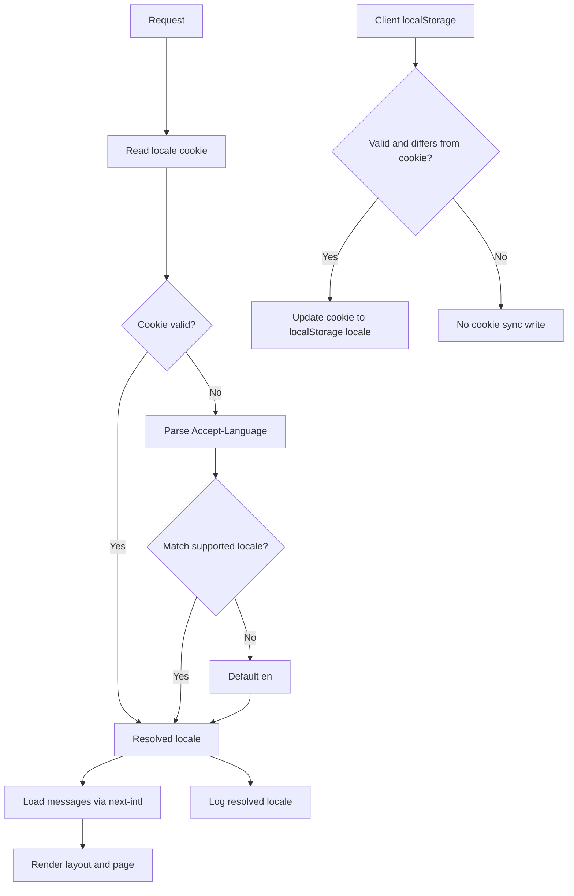

# Implementation Plan: Internationalization Foundation (i18n v1)

## Metadata

- Status: `draft`
- Created At: `2026-04-04`
- Last Updated: `2026-04-04`
- Owner: `Antony Acosta`

## Changelog

- `2026-04-04` - `Antony Acosta` - Initial i18n implementation plan created from approved architecture/spec decisions. (Made with OpenCode)

## Goal

- Deliver a working i18n foundation in App Router using `next-intl` with locale-neutral URLs and deterministic locale resolution.
- Ensure users can get predictable language behavior across server render and client navigation with supported locales `en` and `es`.
- Establish safe fallback, diagnostics, and catalog validation behavior now so future UI work does not require i18n re-architecture.

In scope (implement now):

- add `next-intl` runtime wiring for App Router
- implement locale resolution contract: cookie -> localStorage (client cache) -> `Accept-Language` -> `en`
- keep URLs locale-neutral (no locale path segments)
- create initial message catalogs for `en` and `es` with first namespace coverage
- apply locale in root document language and server-side translation usage
- add deterministic fallback and logging hooks for resolved locale context
- add catalog parity validation check for required locale namespaces

Out of scope (defer intentionally):

- language switcher placement and settings IA (future Global Settings feature)
- full translation polish and glossary governance beyond first required keys
- localization of external rules data and user-generated content
- CI enforcement for pseudolocalization (local pre-commit support only for now)
- locale-specific SEO routes and `hreflang` route variants

Completion criteria:

- App renders with resolved locale from configured fallback order and only emits `en` or `es`.
- Root `<html lang>` reflects resolved locale for each request.
- Message catalogs load from `messages/<locale>/` and missing-key behavior matches architecture policy.
- Client preference cache can converge cookie state when valid localStorage locale differs.
- Request logs include resolved locale code without logging user free text.
- Catalog validation check catches missing required locale namespaces/keys before merge.

## Non-Goals

- Building user-facing language preference UX beyond minimal internal hooks.
- Translating all product copy across not-yet-built screens.
- Introducing locale-in-path route architecture.
- Adding translation vendor integrations (Crowdin/Lokalise/etc.).
- Changing API/CLI transport error envelopes to localized payloads.

## Related Docs

- `docs/features/internationalization.md`
  - Product scope, MVP boundaries, and acceptance criteria.
- `docs/specs/internationalization/foundation.md`
  - Technical contract for locale resolution, fallback, and boundaries.
- `docs/architecture/internationalization.md`
  - Shared i18n architecture decisions and cross-feature constraints.
- `docs/architecture/api-error-contract.md`
  - Locale-neutral API/CLI contract boundaries and error behavior.
- `README.md`
  - v1 scope framing that now includes i18n foundation support.
- `docs/ROADMAP.md`
  - Phase and v1 planning context for i18n foundation work.

## Existing Code References

- `src/app/layout.tsx`
  - Reuse: root layout and `Metadata` ownership boundary.
  - Keep consistent: server component default and minimal shell logic.
  - Do not copy forward: hardcoded `lang="en"` and starter metadata values.
- `src/app/page.tsx`
  - Reuse: first route composition point for translated strings.
  - Keep consistent: simple route-level component structure.
  - Do not copy forward: starter static English tutorial copy.
- `next.config.ts`
  - Reuse: single source for framework plugin wiring.
  - Keep consistent: small, explicit config object.
  - Do not copy forward: empty placeholder config once i18n plugin is introduced.
- `package.json`
  - Reuse: Bun-first script conventions and verification commands.
  - Keep consistent: explicit script names for automation checks.
  - Do not copy forward: missing dedicated i18n catalog check script.
- `src/server/cli/response-meta.ts`
  - Reuse: pattern for structured metadata fields in operational output.
  - Keep consistent: transport remains machine-readable and locale-neutral.
  - Do not copy forward: assumptions that locale context is irrelevant to diagnostics.

## Files to Change

- `package.json` (risk: medium)
  - Add `next-intl` dependency.
  - Add script for catalog parity validation (example: `i18n:check-catalog`).
  - Depends on: creation of catalog-check script file.

- `next.config.ts` (risk: medium)
  - Wire `next-intl` plugin configuration for App Router usage.
  - Keep locale-neutral URL behavior; avoid locale-prefix routing config.
  - Depends on: i18n request config location.

- `src/app/layout.tsx` (risk: medium)
  - Remove hardcoded language and use resolved locale for `<html lang>`.
  - Apply server-side translation/provider wiring needed by App Router.
  - Depends on: `src/i18n/request.ts` and locale resolver utility.

- `src/app/page.tsx` (risk: low)
  - Replace starter static copy with one minimal translated surface.
  - Ensure both `en` and `es` render with existing locale contract.
  - Depends on: initial message namespaces and translation hooks/helpers.

- `README.md` (risk: low, optional touch-up)
  - Keep i18n v1 scope references synchronized if implementation details change materially.
  - Depends on: final implementation behavior.

## Files to Create

Runtime i18n wiring (owner: frontend/platform):

- `middleware.ts`
  - Resolve request locale context from cookie and `Accept-Language` for server path behavior.
  - Enforce supported locale allowlist (`en`, `es`) and locale-neutral URLs.
- `src/i18n/locales.ts`
  - Central locale constants, default locale, cookie key, and helper guards.
- `src/i18n/resolve-locale.ts`
  - Pure resolver logic for fallback order and validation.
- `src/i18n/request.ts`
  - `next-intl` request configuration and message loader binding.

Message catalogs (owner: product content + frontend):

- `messages/en/common.json`
  - Initial baseline strings for shell/demo route.
- `messages/es/common.json`
  - Spanish counterpart with key parity to English.

Validation and tests (owner: platform):

- `scripts/check-i18n-catalog.ts`
  - Validate required locale files/namespaces and key parity for mandatory namespaces.
- `src/i18n/__tests__/resolve-locale.test.ts`
  - Unit tests for resolver fallback order and invalid input handling.

## Data Flow

1. Request enters App Router boundary.
2. Middleware reads locale cookie and validates supported locale.
3. If cookie is invalid/missing, middleware derives best match from `Accept-Language`; otherwise defaults to `en`.
4. Server render loads locale messages through `next-intl` request config.
5. Layout renders with resolved locale in `<html lang>`.
6. Client hydration checks localStorage locale cache; if valid and different from cookie, client updates cookie to converge.
7. Subsequent navigations use converged cookie value as primary source.

Trust boundaries:

- Untrusted: cookie value, `Accept-Language` header, localStorage value.
- Validated: locale value after allowlist check against `en` and `es`.
- Trusted internal: loaded message catalogs and resolved locale enum.



## Behavior and Edge Cases

Success path:

- Valid cookie locale exists -> server uses it -> messages load -> UI renders localized copy.

Not found path:

- Requested message key/namespace missing:
  - development: fail fast for immediate correction
  - production: fallback to default locale key path with structured diagnostics

Validation failure path:

- Cookie/header/localStorage locale outside allowlist is treated as absent and falls through to next source.

Dependency unavailable path:

- Message file read failure in production falls back to default locale where possible and logs error context.

Known edge cases:

- localStorage unavailable (privacy mode) -> rely on cookie/header path only.
- malformed `Accept-Language` header -> ignore and default to `en`.
- cookie and localStorage mismatch loop risk -> write cookie only when localStorage value is valid and different.
- unsupported locale in query/path should not alter locale because URLs stay locale-neutral.

Fail-open vs fail-closed:

- Fail-closed: invalid locale values, unsupported locale inputs, missing required catalog parity checks.
- Fail-open: optional diagnostics enrichment and non-critical observability fields.

## Error Handling

- Error categories:
  - `I18N_UNSUPPORTED_LOCALE_INPUT`
  - `I18N_MESSAGES_NAMESPACE_MISSING`
  - `I18N_MESSAGES_KEY_MISSING`
  - `I18N_MESSAGES_LOAD_FAILED`
- Translation boundary:
  - API/CLI responses remain code-based and locale-neutral.
  - UI maps domain/API error codes to localized copy.
- Expected logging fields:
  - request id (when available)
  - resolved locale
  - fallback source used (`cookie`, `accept-language`, `default`)
  - error category/code
  - namespace/key (for missing message diagnostics)

## Types and Interfaces

```ts
export const SUPPORTED_LOCALES = ["en", "es"] as const;
export type SupportedLocale = (typeof SUPPORTED_LOCALES)[number];

export interface ResolveLocaleInput {
  cookieLocale?: string | null;
  acceptLanguageHeader?: string | null;
  clientStoredLocale?: string | null;
}

export interface ResolveLocaleResult {
  locale: SupportedLocale;
  source: "cookie" | "localStorage" | "accept-language" | "default";
}
```

- `SupportedLocale` is owned by `src/i18n/locales.ts`.
- Runtime validation (allowlist checks) happens in resolver and middleware boundaries.
- Conversion from raw string inputs to typed locale occurs before message loading.

## Functions and Components

- `resolveLocale(input)`
  - Input: cookie/header/client cache values.
  - Output: validated locale + source.
  - Side effects: none (pure function).

- `getRequestConfig(...)` in `src/i18n/request.ts`
  - Input: Next.js request context.
  - Output: locale + message catalog for render.
  - Side effects: reads message files.

- `syncClientLocalePreference(...)` (client utility)
  - Input: current cookie locale and localStorage locale.
  - Output: convergence decision.
  - Side effects: writes cookie when valid mismatch exists.

- `RootLayout` updates in `src/app/layout.tsx`
  - Input: resolved locale.
  - Output: root HTML language and provider wiring.
  - Side effects: none beyond render behavior.

## Integration Points

- App Router rendering: `src/app/layout.tsx` and page/server component usage.
- Next.js middleware: central locale resolution for request path behavior.
- Message catalog storage: `messages/<locale>/` JSON files.
- Logging path: request diagnostics should include resolved locale without user free text.
- Tooling: catalog parity script integrates with developer workflow and CI checks.
- Deferred integration:
  - language switcher placement awaits Global Settings feature.
  - stronger pseudolocalization enforcement is required before first real UI beta.

## Implementation Order

1. Add locale constants and resolver utility
   - Output: `src/i18n/locales.ts`, `src/i18n/resolve-locale.ts`
   - Verify: `bun test src/i18n/__tests__/resolve-locale.test.ts`
   - Merge safety: yes (not wired yet)

2. Add `next-intl` request config and middleware wiring
   - Output: `src/i18n/request.ts`, `middleware.ts`, `next.config.ts` updates
   - Verify: `bun run lint` + `bun run build`
   - Merge safety: medium (request path behavior changes)

3. Add baseline message catalogs
   - Output: `messages/en/common.json`, `messages/es/common.json`
   - Verify: run catalog check script locally
   - Merge safety: yes (additive assets)

4. Update layout and starter page to consume i18n
   - Output: `src/app/layout.tsx`, `src/app/page.tsx`
   - Verify: manual run (`bun dev`) for `en`/`es` resolution paths
   - Merge safety: medium (user-visible copy changes)

5. Add catalog parity validation script and package script entry
   - Output: `scripts/check-i18n-catalog.ts`, `package.json` update
   - Verify: `bun run i18n:check-catalog` + `bun run lint`
   - Merge safety: yes (tooling only)

6. Add logging enrichment for resolved locale context
   - Output: request/middleware logging hooks in i18n path
   - Verify: manual request checks and log assertions
   - Merge safety: yes (observability only)

## Verification

Automated checks:

- `bun run lint`
- `bun run build`
- `bun test` (or targeted resolver tests)
- `bun run i18n:check-catalog`

Manual scenarios:

- No cookie + `Accept-Language: es` -> render in Spanish.
- No cookie + unsupported header -> render in English.
- Cookie `en` + localStorage `es` -> client converges cookie to `es` after hydration.
- Invalid cookie/localStorage values -> ignored, then fallback order applies.

Observability checks:

- Logs contain resolved locale and source, but no user free-text payloads.
- Missing key/namespace in production path logs structured diagnostics and uses fallback.

Negative test case:

- Remove a required key in `messages/es/common.json` and confirm catalog check fails.

Rollback/recovery check:

- Disable middleware/i18n wiring and verify app safely renders with default `en` catalog only.

## Notes

- Assumption: initial translated surface remains minimal because frontend feature routes are not implemented yet.
- Assumption: cookie key naming can be finalized during coding as long as it remains centralized in `src/i18n/locales.ts`.
- Deferred follow-up: define Global Settings feature rundown/spec before implementing user-facing switcher placement.
- Deferred follow-up: add pseudolocalization enforcement gate before first real UI beta milestone.

## Rollout and Backout

- Rollout:
  - ship i18n foundation with default locale fallback enabled
  - keep locale-neutral routes unchanged
  - enable catalog checks in CI once script behavior is stable
- Backout:
  - revert middleware/request config wiring
  - force default `en` locale path in layout
  - keep message files in repo (safe additive assets) while disabling runtime lookup

## Definition of Done

- `next-intl` is wired for App Router with locale-neutral URL behavior.
- Resolver behavior matches contract: cookie -> localStorage cache -> `Accept-Language` -> `en`.
- `en` and `es` catalogs exist with required namespace/key parity checks.
- Layout applies resolved locale to `<html lang>` and first route renders translated copy.
- Logging includes resolved locale context without exposing user free text.
- Lint/build/tests/catalog checks pass and docs remain aligned with feature/spec/architecture decisions.
