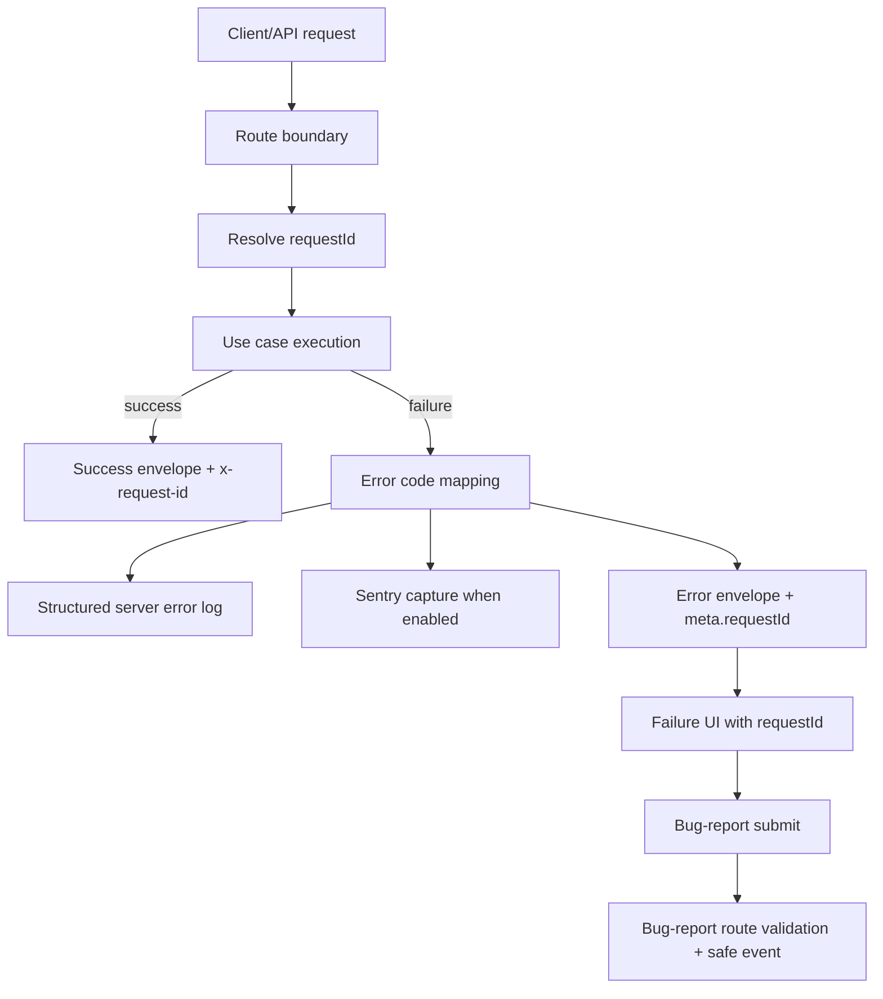

# Implementation Plan: Observability Foundation (Phase 10 MVP)

## Metadata

- Status: `ready`
- Created At: `2026-04-05`
- Last Updated: `2026-04-05`
- Owner: `Antony Acosta`

## Changelog

- `2026-04-05` - `Antony Acosta` - Locked bug-report notes validation to a `750`-character maximum and aligned implementation slice gates to that explicit cap. (Made with OpenCode)
- `2026-04-05` - `Antony Acosta` - Created a lean, slice-based implementation plan for Phase 10 observability MVP with Sentry Cloud, request correlation, failure-state request ID exposure, and bug-report triage flow. (Made with OpenCode)

## Goal

- Implement a minimal but production-usable observability baseline so runtime failures are captured, correlated, and triaged quickly.
- Ensure one support incident can move from user report to logs/Sentry issue in minutes using shared correlation fields (`requestId`, `route`, `timestamp`).

In scope (implement now):

- Sentry Cloud setup and environment-gated runtime capture.
- Shared request ID utility and propagation consistency for API routes.
- Structured server error logging aligned to API error contract codes.
- Client runtime capture + failure UI request ID exposure (failure-only).
- Bug-report submission path with locked payload shape.
- Minimal Sentry dashboards/alerts baseline for recurring errors and spikes.

Out of scope (defer intentionally):

- Product analytics funnels, event taxonomy expansion, growth/retention reporting.
- Session replay, heatmaps, clickstream capture.
- Broad performance tracing program or custom telemetry data lake.
- Always-on diagnostics UI that shows request IDs outside failure states.

Completion criteria:

- Sentry Cloud captures client and server unhandled errors with `environment`, `release`, `route`, and `requestId` when available.
- API error paths emit structured JSON logs with normalized `error.code` and request correlation fields.
- Failure responses preserve `x-request-id` and `meta.requestId`; failure UI displays request ID only on error surfaces.
- Bug-report payload contract (`timestamp`, `route`, optional `requestId`, optional `notes`) is wired and correlatable.
- Baseline dashboards/alerts exist and are validated in staging before production enablement.

## Non-Goals

- Replacing the existing API envelope contract or changing error-code taxonomy.
- Refactoring all API routes in one pass before phased rollout.
- Building generalized observability abstractions for multiple providers in MVP.
- Introducing non-i18n UI text or translated machine-readable error codes.

## Related Docs

- `docs/features/observability-and-share-readiness.md`
  - Product scope, acceptance criteria, and locked MVP decisions.
- `docs/specs/observability/foundation.md`
  - Foundation contract this implementation must follow.
- `docs/architecture/api-error-contract.md`
  - Required request-id/header and error-envelope behavior.
- `docs/specs/internationalization/foundation.md`
  - User-facing error/failure copy must remain translation-driven.
- `docs/ROADMAP.md`
  - Phase 10 strategic scope placement.
- `docs/STATUS.md`
  - Phase progress ledger and evidence tracking.

## Existing Code References

- `src/app/api/characters/route.ts`
  - Reuse: current `x-request-id` resolve/reuse fallback behavior and API envelope shape.
  - Keep consistent: normalized error-code mapping and `meta` contract.
  - Do not copy forward: duplicated inline request-id resolver logic per route.

- `src/app/api/auth/register/route.ts`
  - Reuse: transport-level response/header patterns and route-level error mapping style.
  - Keep consistent: contract-safe error messages and request-id response header behavior.
  - Do not copy forward: duplicate request-id regex helpers in each handler.

- `src/server/composition/app-config.ts`
  - Reuse: typed env parsing + fail-fast config validation pattern.
  - Keep consistent: explicit validation errors and narrow config ownership.
  - Do not copy forward: embedding observability env parsing in unrelated config branches.

- `src/i18n/request-policy.ts` and `messages/*/common.json`
  - Reuse: structured diagnostics pattern and translation key ownership.
  - Keep consistent: no hardcoded user-facing text.
  - Do not copy forward: logging of user free-text diagnostics.

## Files to Change

- `src/server/composition/app-config.ts` (risk: medium)
  - Add typed observability env config (`enabled`, Sentry DSN presence/validation, `environment`, `release`).
  - Why risk: startup validation can block app boot if misconfigured.

- `src/app/api/characters/route.ts` (risk: medium)
  - Replace local request-id resolver with shared utility and add structured error log emission at boundary.
  - Why risk: shared API path and contract-sensitive response behavior.

- `src/app/api/auth/register/route.ts` (risk: medium)
  - Adopt shared request-id utility + structured log mapping for internal failures.
  - Why risk: auth flow reliability + cookie/session behavior.

- `messages/en/common.json` (risk: low)
  - Add failure-state and bug-report UI copy keys.
  - Why risk: copy-only + key consistency.

- `messages/es/common.json` (risk: low)
  - Add translation parity for new keys.
  - Why risk: copy-only + key parity.

- `docs/STATUS.md` (risk: low)
  - Add implementation-plan evidence path for Phase 10 while keeping status conservative.
  - Why risk: documentation alignment only.

## Files to Create

Server contracts and utilities (owner: server/platform):

- `src/server/observability/request-id.ts`
  - Shared request-id parse/reuse/generate helper for API boundaries.

- `src/server/observability/server-error-log.ts`
  - Typed structured error-log builder aligned to foundation contract.

- `src/server/observability/error-code-map.ts`
  - Utility to normalize unknown exceptions to contract error code (`INTERNAL_ERROR`) at boundaries.

- `src/server/observability/sentry-server.ts`
  - Server-side Sentry initialization and safe capture helpers with redaction hooks.

Client runtime + failure-state support (owner: app/frontend):

- `src/app/global-error.tsx`
  - Root failure UI with translated copy, failure-only request ID visibility, and bug-report entry.

- `src/client/observability/runtime-context.ts`
  - Client helper to store/read latest relevant failure context (`route`, `requestId`, timestamp).

- `src/client/observability/sentry-client.ts`
  - Client-side Sentry initialization and runtime exception capture hooks.

Bug-report flow (owner: app/api + frontend):

- `src/app/api/bug-report/route.ts`
  - Validate payload contract, emit correlation-friendly event/log, return contract envelope.

- `src/server/observability/bug-report-schema.ts`
  - Runtime validation schema/type for bug-report payload including `notes` length constraint (`max 750` characters).

Testing (owner: platform/frontend):

- `src/server/observability/__tests__/request-id.test.ts`
  - Request-id validation/reuse/fallback behavior.

- `src/app/api/bug-report/__tests__/route.test.ts`
  - Contract validation, optional fields, and redaction boundaries.

## Data Flow

1. API request enters route boundary.
2. Shared request-id utility reuses valid inbound `x-request-id` or generates one.
3. Route executes use case and maps errors to contract-safe code/status.
4. On failure, route returns error envelope + `x-request-id`, emits structured error log, and (if enabled) sends Sentry event with safe tags/context.
5. Client error state stores latest failure context (`timestamp`, `route`, optional `requestId`).
6. Failure UI renders translated copy and request ID (failure-only) and can submit bug report payload.
7. Bug-report endpoint validates payload, records safe event, and allows triage using requestId/time window.

Trust boundaries:

- **Untrusted**: inbound headers, thrown exceptions, user bug-report notes.
- **Validated**: request-id format, bug-report payload schema, notes max length (`750`) and sanitization.
- **Trusted internal**: normalized error code, structured log object, redacted telemetry payload.



## Behavior and Edge Cases

- Success path:
  - Route responses include `x-request-id`; no failure diagnostics shown in healthy UI.
- Not found path:
  - For contract routes, map domain not-found failures to the existing contract code/status mapping when introduced; until then, unknowns map to `INTERNAL_ERROR`.
- Validation failure path:
  - Bug-report payload validation failures return `REQUEST_VALIDATION_FAILED` with contract envelope.
- Dependency unavailable path:
  - If Sentry is unavailable/misconfigured, app continues serving requests; logs still emit with request correlation.

Known edge cases:

- Invalid inbound `x-request-id` -> discard and regenerate safe ID.
- Client crash before API interaction -> bug report may omit `requestId`; correlate using `route + timestamp + release`.
- Repeated identical runtime errors -> rely on Sentry grouping and alert thresholds to reduce noise.
- Notes containing unsafe content -> sanitize/drop control characters, enforce `750`-character cap, never echo into i18n diagnostics.

Fail-open vs fail-closed:

- Fail-closed: payload validation and secret redaction rules.
- Fail-open: Sentry delivery failures (capture attempts do not block user/API flow).

## Error Handling

Error categories:

- `request_id_invalid` (header rejected and regenerated)
- `telemetry_capture_failed` (provider call failed)
- `bug_report_validation_failed` (payload schema failure)
- `unhandled_runtime_exception` (client or server boundary)

Translation boundaries:

- User-facing copy remains translated and generic.
- Machine-readable error codes stay locale-neutral per API contract.

User-facing vs operational:

- User-facing: failure message, request ID display on failure, optional bug-report notes input.
- Operational: structured logs, Sentry events, alert metadata.

Expected logging fields:

- `level`, `timestamp`, `message`
- `requestId`, `route`, `method`
- `error.code`, `error.status`, `runtime.environment`, `runtime.release`

## Types and Interfaces

```ts
export interface BugReportPayload {
  timestamp: string;
  route: string;
  requestId?: string;
  notes?: string;
}

export interface ServerErrorLog {
  level: "error";
  timestamp: string;
  message: string;
  requestId: string;
  route: string;
  method?: string;
  error: {
    code: "AUTH_UNAUTHENTICATED" | "AUTH_FORBIDDEN" | "REQUEST_VALIDATION_FAILED" | "RULES_CATALOG_UNAVAILABLE" | "RULES_CATALOG_DATASET_MISMATCH" | "RULES_PROVIDER_UNSUPPORTED" | "INTERNAL_ERROR";
    status?: number;
    name?: string;
  };
  runtime: {
    environment: string;
    release?: string;
  };
}
```

Ownership:

- Contract interfaces live in server observability modules.
- Route handlers convert domain/runtime errors into these transport-safe types at boundary.

## Functions and Components

- `resolveRequestId(request: Request, fallback: () => string): string`
  - Shared boundary helper used by API routes.

- `buildServerErrorLog(input): ServerErrorLog`
  - Builds redaction-safe structured error object.

- `captureServerException(error, context): void`
  - Best-effort Sentry server capture with core tags.

- `captureClientException(error, context): void`
  - Client capture wrapper for unhandled runtime errors.

- `GlobalError` (`src/app/global-error.tsx`)
  - Renders translated fallback copy, failure-only request ID visibility, and bug-report trigger.

- `POST /api/bug-report`
  - Validates payload and records correlatable operational event.

## Integration Points

- Routes: update contract API routes to use shared request-id + structured error-log helpers.
- Client app shell/error boundary: wire global failure UI with request context.
- External provider: Sentry Cloud project + DSN configuration.
- i18n: new failure and bug-report keys in `common` namespace (both locales).

Required environment/config (MVP):

- `OBSERVABILITY_ENABLED` (`true|false`, default `false` outside production onboarding)
- `SENTRY_DSN` (server capture)
- `NEXT_PUBLIC_SENTRY_DSN` (client capture)
- `SENTRY_ENVIRONMENT` (defaults to `NODE_ENV`)
- `SENTRY_RELEASE` (build/release identifier)

Low-risk toggles:

- Keep Sentry capture behind `OBSERVABILITY_ENABLED` for staged rollout.
- Keep bug-report endpoint available only when capture is enabled in target environment.

## Implementation Order

1. Prerequisite and environment validation slice
   - Output: typed env contract + Sentry init stubs gated by `OBSERVABILITY_ENABLED`.
   - Data contract gate: app boots with observability disabled by default; invalid DSN in enabled mode fails fast in non-production.
   - Verify: `bun run lint` + `bun run test src/server/composition/__tests__/app-config.test.ts`.
   - Merge safety: yes (feature remains disabled).

2. Shared request-id utility and route adoption slice
   - Output: `request-id.ts` + route updates replacing duplicated resolvers.
   - Data contract gate: all updated routes reuse valid inbound `x-request-id`, else generate; always return header + `meta.requestId`.
   - Verify: `bun run test src/app/api/characters/__tests__/route.test.ts` and `bun run test src/app/api/auth/register/__tests__/route.test.ts`.
   - Merge safety: yes (contract-preserving refactor).

3. Structured server logging and error mapping slice
   - Output: typed `ServerErrorLog` helper + route boundary logging for unhandled failures.
   - Data contract gate: unknown errors map outward to `INTERNAL_ERROR`; structured log includes request correlation fields + normalized code.
   - Verify: targeted route tests + one negative test asserting no secret-bearing fields in log payload.
   - Merge safety: yes (operational enhancement; no response shape changes).

4. Client runtime capture + failure-state request ID exposure slice
   - Output: client Sentry capture wiring + failure UI showing request ID only on error states.
   - Data contract gate: request ID is absent from healthy UI; present in failure UI when available.
   - Verify: `bun run lint`, `bun run test`, and manual crash smoke in dev/staging.
   - Merge safety: partial (safe if capture remains toggle-gated).

5. Bug-report flow slice
   - Output: `POST /api/bug-report` + failure-surface submit action with locked payload shape.
   - Data contract gate: `{ timestamp, route }` required; `requestId` optional; `notes` optional and bounded/sanitized (`max 750` characters).
   - Verify: `bun run test src/app/api/bug-report/__tests__/route.test.ts` + manual submit and correlation lookup.
   - Merge safety: yes (endpoint additive; can be disabled via toggle).

6. Dashboards and alerts baseline slice
   - Output: Sentry issue grouping defaults + alert rules for recurring errors/spikes documented in runbook note.
   - Data contract gate: alerts keyed on grouped errors and include route/environment context.
   - Verify: staging forced-error drill confirms issue creation and alert routing.
   - Merge safety: yes (operational config; no app behavior risk).

## Verification

Automated checks:

- `bun run lint`
- `bun run test`
- Targeted tests for modified routes and new observability utilities.

Manual smoke scenarios:

1. Trigger client runtime exception in development and staging; confirm Sentry event contains `environment`, `release`, route.
2. Trigger API internal failure; confirm response includes `x-request-id` + `meta.requestId` and structured server log includes `error.code`.
3. Render failure UI and confirm request ID is shown only there (not in healthy routes).
4. Submit bug report with and without `requestId`; confirm validation behavior and correlatability.

Observability checks:

- Confirm no secrets in event payload samples (headers/tokens/session blobs absent/redacted).
- Confirm Sentry grouping reduces duplicate noise (same stack + type + route).

Negative test case:

- Invalid bug-report payload (`timestamp` missing or malformed) returns `REQUEST_VALIDATION_FAILED` and safe message.

Rollback/recovery check:

- Set `OBSERVABILITY_ENABLED=false`; verify app continues without capture calls and core flows remain healthy.

## Notes

Assumptions:

- Existing contract routes are the first adoption targets; additional routes can migrate incrementally.
- Sentry project permissions/secrets management are available for dev/staging/prod before rollout starts.

Unresolved questions:

- None blocking for MVP scope.

Deferred follow-up tasks:

- Add optional breadcrumbs for key pre-crash user actions.
- Expand route coverage to all API handlers after MVP validation.

## Rollout and Backout

Rollout strategy:

1. Dev: enable capture with sandbox DSN; validate payload shape/redaction locally.
2. Staging: enable full slice set, run forced-failure drills, tune alert thresholds.
3. Production: enable gradually with conservative alert routing and daily noise review in first week.

Backout strategy:

- Immediate: disable `OBSERVABILITY_ENABLED` to stop capture/bug-report path while preserving existing API behavior.
- Partial: keep structured server logs on while disabling external provider delivery if noise/volume spikes.
- Revert-safe boundary: each slice is additive and can be rolled back independently without schema/data migrations.

## Definition of Done

- [ ] Sentry Cloud env configuration and gating are implemented and documented.
- [ ] Shared request-id utility is adopted by initial contract routes.
- [ ] Structured server error logs are emitted with normalized error-code mapping.
- [ ] Failure UI shows request ID only in error states with translated copy.
- [ ] Bug-report API/UI path is live with locked payload contract and validation.
- [ ] Dashboards/alerts baseline validated in staging.
- [ ] Automated + manual verification steps pass.
- [ ] Phase 10 status evidence paths are updated in `docs/STATUS.md`.
