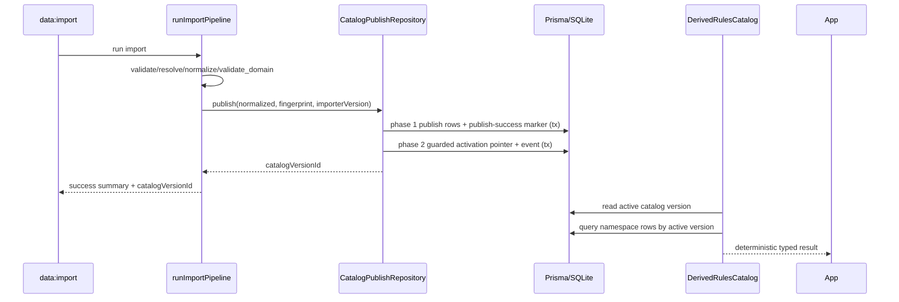

# Implementation Plan: Catalog Publish and RulesCatalog Interface (Foundation)

## Metadata

- Status: `completed`
- Created At: `2026-04-04`
- Last Updated: `2026-04-05`
- Owner: `Antony Acosta`

## Changelog

- `2026-04-05` - `Antony Acosta` - Marked implementation plan completed after merge, closed Definition of Done items, and recorded implementation evidence. Made with OpenCode.
- `2026-04-04` - `Antony Acosta` - Created implementation plan for foundation publish/read-model delivery.
- `2026-04-04` - `Antony Acosta` - Incorporated resolved decisions for publish strategy, activation protocol, payload size policy, and runtime cache posture. Made with OpenCode.

## Goal

- Deliver a working publish/read path so successful imports become queryable runtime catalog data through `RulesCatalog`.
- Close the foundation gap between "parser validates data" and "application can use imported classes/spells/feats/features."

In scope (implemented in this slice):

- runtime catalog persistence schema for canonical entities and key relation tables
- publish-stage implementation in import pipeline
- activation and runtime-state update wiring for published versions
- `DerivedRulesCatalog` adapter with v1 namespaces (`classes`, `subclasses`, `races`, `backgrounds`, `spells`, `feats`, `features`)
- composition wiring so app services can consume concrete derived catalog implementation
- contract tests and integration tests covering publish + read behavior

Out of scope (intentionally deferred):

- `RawRulesCatalog` runtime implementation parity
- advanced search/indexing optimizations beyond required v1 filters
- UI feature work beyond one optional verification route/use-case
- artifact-file snapshot pipeline as mandatory runtime dependency

Completion criteria:

- `data:import` persists runtime catalog rows for successful runs.
- publish flow records/uses `catalogVersionId` and activation state coherently.
- `DerivedRulesCatalog` can serve deterministic `get/list` calls from active version data.
- `RulesCatalog` consumers in app services no longer depend on parser internals or external files.
- tests confirm publish idempotency, activation atomicity, and namespace reader behavior.

## Implementation Outcome (2026-04-05)

- Runtime catalog persistence is implemented in Prisma schema and publish repository adapters.
- Import pipeline publish stage now performs guarded two-phase publish+activation and returns persisted `catalogVersionId`.
- `DerivedRulesCatalog` runtime reads are wired to active-version storage with fingerprint-scoped cache invalidation.
- Foundation tests were added for publish semantics and derived reader behavior.
- Command-level verification completed with `bun x tsc --noEmit`, targeted `bun test`, and successful `bun run data:import`.

## Resolved Decisions (2026-04-04)

- Publish writes use `replace` semantics per catalog version (`delete + insert`, version-scoped).
- Publish and activation use a guarded two-phase boundary.
- Canonical `payloadJson` has a `2MB` max per row (UTF-8 bytes) and fails closed on overflow.
- Immutable JSON artifact snapshots are optional and disabled by default.
- Search/read posture remains baseline indexed queries in v1 (no precomputed searchable text columns).
- Reader adapters use fingerprint-scoped in-memory cache with invalidation on active fingerprint change.

## Non-Goals

- Redesigning the parser stages or parser diagnostics taxonomy.
- Introducing new transport envelope formats.
- Solving full text-search relevance tuning in this slice.

## Related Docs

- `docs/specs/rules-catalog/catalog-publish-and-rules-catalog-interface.md`
  - Feature-level behavior and open decisions for publish/read model work.
- `docs/architecture/catalog-storage-and-read-model.md`
  - Shared storage/read-model policy and boundary rules.
- `docs/architecture/rules-catalog-provider.md`
  - `RulesCatalog` namespace contract and provider wiring expectations.
- `docs/architecture/catalog-lineage-and-import-runs.md`
  - Existing lineage/run/activation persistence model this work extends.
- `docs/architecture/parsing-pipeline.md`
  - Stage semantics and fail-closed behavior for publish/activation.
- `docs/specs/parsing/option-complete-data-source-parsing.md`
  - Parser completeness context; publish must preserve normalized semantics.

## Existing Code References

- `src/server/import/run-import-pipeline.ts`
  - Reuse: stage orchestration, diagnostics mapping, summary output contract.
  - Keep consistent: stage timing, issue aggregation, fail-closed behavior.
  - Historical note: `publish` no-op placeholder has been replaced by guarded two-phase publish+activation wiring.
- `src/server/import/parser-types.ts`
  - Reuse: normalized entity and relation contracts.
  - Keep consistent: source kind enums and spell-edge/feature-ref contracts.
- `src/server/ports/rules-catalog.ts`
  - Reuse: namespaced reader contract and dataset-version semantics.
  - Keep consistent: `get` returns `null` for not found.
- `src/server/composition/create-app-services.ts`
  - Reuse: dependency injection pattern and provider factory usage.
  - Keep consistent: composition-root only binding decisions.
- `prisma/schema.prisma`
  - Reuse: existing catalog lineage/run/runtime state/activation tables.
  - Keep consistent: SQLite-compatible schema style and explicit indexes.

## Files to Change

- `prisma/schema.prisma` (risk: high)
  - Add runtime catalog tables for canonical entities and relation rows.
  - Add required indexes/uniques for active-version queries and idempotent publish writes.
  - Depends on finalized runtime row model naming.

- `src/server/import/run-import-pipeline.ts` (risk: high)
  - Publish stage now runs persistence + activation workflow.
  - Return real `catalogVersionId` on success.
  - Ensure failure path preserves active pointer safety.
  - Depends on publish service/repository ports and adapters.

- `src/server/composition/create-app-services.ts` (risk: medium)
  - Wire concrete `DerivedRulesCatalog` implementation path by default.
  - Inject required repositories/adapters for reader construction.
  - Depends on new adapters and provider factory updates.

- `src/server/composition/rules-catalog-factory.ts` (risk: low)
  - Keep provider selection behavior while binding new derived implementation factory.
  - Depends on derived adapter creation function.

- `src/server/ports/catalog-version-repository.ts` (risk: medium)
  - Extend with publish/runtime-row operations if required by chosen split of responsibilities.
  - Depends on publish transaction design.

- `src/server/ports/catalog-import-run-repository.ts` (risk: medium)
  - Confirm run finalization fields support non-null `catalogVersionId` and publish metrics.

## Files to Create

Ports:

- `src/server/ports/catalog-publish-repository.ts`
  - Contract for writing runtime rows and publish/activation transaction orchestration.

Prisma adapters:

- `src/server/adapters/prisma/catalog-publish-repository.ts`
  - Concrete publish transaction implementation.
- `src/server/adapters/prisma/catalog-version-repository.ts`
  - Concrete version/runtime state/activation queries used by readers and ops.
- `src/server/adapters/prisma/catalog-import-run-repository.ts`
  - Concrete run/issue persistence for pipeline command path.

Rules catalog adapters:

- `src/server/adapters/rules-catalog/derived-rules-catalog.ts`
  - Implements v1 namespaces in one adapter module backed by published tables.
- `src/server/adapters/rules-catalog/raw-rules-catalog.ts`
  - Explicit unsupported provider implementation for v1.

Application layer (optional-but-recommended verification path):

- Deferred in v1: dedicated `get-rules-catalog-health` use-case and route-level read-model exposure.

Tests:

- `src/server/adapters/rules-catalog/__tests__/derived-rules-catalog.test.ts`
  - cache invalidation and spell filter semantics against mocked active-version data.
- `src/server/adapters/prisma/__tests__/catalog-publish-repository.test.ts`
  - payload overflow aggregation, guard checks, idempotent recovery, and lock behavior.

## Data Flow



Trust boundaries and validation points:

- Untrusted input remains confined to import stages before publish.
- Publish consumes normalized data only.
- Runtime readers consume published DB rows only.

## Behavior and Edge Cases

Success path:

- publish phase 1 persists runtime rows using replace semantics and marks publish success.
- activation phase 2 atomically updates active catalog pointer and activation event after publish guard verification.
- subsequent `RulesCatalog` reads return active-version scoped data.

Not found path:

- reader `get` returns `null` for missing entities.

Validation failure path:

- any parser/domain error prevents publish.

Dependency unavailable path:

- DB unavailability maps to controlled operational errors.

Known edge cases:

- no active catalog version yet -> readers return controlled unavailable behavior.
- concurrent publish attempts for same fingerprint -> unique constraints and transaction strategy prevent split-brain active state.
- partial row write failures -> transaction rollback with unchanged active pointer.
- phase 1 publish success + phase 2 activation failure -> catalog remains published but inactive; retry activation safely without rewriting rows.

Fail-open vs fail-closed decisions:

- publish/activation is always fail-closed.
- reader contract violations are fail-closed operational errors.
- not-found entity lookups fail-open as `null` (contractual behavior).

## Error Handling

Categories:

- `PersistenceError`
- `RulesCatalogUnavailableError`
- `RulesCatalogContractViolationError`
- `RulesCatalogDatasetMismatchError`

Translation boundaries:

- repository/adapters map Prisma errors to stable categories.
- application/CLI surfaces map categories to existing envelope contracts.

Logging fields (minimum):

- `runId`
- `catalogVersionId`
- `datasetFingerprint`
- `providerKind`
- `stage`
- `errorCode`

## Types and Interfaces

Representative contracts:

```ts
interface PublishCatalogArgs {
  providerKind: "derived" | "raw";
  datasetFingerprint: string;
  importerVersion: string;
  normalized: NormalizedDataSource;
  integrityMode: DataIntegrityMode;
  runId: string;
}

interface PublishCatalogResult {
  catalogVersionId: string;
  publishedAt: Date;
}
```

Ownership:

- parser contracts remain in import module types.
- runtime reader DTO conversion remains in adapter layer.
- app layer consumes only `RulesCatalog` and repository ports.

## Functions and Components

- `publishCatalog(args)`
  - writes runtime catalog rows with replace semantics, enforces `2MB` payload limit, and marks publish success in phase 1 transaction.
- `activateCatalogVersion(args)`
  - verifies publish-success guard, then ensures active pointer switch + activation event atomicity in phase 2 transaction.
- `createDerivedRulesCatalog(deps)`
  - wires namespace readers and version metadata reader.
- `create*Reader(deps)` per namespace
  - executes active-version scoped queries and maps rows to port types.

Idempotency expectations:

- same fingerprint/importerVersion publish is idempotent by unique version policy.

## Integration Points

- `data:import` CLI is the publish trigger in v1.
- `createAppServices` consumes derived reader implementation.
- runtime health command should report active version/provider/fingerprint once wired.

Environment/config:

- `DATABASE_URL`
- `RULES_PROVIDER`
- `DATA_INTEGRITY_MODE`
- `IMPORTER_VERSION`

## Implementation Order

1. Add runtime catalog persistence schema.
   - Output: Prisma tables/indexes for canonical entities + relations.
   - Verify: `bun run db:generate` + migration apply.
   - Merge safety: partial (no runtime wiring yet).

2. Add publish repository port + Prisma adapter.
   - Output: phase 1 publish implementation (replace writes + payload size guard) returning `catalogVersionId`.
   - Verify: publish repository tests.
   - Merge safety: partial.

3. Wire publish stage in `run-import-pipeline`.
   - Output: guarded two-phase publish + activation orchestration and failure mapping.
   - Verify: import integration tests + CLI output includes real `catalogVersionId`.
   - Merge safety: partial; command path affected.

4. Implement `DerivedRulesCatalog` and namespace readers.
   - Output: runtime readers serving active-version data with fingerprint-scoped cache invalidation behavior.
   - Verify: contract tests for get/list/resolve semantics.
   - Merge safety: yes if composition not switched yet.

5. Wire composition to real derived implementation.
   - Output: app services expose working `rulesCatalog`.
   - Verify: smoke use-case test (optional class list/health).
   - Merge safety: medium.

6. Finalize observability and recovery checks.
   - Output: stable logging and rollback behavior tests.
   - Verify: strict/warn mode scenarios.
   - Merge safety: yes.

## Verification

Automated checks:

- `bun run lint`
- `bun x tsc --noEmit`
- import publish-stage tests
- derived reader contract tests
- repository transaction tests

Manual scenarios:

- run `bun run data:import` and confirm non-null `catalogVersionId` on success.
- query via `RulesCatalog` readers and confirm active-version data is returned.
- rerun import with same fingerprint/importerVersion and confirm idempotent behavior.

Observability checks:

- ensure publish/activation logs include run/version/fingerprint context.

Negative/recovery checks:

- simulate publish write failure and confirm active pointer unchanged.
- rollback to prior catalog version and confirm reader output switches accordingly.

## Notes

Assumptions:

- SQLite remains runtime DB in this phase.
- generated parity mismatches may still block strict mode until Data Source snapshot parity is refreshed.

Follow-ups intentionally deferred:

- optional artifact-file snapshot output remains disabled by default until explicitly enabled.
- read-model performance optimizations beyond baseline indexes.

## Rollout and Backout

Rollout:

- ship in slices: schema -> publish repo -> pipeline publish -> readers -> composition wiring.
- keep provider default as `derived`.

Backout:

- deactivate problematic version by re-activating previous known-good version.
- disable publish command in automation if runtime mismatch detected.

## Definition of Done

- [x] publish stage persists runtime rows and sets `catalogVersionId`.
- [x] activation pointer updates atomically with event history.
- [x] derived readers serve active-version scoped data for v1 namespaces.
- [x] app composition uses concrete derived adapter path.
- [x] tests cover idempotency, atomicity, and reader contract semantics.
- [x] runbook-level CLI verification is documented and repeatable.
