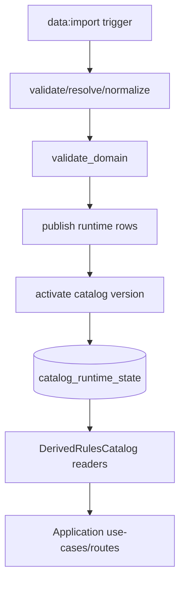

# Spec: Catalog Publish and RulesCatalog Interface (Foundation)

## Metadata

- Status: `approved`
- Created At: `2026-04-04`
- Last Updated: `2026-04-05`
- Owner: `Antony Acosta`

## Changelog

- `2026-04-05` - `Antony Acosta` - Marked the foundation rules-catalog publish/read spec as approved after merged implementation and verification evidence. Made with OpenCode.
- `2026-04-04` - `Antony Acosta` - Created the foundation spec for catalog publish and `RulesCatalog` reader wiring.
- `2026-04-04` - `Antony Acosta` - Resolved blocking and non-blocking publish/read-model decisions for v1 implementation scope. Made with OpenCode.
- `2026-04-04` - `Antony Acosta` - Updated context to reflect implemented publish persistence and derived runtime reader wiring. Made with OpenCode.

## Related Feature

- Placeholder: `docs/features/foundation.md` (feature rundown not created yet).
- Roadmap alignment: Phase 0 foundation operational slice completion.

## Context

- The import parser pipeline now validates, resolves, normalizes, and domain-validates Data Source input.
- The import pipeline now persists normalized catalog content in publish stage and activates a runtime catalog version.
- Runtime `RulesCatalog` interfaces now have a concrete derived reader adapter backed by published storage.
- Result: successful imports can be consumed through `RulesCatalog` namespaces for foundation v1 domains.

This spec defines the first publishable runtime catalog implementation and reader interface wiring.

Implementation evidence for approval:

- `src/server/import/run-import-pipeline.ts`
- `src/server/adapters/prisma/catalog-publish-repository.ts`
- `src/server/adapters/rules-catalog/derived-rules-catalog.ts`
- `src/server/composition/create-app-services.ts`
- `src/server/adapters/prisma/__tests__/catalog-publish-repository.test.ts`
- `src/server/adapters/rules-catalog/__tests__/derived-rules-catalog.test.ts`

## Current Plan

### Scope of this spec

- Persist normalized import output as versioned runtime catalog data.
- Atomically activate a catalog version when publish succeeds.
- Implement `DerivedRulesCatalog` backed by published catalog storage.
- Wire composition to expose usable `rulesCatalog.*` readers in app services.

### Storage strategy (v1)

Use a hybrid relational model in SQLite (via Prisma):

- canonical entity rows for flexibility and schema stability
- typed relation/projection rows for high-value lookups and filters

v1 storage shape:

- `CatalogEntity` (canonical rows)
  - scoped by `catalogVersionId`
  - stores normalized identity/name/source/kind and `payloadJson`
- `CatalogFeatureReference` (owner -> feature links)
- `CatalogSpellSourceEdge` (spell availability graph)

Guidance:

- canonical table is the runtime source of truth for entity payloads.
- relation tables support queryability and avoid reparsing JSON for critical option paths.

### Publish contract

On successful validation:

1. Create or reuse `CatalogVersion` for `(providerKind, datasetFingerprint, importerVersion)`.
2. Replace canonical and relation rows for that catalog version (`delete + insert`, version-scoped).
3. Enforce canonical `payloadJson` max size (`2MB` UTF-8 bytes per row); fail-closed with explicit diagnostics when exceeded.
4. Mark version publish status and publish-success marker.
5. In a guarded second transaction, verify publish success and atomically update active runtime pointer with activation event insert.

Failure policy:

- publish/activation failures are fail-closed.
- active pointer remains unchanged on failure.

### Runtime RulesCatalog contract implementation

Implement `DerivedRulesCatalog` namespaces from published storage:

- `classes.get/list`
- `subclasses.get/listByClass`
- `races.get/list`
- `backgrounds.get/list`
- `spells.get/list`
- `feats.get/list`
- `features.resolve`
- `getDatasetVersion`

Rules:

- reads are always against active catalog version from runtime state.
- `get` methods return `null` on not found.
- filters execute through relational query criteria, not full-table JSON scans where avoidable.

### Integrity-mode behavior

- `strict`: integrity/parity errors block publish and activation.
- `warn`: publish may succeed with warnings; warnings are persisted and surfaced in CLI output.
- `off`: parity checks may be bypassed per existing policy.

## Data and Flow

Input:

- normalized data package from import pipeline (`entities`, `featureReferences`, `spellSourceEdges`).

Transform:

- normalize runtime rows for canonical and relation tables.
- phase 1 transaction: replace version-scoped runtime rows and commit publish-success marker.
- phase 2 guarded transaction: verify publish success, then atomically insert activation event and switch active pointer.

Output:

- published and active catalog version with queryable runtime readers.

Trust boundaries:

- Data Source content remains untrusted until post-validation.
- Runtime readers trust only published storage content tied to active catalog version.

## Constraints and Edge Cases

- `publish` must be idempotent for same `(providerKind, datasetFingerprint, importerVersion)`.
- Activation pointer update must be atomic with activation-event insert.
- Concurrent publish attempts for same fingerprint must not duplicate active content inconsistently.
- Reader calls before any active version exists must return controlled operational error behavior.
- `RulesCatalog` payloads must preserve provenance fields required by option and lineage logic.
- Canonical payload storage must avoid runtime dependence on external Data Source file paths.
- Large payload writes must avoid unbounded memory amplification during publish.

## Resolved Decisions (2026-04-04)

Blocking:

- Publish uses `replace` semantics per catalog version (`delete + insert` for version-scoped runtime rows).
- Publish/activation uses a guarded two-phase boundary: publish commits first, activation pointer+event commit second only after publish-success verification.
- Canonical row `payloadJson` is limited to `2MB` per row (UTF-8 bytes) with fail-closed overflow behavior and explicit diagnostics.

Non-blocking:

- Immutable JSON artifact snapshots are optional and disabled by default in v1.
- Search/read posture in v1 uses baseline indexed queries only; precomputed searchable text columns are deferred.
- Reader adapters use fingerprint-scoped in-memory cache in v1, with invalidation when active dataset fingerprint changes.

## Related Implementation Plan

- `docs/specs/rules-catalog/catalog-publish-and-rules-catalog-interface-implementation-plan.md`
