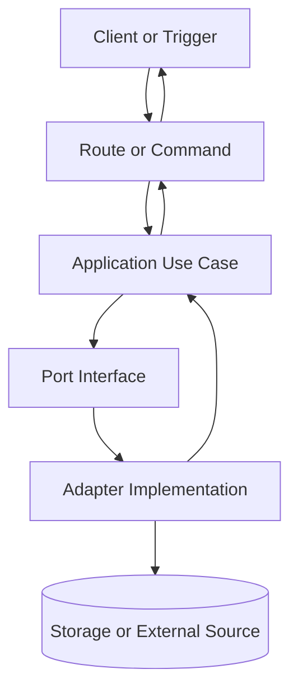
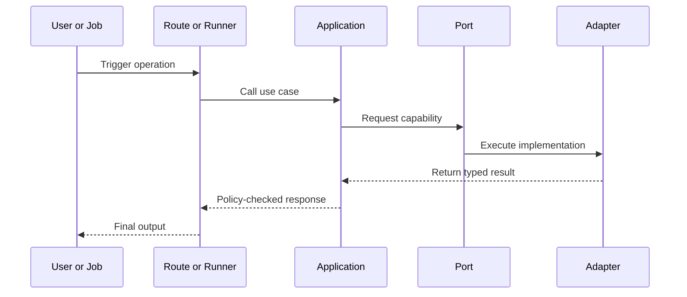

# Implementation Plan: <name>

## Metadata

- Status: `draft` | `ready` | `in-progress` | `blocked` | `completed`
- Created At: `YYYY-MM-DD`
- Last Updated: `YYYY-MM-DD`
- Owner: `<name or team>`

## Changelog

- Order entries from most recent to oldest.
- `YYYY-MM-DD` - `<author>` - <most recent change and why>
- `YYYY-MM-DD` - `<author>` - <older change and why>

## Goal

- Describe the concrete outcome in code (what will exist after this work that does not exist now).
- Link the outcome to user value or operational value.
- Add explicit scope controls:
  - In scope (what this plan will implement now)
  - Out of scope (what is intentionally deferred)
- State completion criteria in 3-6 bullet points.

## Non-Goals

- List adjacent work that should not be pulled into this implementation.
- Use this section to prevent scope creep during coding.

## Related Docs

- Link the feature rundown.
- Link the relevant feature specs.
- Link any architecture notes this plan depends on.
- For each link, add a short note about why it matters to this implementation.

## Existing Code References

- Link files, components, utilities, or patterns already in the app that should be reused or matched.
- For each reference, include:
  - what should be reused
  - what should stay consistent (naming, error shape, layering, style)
  - what should not be copied forward (known debt or temporary patterns)

## Files to Change

- List the files that should be updated.
- Add a detailed note on what changes belong in each file.
- Call out risk level per file (`low`, `medium`, `high`) and why.
- If order matters, annotate dependencies between files.

Example format:

```md
- `src/server/example.ts` (risk: medium)
  - Add input validation and map adapter errors to domain-safe errors.
  - Depends on `src/server/ports/example-port.ts` type updates.
```

## Files to Create

- List any new files to add.
- Add a short note describing the role of each file.
- Group by layer or concern (for example: `ports`, `adapters`, `application`, `ui`, `tests`).
- Include minimal ownership notes so future edits are predictable.

## Data Flow

- Explain how data moves through the implementation.
- Include where data is created, transformed, validated, stored, and rendered.
- Explicitly name trust boundaries and where untrusted input is validated.
- Include one diagram (Mermaid preferred) for request/response or pipeline flow.



If sequence details are important, also include:



## Behavior and Edge Cases

- Define expected behavior for:
  - success path
  - not found path
  - validation failure path
  - dependency unavailable path
- List known edge cases and expected handling.
- Identify fail-open vs fail-closed decisions explicitly.

## Error Handling

- Define error categories and where they are translated.
- State which errors are user-facing vs operational only.
- Include expected logging fields (for example: request id, entity id, provider, fingerprint).

## Types and Interfaces

- Define the main types, interfaces, or schemas that should exist.
- Include representative snippets when helpful.
- Include both compile-time and runtime validation shapes when relevant.
- Note which layer owns each type and where conversion occurs.

```ts
// Example
interface ExampleType {
  id: string;
}

// Optional runtime schema example
// const ExampleSchema = z.object({ id: z.string() })
```

## Functions and Components

- List the functions, hooks, components, or modules that should be added or changed.
- For each one, describe its responsibility and inputs/outputs.
- Include side effects, idempotency expectations, and transactional boundaries where relevant.
- For UI components, include client/server component expectations and state ownership.

```ts
// Example
function exampleFunction(input: ExampleType): ExampleType {
  return input;
}
```

## Integration Points

- Explain where this work connects to routes, UI state, storage, import scripts, or external data.
- Mention any dependencies on other features or shared systems.
- Include required environment variables, config flags, and feature gates.
- Include rollout strategy for integrations that may be incomplete at first.

## Implementation Order

- Break the work into coding steps in the order they should be done.
- Prefer small slices that can be verified incrementally.
- For each step, include:
  - expected output
  - verification step
  - merge safety note (can this ship independently?)

Example step format:

```md
1. Add port contract
   - Output: `src/server/ports/example.ts`
   - Verify: `bun run lint` + typecheck
   - Merge safety: yes (no runtime wiring yet)
```

## Verification

- List the checks that should confirm the implementation works.
- Include test ideas, manual verification, or build/typecheck expectations.
- Split verification into:
  - automated checks (lint, typecheck, unit/integration tests)
  - manual scenarios
  - observability checks (logs/metrics/events)
- Include at least one negative test case and one rollback or recovery check when applicable.

## Notes

- Add pseudocode, code snippets, or extra guidance that will help a coding agent implement this accurately.
- Add explicit assumptions and unresolved questions.
- Record follow-up tasks that are intentionally deferred.

## Rollout and Backout

- Describe how this change is introduced safely (flags, staged deploy, shadow reads, etc.).
- Describe how to revert or disable it quickly if behavior is incorrect.

## Definition of Done

- Summarize the objective exit criteria as a final checklist.
- Include code, tests, docs, and operational readiness items.
