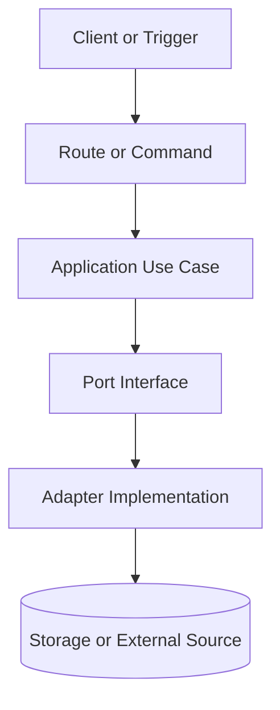

# Implementation Plan: <name>

> Template Version: `v2` (default)
>
> This is the canonical implementation plan template.
> Legacy v1 template is archived at `docs/templates/implementation-plan-template-v1-deprecated.md`.

## Metadata (Required)

- Status: `draft` | `ready` | `in-progress` | `blocked` | `completed`
- Created At: `YYYY-MM-DD`
- Last Updated: `YYYY-MM-DD`
- Owner: `<name or team>` (human owner, not tool)

## Changelog (Required)

- Order entries from most recent to oldest.
- `YYYY-MM-DD` - `<author>` - <most recent change and why>
- `YYYY-MM-DD` - `<author>` - <older change and why>

## Goal and Scope (Required)

- Describe concrete code outcome (what will exist after this work that does not exist now).
- Link outcome to user or operational value.
- Include scope controls:
  - In scope
  - Out of scope
- Add 3-6 completion criteria bullets.

## Related Docs (Required)

- Link feature rundown.
- Link relevant feature specs.
- Link architecture notes this work depends on.
- For user-facing work, link `ux-guide.md`.
- Add one short note per link explaining why it matters.

## Existing Code References (Required)

- Link files, components, utilities, or patterns to reuse.
- For each reference, note:
  - what to reuse
  - what must stay consistent (naming, error shape, layering, style)
  - what known debt should not be copied forward

## File Plan (Required)

### Files to Change

- List files to update and what belongs in each.
- Add risk level per file (`low`, `medium`, `high`) and why.
- If order matters, note dependencies between files.

### Files to Create

- List new files and each file role.
- Group by layer or concern (`ports`, `adapters`, `application`, `ui`, `tests`).

Example format:

```md
- `src/server/example.ts` (risk: medium)
  - Add input validation and map adapter errors to domain-safe errors.
  - Depends on `src/server/ports/example-port.ts` type updates.
```

## Data and Boundaries (Required)

- Explain how data moves through this implementation.
- Name trust boundaries and where untrusted input is validated.
- Note where errors are translated to stable, consumer-safe shapes.
- Include one short flow diagram only when it reduces ambiguity.

Optional diagram starter:


```mermaid
flowchart TD
  A[Client or Trigger] --> B[Route or Command]
  B --> C[Application Use Case]
  C --> D[Port Interface]
  D --> E[Adapter Implementation]
  E --> F[(Storage or External Source)]
```

## Behavior and Edge Cases (Required)

- Define expected behavior for:
  - success path
  - validation failure path
  - not found path
  - dependency unavailable path
- List known edge cases and expected handling.
- State fail-open vs fail-closed decisions explicitly.

## Implementation Order (Required)

- Break work into small coding steps in execution order.
- For each step, include:
  - expected output
  - verification step
  - merge safety note (can this ship independently?)

Example step format:

```md
1. Add port contract
   - Output: `src/server/ports/example.ts`
   - Verify: `bun run lint` + typecheck
   - Merge safety: yes (no runtime wiring yet)
```

## Verification (Required)

- Split checks into:
  - automated checks (lint, typecheck, unit/integration tests)
  - manual scenarios
  - observability checks (logs/metrics/events)
- Include at least one negative test and one rollback or recovery check when applicable.

## Rollout and Backout (Required)

- Describe safe rollout approach (flags, staged deploy, shadow reads, etc.).
- Describe fastest safe backout path if behavior is incorrect.

## Roadmap / Status Impact (Required)

- State one of:
  - `no roadmap progress impact`
  - impacted phase(s) and expected status movement
- If impact exists, list evidence paths that should update `docs/STATUS.md` and `docs/ROADMAP.md`.

## Definition of Done (Required)

- Final checklist for exit criteria:
  - code complete and wired
  - tests and checks pass
  - docs updated
  - operational readiness confirmed

## Optional Sections (Use only when needed)

- Types and interfaces
- Functions and components
- Integration points
- Additional diagrams
- Notes, assumptions, and unresolved questions

Use optional sections only when they materially reduce implementation ambiguity.
